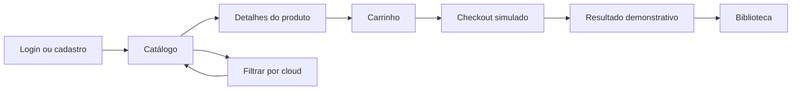
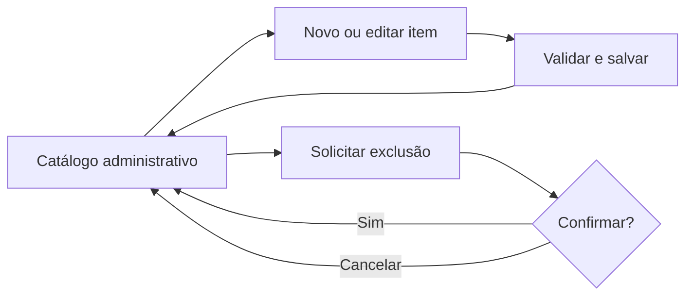

# PixelVault - Artefatos Consolidados dos Prompts 1 a 9

**Projeto Integrador IV - Desenvolvimento para Dispositivos Móveis**  
**Produto:** PixelVault - Loja de Jogos para Cloud Gaming  
**Versão do consolidado:** 1.0  
**Data da consolidação:** 14/09/2026  
**Conteúdo:** artefatos completos das Fases 1, 2 e 3

> Este arquivo reúne, sem resumos ou supressões, o conteúdo integral dos nove artefatos concluídos nos Prompts 1 a 9. Os títulos, versões, tabelas, checklists, referências e pendências internas de cada documento foram preservados. Os PDFs de roteiro, templates e aulas continuam sendo fontes externas de referência e não fazem parte desta consolidação de artefatos produzidos.

## Regras de uso e precedência

1. O índice abaixo é o mapa oficial entre prompt, código de seção e artefato original.
2. Cada conteúdo integral fica entre os marcadores HTML `ARTEFATO-Pxx-INICIO` e `ARTEFATO-Pxx-FIM`, permitindo localização textual mesmo quando o leitor não processar links internos.
3. As menções a nomes de arquivos individuais dentro dos conteúdos preservados são registros históricos. Para fornecer contexto aos próximos prompts, deve-se usar este arquivo unificado e indicar o código de seção correspondente.
4. Em qualquer divergência de UX, a seção `A09` — Prompt 9 prevalece sobre a seção `A08` — Prompt 8, versão 0.2.
5. O aceite do Product Owner registrado na seção `A09` permanece válido.
6. Permanecem reais e abertas as pendências registradas nos artefatos, inclusive os recortes do Figma definidos em `COR-06`, as confirmações dos dados simulados e os testes dependentes da implementação.

## Índice de artefatos

| Seção | Origem | Artefato original | Localização no consolidado |
|---|---|---|---|
| `A01` | Prompt 1 | `PixelVault_Auditoria_Roteiro_Estrutura_Entrega.md` | [Abrir seção](#artefato-p01) |
| `A02` | Prompt 2 | `PixelVault_Visao_Produto_Stakeholders.md` | [Abrir seção](#artefato-p02) |
| `A03` | Prompt 3 | `PixelVault_Escopo_MVP_Limites.md` | [Abrir seção](#artefato-p03) |
| `A04` | Prompt 4 | `PixelVault_Historias_Usuario_Criterios_Aceitacao.md` | [Abrir seção](#artefato-p04) |
| `A05` | Prompt 5 | `PixelVault_Processo_Scrum_Grupo.md` | [Abrir seção](#artefato-p05) |
| `A06` | Prompt 6 | `PixelVault_Product_Backlog_Planning_Poker_Roadmap_Sprint.md` | [Abrir seção](#artefato-p06) |
| `A07` | Prompt 7 | `PixelVault_Pesquisa_Exploratoria_de_Mercado.md` | [Abrir seção](#artefato-p07) |
| `A08` | Prompt 8 | `PixelVault_Fluxo_Principal_Wireframes_Baixa_Fidelidade.md` | [Abrir seção](#artefato-p08) |
| `A09` | Prompt 9 | `PixelVault_Consistencia_UX_Rastreabilidade.md` | [Abrir seção](#artefato-p09) |

---

## A01 - Prompt 1: Auditoria do roteiro e estrutura da entrega

**Arquivo original:** `PixelVault_Auditoria_Roteiro_Estrutura_Entrega.md`  
**Localização estável:** seção `A01`, entre `ARTEFATO-P01-INICIO` e `ARTEFATO-P01-FIM`

<!-- ARTEFATO-P01-INICIO -->

# PixelVault - Auditoria do Roteiro e Estrutura da Primeira Entrega

**Projeto Integrador IV - Desenvolvimento para Dispositivos Móveis**  
**Marco documental:** Sprint 1  
**Data de corte da entrega:** 24/09/2026  
**Responsável por esta auditoria:** Integrante 1 - RA: `[RA-1]`  
**Versão:** 0.3 - escopo ajustado para jogos digitais e DLCs

> Este documento organiza a entrega sem declarar como concluído o que ainda será produzido pelos próximos prompts. Todo conteúdo futuro deve substituir os marcadores `[PREENCHER]`, `[EVIDÊNCIA PENDENTE]` e `[VALIDAR COM O PROFESSOR]`.

## 1. Resultado da auditoria

### 1.1 Requisitos confirmados

1. O projeto deve ser desenvolvido em **React Native**.
2. O tema obrigatório é **PixelVault - Loja de Jogos Digitais**.
3. A equipe com seis integrantes atende à regra de grupos de 5 a 7 alunos.
4. A Sprint 1 deve cobrir, na ordem, todos os itens **1.1 a 1.6** do roteiro.
5. Todos esses itens devem aparecer nominalmente no sumário.
6. O produto deve contemplar cinco áreas de tela:
   - Login e cadastro do usuário;
   - Loja/catálogo com CRUD de jogos digitais e DLCs;
   - Carrinho de compras;
   - Checkout/pagamento com Mercado Pago;
   - Biblioteca de jogos, incluindo jogos adquiridos e chaves de ativação.
7. A modelagem deve incluir **Usuários e Produtos**, além das entidades necessárias ao e-commerce de jogos digitais.
8. A solução deve prever **backend Node** e banco de dados mobile local, como SQLite.
9. A Sprint Review deve produzir feedback, ajuste do backlog, lições aprendidas, relatório de status, registro de riscos e plano de mitigação para os riscos de alta prioridade.
10. O relatório deve respeitar as regras de margem, fonte, espaçamento, parágrafo e organização informadas no roteiro.

### 1.2 Decisões de interpretação adotadas

| Questão | Decisão para o projeto | Motivo |
|---|---|---|
| Data da primeira entrega | Usar 24/09/2026 como data de corte da Sprint 1. | Data de referência definida pelo grupo. |
| Conteúdo ainda não produzido | Manter marcador de pendência, sem inventar resultados. | Esta auditoria antecede os demais prompts. |
| Cinco telas na Sprint 1 | Entregar estrutura visual e navegação demonstrável das cinco áreas; completar regras e integrações na continuidade. | O item 1.4 exige interfaces iniciais, enquanto a exigência global define o conjunto mínimo de telas. |
| CRUD na Sprint 1 | Demonstrar ao menos o fluxo visual e uma operação básica; planejar persistência e validações completas conforme o backlog. | Facilita a correção sem declarar o produto final concluído. |
| Mercado Pago | Na Sprint 1, documentar o fluxo e preparar a interface; integração real permanece pendente se ainda não tiver sido implementada. | Evita simular como pronta uma integração futura. |
| Documentação da Sprint | Consolidar visão, planejamento, pesquisa, evidências, status e riscos em um único PDF. | Atende à regra de entrega compactada e torna a correção mais simples. |

### 1.3 Lacunas e pontos que exigem controle

- O roteiro informa que o projeto é dividido em duas sprints, mas o arquivo fornecido descreve apenas a Sprint 1. Assim, este documento não inventa itens oficiais da Sprint 2; registra apenas a continuidade lógica do produto.
- A expressão “na última aula do PI em setembro” foi substituída pela data operacional fornecida pelo grupo: **24/09/2026**.
- O roteiro geral exige um arquivo compactado com PDF, projeto e vídeo MP4 para o projeto final, mas não repete de forma inequívoca se o vídeo já é obrigatório na Sprint 1. Recomenda-se produzir uma demonstração curta se houver tempo e marcar o item como `[VALIDAR COM O PROFESSOR]`.
- Nomes, RAs, nome da turma, período inicial da Sprint e identificação do professor ainda precisam ser preenchidos.
- O roteiro usa “Cadastro e login” dentro de uma das cinco áreas. Para facilitar a avaliação, o relatório e os wireframes podem apresentar login e cadastro como duas telas do mesmo módulo, mantendo as cinco áreas funcionais previstas no tema.

## 2. Esqueleto do relatório

O relatório deve seguir a ordem cronológica abaixo. A numeração principal de 1.1 a 1.6 reproduz a ordem do roteiro.

### Elementos pré-textuais

#### Capa

- Centro Universitário Senac no topo;
- disciplina: Projeto Integrador IV - Desenvolvimento para Dispositivos Móveis;
- título: **PixelVault - Loja de Jogos Digitais**;
- identificação dos seis integrantes e respectivos RAs;
- São Paulo - 2026.

#### Sumário

- Gerar automaticamente após a diagramação final;
- incluir explicitamente os itens 1.1 a 1.6 e respectivos subtópicos;
- conferir páginas após a exportação para PDF.

#### Introdução

Texto curto, com:

- contexto do e-commerce gamer;
- problema que o PixelVault pretende resolver;
- objetivo da Sprint 1;
- tecnologias centrais;
- organização do relatório;
- data de corte de 24/09/2026.

### Desenvolvimento do projeto

### 1.1 Definição do Escopo e Requisitos

**Responsável principal:** Integrante 1 - `[RA-1]`

1.1.1 Nome e visão do produto  
1.1.2 Problema a ser resolvido  
1.1.3 Público-alvo e perfis de usuário  
1.1.4 Stakeholders e valor esperado  
1.1.5 Escopo do produto  
1.1.6 Itens fora do escopo desta fase  
1.1.7 Objetivo e funcionalidades essenciais do MVP  
1.1.8 Histórias de usuário iniciais  
1.1.9 Critérios de aceitação  
1.1.10 Definição de Pronto (DoD)

**Evidência esperada:** Documento de Visão e Escopo preenchido, histórias priorizáveis e critérios claros de validação.

### 1.2 Estruturação do Planejamento Ágil

**Responsável principal:** Integrante 2 - `[RA-2]`

1.2.1 Processo Scrum adotado  
1.2.2 Papéis e distribuição da equipe  
1.2.3 Artefatos do projeto  
1.2.4 Cerimônias e cadência  
1.2.5 Product Backlog priorizado  
1.2.6 Critério de priorização  
1.2.7 Planning Poker e escala utilizada  
1.2.8 Resultado das estimativas  
1.2.9 Objetivo e Sprint Backlog da Sprint 1

**Evidência esperada:** quadro ou tabela do Product Backlog, registro de estimativas dos seis integrantes e backlog selecionado para a Sprint 1.

### 1.3 Pesquisa de Mercado e Design de Interface (Wireframing)

**Responsável principal:** Integrante 3 - `[RA-3]`

1.3.1 Objetivo e método da pesquisa exploratória  
1.3.2 Concorrentes analisados  
1.3.3 Comparação de funcionalidades e experiência  
1.3.4 Oportunidades para o PixelVault  
1.3.5 Fluxo principal do usuário  
1.3.6 Wireframes de baixa fidelidade  
1.3.7 Justificativas das decisões de interface

**Wireframes mínimos:** login, cadastro de usuário, catálogo/listagem, cadastro e edição de item, carrinho, checkout e biblioteca.

**Evidência esperada:** imagens legíveis dos wireframes, fluxo de navegação e síntese comparativa dos concorrentes.

### 1.4 Configuração do Ambiente e Interface Inicial

**Responsável principal:** Integrante 4 - `[RA-4]`

1.4.1 Ambiente e versões utilizadas  
1.4.2 Criação e estrutura do projeto React Native  
1.4.3 Dependências instaladas  
1.4.4 Organização de componentes e telas  
1.4.5 Implementação das interfaces iniciais  
1.4.6 Navegação entre telas  
1.4.7 Procedimento de execução  
1.4.8 Evidência de compilação e inicialização  
1.4.9 Limitações atuais

**Evidência esperada:** captura do aplicativo em execução, instruções reproduzíveis, estrutura do código e telas sem erros aparentes.

### 1.5 Modelagem, Estrutura do Banco de Dados e Node

**Responsável principal:** Integrante 5 - `[RA-5]`

1.5.1 Premissas da modelagem  
1.5.2 Entidades e relacionamentos  
1.5.3 Diagrama Entidade-Relacionamento (DER)  
1.5.4 Dicionário de dados resumido  
1.5.5 Script SQL de criação e dados mínimos  
1.5.6 Banco local mobile  
1.5.7 Estrutura inicial da API Node  
1.5.8 Endpoints previstos ou implementados  
1.5.9 Procedimento de execução e teste

**Entidades mínimas:** Usuário e Produto. Recomenda-se complementar com Carrinho, ItemCarrinho, Pedido, ItemPedido, Pagamento, Biblioteca e ChaveAtivacao. Jogos digitais e DLCs podem ser representados como tipos de produto.

**Evidência esperada:** DER legível, script SQL executável, estrutura do backend e prova de inicialização ou teste básico.

### 1.6 Monitoramento e Sprint Review

**Responsável principal:** Integrante 6 - `[RA-6]`

1.6.1 Identificação da Sprint Review  
1.6.2 Participantes e stakeholders consultados  
1.6.3 Roteiro da demonstração  
1.6.4 Interfaces e incremento apresentados  
1.6.5 Feedback recebido  
1.6.6 Decisões e ajustes do Product Backlog  
1.6.7 Lições aprendidas  
1.6.8 Relatório de Status  
1.6.9 Registro e matriz de riscos  
1.6.10 Plano de mitigação e contingência dos riscos de alta prioridade  
1.6.11 Próximos passos

**Evidência esperada:** ata ou registro da revisão, backlog antes/depois, relatório de status datado, matriz de riscos e responsáveis por cada mitigação.

### Elementos pós-textuais

#### Conclusão

- resumir o que foi efetivamente realizado até 24/09/2026;
- registrar limitações sem ocultá-las;
- indicar que o produto continuará evoluindo na Sprint 2;
- não declarar encerramento do projeto.

#### Referências

- roteiro oficial do PI IV;
- materiais de aula utilizados;
- documentação oficial das tecnologias efetivamente adotadas;
- fontes da pesquisa de mercado;
- referências de imagens, ícones e dados de exemplo.

#### Anexos

- Anexo A - Documento de Visão e Escopo, se não estiver integralmente no item 1.1;
- Anexo B - Product Backlog e registro do Planning Poker;
- Anexo C - Wireframes e fluxo de navegação em tamanho ampliado;
- Anexo D - Evidências de execução do aplicativo;
- Anexo E - DER, dicionário de dados e script SQL;
- Anexo F - Relatório de Status;
- Anexo G - Registro, matriz e Plano de Mitigação de Riscos;
- Anexo H - Registro da Sprint Review.

## 3. Sumário preliminar

> As páginas devem ser inseridas somente após a versão final ser diagramada.

Introdução  
1. Desenvolvimento do Projeto  
   1.1 Definição do Escopo e Requisitos  
   1.2 Estruturação do Planejamento Ágil  
   1.3 Pesquisa de Mercado e Design de Interface (Wireframing)  
   1.4 Configuração do Ambiente e Interface Inicial  
   1.5 Modelagem, Estrutura do Banco de Dados e Node  
   1.6 Monitoramento e Sprint Review  
2. Conclusão  
3. Referências  
4. Anexos

## 4. Matriz de rastreabilidade: requisito x evidência

| ID | Requisito auditado | Evidência esperada | Local no relatório | Critério objetivo de aceite |
|---|---|---|---|---|
| R01 | Definir visão, problema e valor | Documento de Visão preenchido | 1.1.1 a 1.1.4 | Problema, público, stakeholders e benefício estão coerentes com PixelVault. |
| R02 | Delimitar escopo e MVP | Listas de dentro/fora do escopo e MVP | 1.1.5 a 1.1.7 | As cinco áreas do tema estão mapeadas e a fase atual está delimitada. |
| R03 | Criar histórias iniciais | Tabela com ID, história e prioridade | 1.1.8 | Cada história segue “Como..., quero..., para...” e tem valor ao usuário. |
| R04 | Definir validação | Critérios de aceitação e DoD | 1.1.9 e 1.1.10 | Histórias possuem condição verificável e definição comum de pronto. |
| R05 | Definir Scrum | Papéis, artefatos e cerimônias | 1.2.1 a 1.2.4 | Papéis dos seis integrantes e cadência estão documentados. |
| R06 | Priorizar o trabalho | Product Backlog ordenado | 1.2.5 e 1.2.6 | Itens têm prioridade, responsável e relação com uma história/requisito. |
| R07 | Estimar esforço | Registro do Planning Poker | 1.2.7 e 1.2.8 | Escala informada, votos registrados e estimativa final justificada. |
| R08 | Planejar a Sprint 1 | Objetivo e Sprint Backlog | 1.2.9 | Itens selecionados cabem no período encerrado em 24/09/2026. |
| R09 | Pesquisar concorrentes | Quadro comparativo com fontes | 1.3.1 a 1.3.4 | Há comparação objetiva e conclusão aplicável ao PixelVault. |
| R10 | Criar wireframes | Imagens e fluxo principal | 1.3.5 a 1.3.7 | Login, cadastros e catálogo estão presentes; demais áreas do tema estão mapeadas. |
| R11 | Criar o projeto React Native | Estrutura do repositório e arquivo de dependências | 1.4.1 a 1.4.4 | Projeto abre com instruções registradas e tecnologia correta. |
| R12 | Implementar interface inicial | Capturas e demonstração | 1.4.5 e 1.4.6 | Telas carregam, são legíveis e permitem demonstrar a navegação principal. |
| R13 | Garantir compilação/início | Log ou captura da execução | 1.4.7 e 1.4.8 | Outro integrante consegue iniciar o app seguindo o README. |
| R14 | Modelar dados | DER e dicionário resumido | 1.5.1 a 1.5.4 | Inclui Usuários e Produtos com cardinalidades legíveis e suporte a jogos digitais e DLCs. |
| R15 | Gerar SQL e banco local | Script SQL e arquivo/configuração local | 1.5.5 e 1.5.6 | Script cria a estrutura sem erro e a estratégia local está descrita. |
| R16 | Configurar backend Node | Código, endpoints e teste | 1.5.7 a 1.5.9 | Backend inicia e possui ao menos rota de saúde ou operação mínima demonstrável. |
| R17 | Realizar Sprint Review | Registro de participantes, demonstração e feedback | 1.6.1 a 1.6.5 | Data, participantes, itens apresentados e feedback estão registrados. |
| R18 | Ajustar backlog e registrar lições | Comparação ou histórico das alterações | 1.6.6 e 1.6.7 | Cada mudança relevante tem origem no feedback ou aprendizado. |
| R19 | Produzir Relatório de Status | Relatório datado | 1.6.8 / Anexo F | Status, progresso, entregas, impedimentos, riscos e próximos passos estão presentes. |
| R20 | Identificar e mitigar riscos | Registro, matriz e planos | 1.6.9 e 1.6.10 / Anexo G | Todo risco alto possui prevenção, contingência e responsável. |
| R21 | Respeitar a formatação | PDF final | Documento inteiro | Margens, fonte, tamanhos, espaçamento e ordem cumprem o roteiro. |
| R22 | Preparar o pacote de entrega | ZIP final | Inventário de entrega | Um PDF, código do projeto e vídeo MP4 quando confirmado/necessário. |

## 5. Checklist de conteúdo

### 5.1 Controle geral

- [ ] O tema é PixelVault em todos os arquivos, telas e diagramas.
- [ ] O relatório contém os itens 1.1 a 1.6, nessa ordem.
- [ ] Nenhum item solicitado foi omitido ou renomeado de forma irreconhecível.
- [ ] Nenhuma funcionalidade futura foi apresentada como concluída.
- [ ] A data de corte indicada é 24/09/2026.
- [ ] Os seis nomes e RAs foram preenchidos sem divergências.
- [ ] Siglas são explicadas na primeira ocorrência.
- [ ] Texto, tabelas e imagens são legíveis e objetivos.
- [ ] Todas as figuras e tabelas têm título e fonte/origem.
- [ ] Todos os links e referências foram testados.

### 5.2 Itens 1.1 a 1.6

- [ ] 1.1 contém visão, escopo, stakeholders, MVP, histórias e DoD.
- [ ] 1.2 contém papéis, artefatos, cerimônias, backlog e Planning Poker.
- [ ] 1.3 contém pesquisa de concorrentes, conclusões, fluxo e wireframes.
- [ ] 1.4 contém ambiente, projeto React Native, interfaces, navegação e prova de execução.
- [ ] 1.5 contém DER, SQL, banco local e backend Node.
- [ ] 1.6 contém Sprint Review, feedback, backlog atualizado, lições, status e riscos.
- [ ] Riscos altos possuem mitigação preventiva, Plano B e responsável.

### 5.3 Formatação obrigatória

- [ ] Margem superior: 2 cm.
- [ ] Margem inferior: 2 cm.
- [ ] Margem esquerda: 3 cm.
- [ ] Margem direita: 2 cm.
- [ ] Fonte escolhida entre Verdana, Arial ou Times New Roman.
- [ ] Corpo do texto em tamanho 10.
- [ ] Títulos em tamanho 12 e negrito.
- [ ] Espaçamento entre linhas de 1,5.
- [ ] Recuo de parágrafo de 2 cm.
- [ ] Capa no padrão solicitado.
- [ ] Sumário atualizado e com páginas corretas.
- [ ] Introdução, desenvolvimento, conclusão, referências e anexos estão na ordem.
- [ ] PDF final foi revisado página a página após a exportação.

### 5.4 Verificação técnica mínima

- [ ] Aplicativo inicia sem erro aparente.
- [ ] README informa pré-requisitos e comandos de execução.
- [ ] Dependências estão declaradas e não há arquivos secretos no pacote.
- [ ] Navegação entre as áreas principais pode ser demonstrada.
- [ ] Layout permanece legível em tela pequena.
- [ ] CRUD de jogos digitais e DLCs tem escopo e estado atual documentados.
- [ ] Backend Node inicia conforme instruções.
- [ ] Banco local e script SQL possuem instruções de criação/teste.
- [ ] DER corresponde ao script SQL.
- [ ] Capturas do relatório correspondem à versão de código entregue.

## 6. Inventário dos arquivos da entrega

Para simplificar a correção, a recomendação é manter poucos arquivos de topo e incorporar documentos auxiliares como seções ou anexos do PDF.

| Caminho sugerido no pacote | Conteúdo | Obrigatoriedade no marco de 24/09 |
|---|---|---|
| `PixelVault_PI_IV_Sprint1_2026-09-24.zip` | Arquivo único enviado ao Blackboard | Obrigatório para empacotamento |
| `documentacao/PixelVault_Relatorio_Sprint1.pdf` | Relatório completo, incluindo visão, backlog, wireframes, DER, status, riscos e evidências | Obrigatório |
| `projeto/pixelvault-mobile/` | Código-fonte React Native, dependências, assets e README | Obrigatório |
| `projeto/pixelvault-api/` | Estrutura da API Node e README | Obrigatório |
| `projeto/banco/pixelvault.sql` | Script SQL de criação e, se útil, carga mínima de teste | Obrigatório |
| `projeto/banco/README.md` | Como criar/testar o banco local e o modelo relacional | Recomendado |
| `video/PixelVault_Demonstracao_Sprint1.mp4` | Demonstração curta do app e das evidências | `[VALIDAR COM O PROFESSOR]`; recomendado para facilitar a correção |

**Regra de higiene do pacote:** não incluir `node_modules`, caches, builds temporários, credenciais, arquivos `.env` com segredos ou duplicatas desnecessárias.

## 7. Separação entre Sprint 1 e continuidade na Sprint 2

| Área | Deve estar pronto e evidenciado até 24/09/2026 | Continuidade lógica da Sprint 2, sem declarar requisito oficial não fornecido |
|---|---|---|
| Visão e escopo | Documento preenchido, MVP delimitado, stakeholders, histórias e DoD | Refinar visão e backlog apenas se houver feedback. |
| Scrum | Papéis, cerimônias, Product Backlog, estimativas e Sprint Backlog | Manter backlog vivo e planejar os próximos itens. |
| Pesquisa e UX | Concorrentes, fluxo e wireframes das telas críticas; preferencialmente todas as cinco áreas mapeadas | Refinar layout, acessibilidade e estados de erro/vazio. |
| Aplicativo | Projeto React Native compilável; interfaces iniciais e navegação demonstrável | Completar regras, validações, persistência e acabamento. |
| Login/cadastro | Interface e fluxo básico demonstrável | Autenticação real, sessão, segurança e recuperação de acesso, se previstos. |
| Catálogo/CRUD | Interfaces de listagem e cadastro; ao menos fluxo básico coerente | CRUD completo conectado ao backend/banco e tratamento de erros. |
| Carrinho | Tela e comportamento inicial demonstrável | Persistência, cálculo de totais, quantidades e integração com checkout. |
| Checkout | Tela e fluxo planejado, sem fingir pagamento aprovado | Integração e validação real/sandbox do Mercado Pago. |
| Biblioteca | Estrutura visual e regras documentadas | Vincular compras aprovadas, jogos e chaves de ativação. |
| Dados e backend | DER, SQL, banco local e API Node configurada com teste mínimo | Expandir endpoints, persistência, validações e integrações. |
| Governança | Sprint Review, feedback, backlog atualizado, relatório de status e plano de riscos | Acompanhar métricas, riscos e decisões da próxima sprint. |
| Entrega | PDF revisado e pacote reproduzível | Evoluir os mesmos artefatos, mantendo histórico e rastreabilidade. |

## 8. Divisão equilibrada de responsabilidade

| Integrante | Responsabilidade principal nesta estrutura | Apoio cruzado obrigatório |
|---|---|---|
| Integrante 1 - `[RA-1]` | 1.1 Visão, Escopo e Requisitos; consolidação documental | Revisar coerência geral e capa/sumário. |
| Integrante 2 - `[RA-2]` | 1.2 Planejamento Ágil e estimativas | Apoiar backlog atualizado após a Review. |
| Integrante 3 - `[RA-3]` | 1.3 Pesquisa, fluxo e wireframes | Apoiar validação visual das telas. |
| Integrante 4 - `[RA-4]` | 1.4 Ambiente e interfaces React Native | Fornecer capturas e instruções de execução. |
| Integrante 5 - `[RA-5]` | 1.5 DER, SQL, banco local e Node | Validar coerência entre modelo, SQL e API. |
| Integrante 6 - `[RA-6]` | 1.6 Review, status e riscos | Consolidar feedback, decisões e próximos passos. |

Cada integrante deve revisar ao menos uma seção de outro responsável antes da exportação final. Isso reduz inconsistências sem alterar a responsabilidade principal.

## 9. Portões de qualidade antes da entrega

### Portão 1 - Cobertura

- Todos os itens R01 a R22 têm evidência ou pendência explicitamente justificada.
- Todos os itens 1.1 a 1.6 aparecem no sumário e no corpo.

### Portão 2 - Consistência

- Histórias, wireframes, telas, DER, SQL e API usam os mesmos nomes de domínio.
- O status informado no relatório corresponde ao código e às evidências.

### Portão 3 - Reprodutibilidade

- Um integrante diferente do autor consegue iniciar o aplicativo e o backend usando apenas os READMEs.
- O SQL pode ser executado sem correções manuais não documentadas.

### Portão 4 - Apresentação

- O PDF atende à formatação, não possui cortes ou imagens ilegíveis e usa linguagem simples.
- O arquivo compactado abre corretamente e não contém pastas pesadas ou segredos.

### Portão 5 - Aprovação interna

- Os seis integrantes confirmam nomes, RAs, responsabilidades e conteúdo.
- A versão final é congelada e identificada com a data 24/09/2026.

## 10. Fontes auditadas

- **Primeira entrega - Roteiro PI IV - Desenvolvimento para dispositivos móveis**, especialmente páginas 1 a 4.
- **Tema do trabalho**, página 1.
- **Template - Documento de Visão e Escopo**, incluindo os anexos de status e riscos.
- **Exemplo documento de visão**.
- **Template - Relatório de status** e **exemplo relatório de status**.
- **Exemplo e Template - Plano de Mitigação de Riscos**.
- **Aula 01 - Documento de Visão e Escopo, Histórias de Usuário, Scrum e Planning Poker**.
- **Aulas 02 a 05**, usadas como referência para React Native, Expo, componentes, `useState`, listas, Flexbox e formulários.

## 11. Saída para os próximos prompts

Os próximos prompts devem usar este documento como contrato de estrutura. Cada nova entrega deve:

1. preencher apenas a seção correspondente;
2. gerar as evidências indicadas na matriz;
3. manter a terminologia PixelVault;
4. atualizar o checklist e o status real;
5. respeitar a data de corte de 24/09/2026;
6. deixar explícita qualquer pendência destinada à Sprint 2.
<!-- ARTEFATO-P01-FIM -->

[Voltar ao índice de artefatos](#indice-artefatos)

---

## A02 - Prompt 2: Visão do produto e stakeholders

**Arquivo original:** `PixelVault_Visao_Produto_Stakeholders.md`  
**Localização estável:** seção `A02`, entre `ARTEFATO-P02-INICIO` e `ARTEFATO-P02-FIM`

<!-- ARTEFATO-P02-INICIO -->

# PixelVault - Visão do Produto e Stakeholders

**Projeto Integrador IV - Desenvolvimento para Dispositivos Móveis**  
**Item atendido:** 1.1 - Definição do Escopo e Requisitos  
**Responsável e Product Owner:** Integrante 2 - RA: `[RA-2]`  
**Versão:** 0.4 - Product Owner definido  
**Data de elaboração:** 13/09/2026  
**Data de corte da Sprint 1:** 24/09/2026

> Este conteúdo preenche somente a parte inicial do item 1.1. O escopo detalhado, o MVP, as histórias de usuário, os critérios de aceitação e a Definição de Pronto serão desenvolvidos nos próximos prompts. A visão deve ser revisada após a pesquisa com usuários e a Sprint Review.

## 1.1.1 Nome e visão do produto

### Nome do projeto

**PixelVault - Loja de Jogos para Cloud Gaming**

### Breve apresentação

O PixelVault é um aplicativo móvel de e-commerce especializado em jogos digitais para execução por meio de plataformas de cloud gaming. Desenvolvido em React Native, o produto reunirá um catálogo de jogos, jogos independentes e conteúdos adicionais (DLCs), com indicação das plataformas compatíveis, como GeForce NOW e Boosteroid. A jornada prevista inclui cadastro e login, consulta ao catálogo e à compatibilidade de cada título, carrinho, checkout com Mercado Pago e uma biblioteca para acesso aos jogos adquiridos e às chaves de ativação.

### Declaração de visão do produto

Oferecer aos usuários de cloud gaming uma experiência móvel simples, segura e integrada para descobrir e adquirir jogos digitais e DLCs compatíveis com as plataformas que utilizam, realizar o pagamento e acessar suas compras e chaves de ativação em um único aplicativo.

### Proposta de valor

O principal valor do PixelVault é organizar o catálogo de acordo com a compatibilidade dos jogos com plataformas de cloud gaming. Antes da compra, o jogador poderá identificar em quais plataformas o título está disponível; depois da compra, poderá consultar o jogo e sua chave de ativação na biblioteca. Para o usuário, isso reduz dúvidas e torna a escolha mais objetiva. Para o pequeno negócio, cria um posicionamento especializado e um canal móvel direcionado a um público gamer bem definido.

## 1.1.2 Problema a ser resolvido

Jogadores que utilizam cloud gaming precisam verificar se um título está disponível na plataforma escolhida antes de comprá-lo. Quando as informações de compatibilidade, a compra e o acesso à chave de ativação estão separados, o usuário precisa pesquisar em diferentes canais e pode adquirir um jogo inadequado para a forma como pretende executá-lo. Ao mesmo tempo, lojas digitais generalistas nem sempre organizam a navegação a partir da plataforma de cloud gaming utilizada pelo cliente.

O PixelVault busca resolver esse problema ao reunir, em um único aplicativo, um catálogo direcionado a cloud gaming, a indicação das plataformas compatíveis, o processo de compra e a biblioteca do usuário.

## 1.1.3 Público-alvo e perfis de usuário

| Grupo | Definição | Necessidade principal |
|---|---|---|
| **Público principal** | Jogadores que já utilizam plataformas de cloud gaming, como GeForce NOW, Boosteroid ou alternativas semelhantes. | Encontrar e comprar jogos compatíveis com a plataforma que utilizam, com informação clara antes da compra. |
| **Público secundário** | Jogadores interessados em começar a utilizar cloud gaming para jogar em diferentes dispositivos sem depender exclusivamente do desempenho do equipamento local. | Conhecer títulos disponíveis para cloud gaming e escolher uma opção compatível com sua forma de jogar. |

Para a concepção inicial, serão considerados três perfis centrais:

- **Usuário de cloud gaming:** já utiliza uma ou mais plataformas e procura títulos compatíveis para comprar.
- **Novo usuário de cloud gaming:** deseja conhecer opções de jogos que possam ser executados remotamente em seus dispositivos.
- **Administrador/curador do catálogo:** mantém jogos, DLCs e informações de compatibilidade e acompanha os pedidos realizados.

## 1.1.4 Stakeholders e valor esperado

| Stakeholder | Interesse no projeto | Poder ou influência | Valor ou expectativa principal |
|---|---|---|---|
| Usuários de cloud gaming e avaliadores | Alto | Médio | Identificação clara de jogos compatíveis, compra simples e acesso às aquisições digitais. |
| Integrante 2 - Product Owner | Alto | Alto | Manter a visão do produto, representar o valor esperado, organizar prioridades e esclarecer os itens do Product Backlog. |
| Administradores e curadores do catálogo | Alto | Médio | Fluxos claros para manter jogos, DLCs, plataformas compatíveis e pedidos. |
| Plataformas de cloud gaming | Baixo | Alto sobre a compatibilidade do catálogo | Disponibilidade dos títulos e condições de execução que sirvam como referência para as informações exibidas pela loja. |
| Equipe do projeto - seis integrantes | Alto | Alto | Direção compartilhada para planejar, desenvolver, testar e documentar a solução. |
| Professor/orientador | Alto | Alto | Aderência ao roteiro, evidências verificáveis e aplicação adequada dos conteúdos da disciplina. |
| Mercado Pago, como provedor externo | Baixo | Alto no fluxo de pagamento | Compatibilidade técnica e uso correto da integração prevista para o checkout. |

Os stakeholders de alto interesse devem acompanhar as validações do produto. O Integrante 2, como Product Owner, será responsável por manter a visão e organizar as prioridades do produto com base no valor esperado. A equipe e o professor/orientador devem participar das principais decisões; gamers e curadores do catálogo devem contribuir com feedback sobre os fluxos apresentados; e as limitações das integrações externas devem permanecer registradas como dependências do projeto.

## Premissas e pontos para validação do grupo

- O foco comercial do PixelVault são jogos digitais e DLCs compatíveis com plataformas de cloud gaming.
- O PixelVault não executará os jogos nem venderá assinaturas de cloud gaming; sua função será comercializar os títulos e informar a compatibilidade declarada no catálogo.
- GeForce NOW e Boosteroid são exemplos de plataformas consideradas pelo projeto. A menção não representa parceria, vínculo comercial ou integração já implementada.
- Como a disponibilidade de jogos pode variar entre plataformas, as informações de compatibilidade deverão ser revisadas durante a manutenção do catálogo.
- A integração com o Mercado Pago é parte da visão do produto, mas este documento não declara que ela já esteja implementada.
- O Integrante 2 exercerá a função de Product Owner por ser o responsável pela elaboração e manutenção deste Documento de Visão, garantindo continuidade entre visão, valor e priorização do backlog.
- A função de Product Owner não atribui autoridade técnica sobre os demais integrantes; decisões de implementação, estimativas e divisão do trabalho continuarão sendo construídas de forma colaborativa pela equipe.
- O problema descrito é uma hipótese inicial de produto e deverá ser confrontado com a pesquisa exploratória e com o feedback da Sprint Review.

## Base documental consultada

- *Primeira entrega - Roteiro PI IV - Desenvolvimento para dispositivos móveis*;
- *Tema do trabalho*;
- *Template - Documento de Visão e Escopo*;
- *Exemplo documento de visão*;
- *Aula 01 - Documento de Visão e Escopo, Histórias de Usuário, Scrum e Planning Poker*;
- *PixelVault - Auditoria do Roteiro e Estrutura da Primeira Entrega*.
<!-- ARTEFATO-P02-FIM -->

[Voltar ao índice de artefatos](#indice-artefatos)

---

## A03 - Prompt 3: Escopo, MVP e limites

**Arquivo original:** `PixelVault_Escopo_MVP_Limites.md`  
**Localização estável:** seção `A03`, entre `ARTEFATO-P03-INICIO` e `ARTEFATO-P03-FIM`

<!-- ARTEFATO-P03-INICIO -->

# PixelVault - Escopo, MVP e Limites

**Projeto Integrador IV - Desenvolvimento para Dispositivos Móveis**  
**Item atendido:** 1.1 - Definição do Escopo e Requisitos  
**Responsável:** Integrante 3 - RA: `[RA-3]`  
**Product Owner responsável pela validação:** Integrante 2 - RA: `[RA-2]`  
**Versão:** 0.1 - definição inicial do escopo  
**Data de elaboração:** 13/09/2026  
**Data de corte da Sprint 1:** 24/09/2026

> Este documento complementa a visão do produto aprovada no Prompt 2. As referências anteriores a otimização de PC, montagem de setup, agendamentos, catálogo de serviços e entidade `Serviço` são consideradas obsoletas e não compõem o escopo atual do PixelVault.

## Finalidade deste documento

Delimitar o escopo acadêmico do PixelVault, definir o objetivo e as funcionalidades essenciais do Produto Mínimo Viável (MVP), estabelecer o incremento esperado para a Sprint 1 e registrar os critérios mínimos para que uma história seja considerada pronta.

O escopo foi mantido propositalmente simples para ser compatível com o prazo, com uma equipe de seis integrantes e com os conteúdos de React Native apresentados nas aulas. O foco é produzir uma solução demonstrável, coerente e fácil de avaliar, sem exigir robustez de produção.

## Premissas e decisões de escopo

- O PixelVault será um aplicativo móvel de comércio de jogos digitais e DLCs compatíveis com plataformas de cloud gaming.
- O aplicativo será desenvolvido em React Native com Expo e JavaScript.
- GeForce NOW e Boosteroid serão usados apenas como exemplos de plataformas. O projeto não pressupõe parceria ou integração oficial com essas empresas.
- O PixelVault venderá jogos e DLCs; não executará os jogos e não comercializará assinaturas de cloud gaming.
- A compatibilidade de cada título com as plataformas de cloud gaming será mantida manualmente no catálogo durante o projeto acadêmico.
- Os dados de usuários, jogos, DLCs, pedidos, pagamentos e chaves de ativação utilizados na demonstração serão fictícios.
- As cinco áreas funcionais exigidas serão contempladas. Login e cadastro, bem como cadastro e edição de jogos, poderão ser apresentados em telas separadas sem alterar a estrutura mínima do tema.
- A Sprint 1 entregará a concepção, as interfaces iniciais, a navegação e a base técnica do projeto. As integrações e regras ainda não concluídas ficarão registradas para a Sprint 2.

## 1.1.5 Escopo do produto

O PixelVault compreenderá os seguintes módulos e capacidades:

1. **Acesso do usuário:** cadastro e login de jogadores, com validações básicas dos campos.
2. **Catálogo especializado:** consulta de jogos digitais e DLCs, com informações como nome, imagem, preço, descrição e plataformas de cloud gaming compatíveis.
3. **Consulta por compatibilidade:** identificação e filtro simples dos títulos de acordo com a plataforma de cloud gaming escolhida.
4. **Manutenção do catálogo:** inclusão, consulta, alteração e exclusão de jogos e DLCs por um perfil administrador ou curador.
5. **Carrinho de compras:** inclusão e remoção de itens, alteração de quantidade quando aplicável e visualização do valor total.
6. **Checkout:** formulário de pagamento e preparação da integração com o Mercado Pago, usando ambiente ou dados de teste.
7. **Biblioteca do usuário:** exibição dos jogos e DLCs adquiridos, acompanhados de chaves de ativação fictícias para demonstração.
8. **Fluxo móvel integrado:** navegação entre acesso, catálogo, carrinho, checkout e biblioteca, com layout legível em telas pequenas.
9. **Base técnica acadêmica:** estrutura inicial de uma API Node e banco de dados local, como SQLite, coerentes com o fluxo do aplicativo e com a modelagem a ser detalhada no item 1.5.

### Perfis contemplados

| Perfil | Capacidades previstas |
|---|---|
| Jogador | Cadastrar-se, entrar no aplicativo, consultar compatibilidade, selecionar itens, percorrer o checkout e acessar sua biblioteca. |
| Administrador/curador | Incluir, consultar, alterar e excluir jogos e DLCs e manter suas informações de compatibilidade. |

O controle desses perfis será simples e voltado à demonstração. Um sistema completo de autorização por papéis não é necessário para a Sprint 1.

### Recorte mínimo da Sprint 1

Até 24/09/2026, o incremento deverá conter e evidenciar:

- Documento de Visão e Escopo, histórias iniciais, planejamento ágil e Product Backlog;
- pesquisa exploratória, fluxo do usuário e wireframes das áreas críticas;
- projeto React Native que compile e inicie corretamente;
- interfaces iniciais das cinco áreas funcionais e navegação demonstrável entre elas;
- interações básicas com dados fictícios e estado local, suficientes para demonstrar o fluxo;
- indicação visível da compatibilidade dos jogos com plataformas de cloud gaming;
- fluxo visual de inclusão, consulta, alteração e exclusão de jogos ou DLCs;
- tela de checkout preparada para o Mercado Pago, sem apresentar pagamento real como concluído;
- DER, script SQL, banco local e estrutura inicial da API Node, conforme o item 1.5 do roteiro;
- Sprint Review, feedback, atualização do backlog, relatório de status e registro de riscos.

## 1.1.6 Itens fora do escopo

### Fora do escopo do PixelVault

Os itens abaixo não fazem parte do produto e não devem aparecer como funcionalidades, entidades ou fluxos planejados:

- otimização de computadores;
- montagem de setup gamer;
- agendamento de atendimentos;
- catálogo ou contratação de serviços;
- entidade `Serviço` ou entidade `Agendamento`;
- execução ou transmissão de jogos pelo próprio PixelVault;
- venda de assinaturas do GeForce NOW, Boosteroid ou de outras plataformas;
- integração oficial ou parceria comercial com plataformas de cloud gaming;
- venda e entrega física de equipamentos;
- marketplace com múltiplos vendedores.

### Fora do incremento da Sprint 1, mas previsto para continuidade

Por limite de prazo e maturidade técnica, os itens abaixo não serão considerados concluídos em 24/09/2026:

- autenticação segura de produção, recuperação de senha e gerenciamento avançado de sessão;
- persistência completa de todos os fluxos do aplicativo na API Node e no banco;
- integração real ou homologada de ponta a ponta com o Mercado Pago;
- processamento financeiro real, estorno, reembolso ou conciliação de pagamentos;
- liberação automática de uma chave de ativação após a aprovação do pagamento;
- sincronização automática da compatibilidade com APIs externas;
- painel administrativo avançado, relatórios gerenciais ou métricas comerciais;
- notificações, avaliações, lista de desejos, recomendações e recursos sociais;
- publicação nas lojas de aplicativos, infraestrutura de produção, escalabilidade e testes de carga;
- suíte abrangente de testes automatizados e requisitos avançados de segurança.

Esses limites não impedem a criação de telas, contratos, dados fictícios ou respostas simuladas necessários para demonstrar o fluxo e orientar a implementação posterior.

## 1.1.7 Objetivo e funcionalidades essenciais do MVP

### Objetivo do MVP

Validar se um usuário de cloud gaming consegue identificar jogos compatíveis com a plataforma que utiliza, selecionar um título, percorrer uma compra de demonstração e localizar a aquisição e sua chave fictícia na biblioteca, enquanto um administrador consegue manter o catálogo básico.

O MVP será considerado validado no contexto acadêmico quando o fluxo principal puder ser demonstrado de ponta a ponta com dados fictícios e sem erros bloqueantes. A Sprint 1 produzirá o primeiro incremento desse MVP; a conclusão das integrações e da persistência poderá ocorrer na Sprint 2.

### Funcionalidades essenciais e prioridades

| Funcionalidade | Descrição essencial | Prioridade | Meta da Sprint 1 |
|---|---|---:|---|
| Cadastro e login | Permitir a entrada do jogador no fluxo do aplicativo com validações básicas. | Alta | Interface funcional com estado local e mensagens básicas. |
| Catálogo de jogos e DLCs | Listar títulos com imagem, preço, descrição resumida e tipo do item. | Alta | Lista com dados fictícios, implementada de forma legível. |
| Compatibilidade com cloud gaming | Exibir e filtrar os títulos pela plataforma compatível. | Alta | Compatibilidade visível e filtro simples demonstrável. |
| CRUD do catálogo | Incluir, consultar, alterar e excluir jogos ou DLCs. | Alta | Fluxo visual completo e pelo menos uma operação local demonstrável. |
| Carrinho | Adicionar e remover itens e apresentar o total da compra. | Alta | Comportamento básico controlado por estado local. |
| Checkout com Mercado Pago | Coletar os dados necessários e encaminhar a intenção de pagamento. | Alta | Formulário e resultado simulado, identificados como demonstração. |
| Biblioteca e chaves | Exibir aquisições do usuário e suas chaves de ativação. | Alta | Lista fictícia navegável, sem geração real de chaves. |
| Navegação e adaptação móvel | Conectar as áreas do fluxo e manter o conteúdo utilizável em tela pequena. | Alta | Navegação demonstrável e revisão visual básica. |

### Fluxo essencial do MVP

1. O jogador realiza cadastro ou login.
2. Escolhe uma plataforma de cloud gaming ou consulta a compatibilidade exibida no catálogo.
3. Abre um jogo ou DLC e adiciona o item ao carrinho.
4. Confere os itens e o valor total.
5. Preenche o checkout e recebe um resultado de pagamento claramente identificado como simulado na Sprint 1.
6. Acessa a biblioteca de demonstração e consulta o título e a chave fictícia.
7. Em fluxo separado, o administrador demonstra a manutenção de um item do catálogo.

## 1.1.10 Definição de Pronto (DoD)

Uma história de software somente será considerada pronta quando todos os critérios aplicáveis abaixo forem atendidos:

- a implementação corresponde à história e aos seus critérios de aceitação aprovados;
- o fluxo pode ser iniciado e concluído sem erro bloqueante;
- a interface informa ao usuário o resultado da ação e trata campos obrigatórios quando houver formulário;
- a funcionalidade pode ser demonstrada no ambiente definido pelo projeto, preferencialmente Expo Go ou emulador;
- o conteúdo permanece legível e utilizável em uma tela de celular de dimensões reduzidas;
- os testes funcionais manuais previstos foram executados e o resultado foi registrado;
- dados simulados, pagamentos de teste e chaves fictícias estão identificados, sem uso de credenciais ou dados pessoais reais;
- o código foi versionado no repositório da equipe e integrado à versão corrente sem quebrar funcionalidades já aceitas;
- nomes, telas, dados e documentação permanecem coerentes com o domínio de jogos e DLCs para cloud gaming;
- instruções de execução ou documentação foram atualizadas quando a história alterou o uso ou a configuração do projeto;
- pelo menos um integrante diferente do autor revisou a entrega;
- o Product Owner confirmou o atendimento da história, e eventuais observações do professor ou da Sprint Review foram registradas no backlog.

Para histórias exclusivamente documentais ou de design, os critérios técnicos não aplicáveis deverão ser marcados como **não aplicáveis**, nunca ignorados sem justificativa. Wireframe ou interface estática não comprovam a conclusão de uma história que exija comportamento funcional.

## Pendências iniciais previstas para a Sprint 2

| Pendência | Resultado esperado na continuidade | Dependência principal |
|---|---|---|
| Integrar aplicativo, API Node e banco | Substituir estados ou dados temporários pela persistência definida para o projeto. | DER, SQL e contratos de API aprovados. |
| Completar autenticação | Persistir usuário e sessão com validações adequadas ao contexto acadêmico. | Modelo de usuário e endpoints. |
| Completar o CRUD do catálogo | Persistir inclusão, consulta, alteração e exclusão de jogos, DLCs e compatibilidades. | Banco e API integrados. |
| Consolidar o carrinho e o pedido | Manter itens, totais e criação de pedido de forma consistente. | Catálogo persistido e regra de pedido. |
| Integrar o Mercado Pago | Executar o fluxo em ambiente de teste ou sandbox, conforme orientação do professor. | Endpoint de pagamento e credenciais de teste. |
| Vincular compra e biblioteca | Registrar uma compra aprovada e disponibilizar o item e uma chave fictícia ao usuário. | Pedido, pagamento e biblioteca integrados. |
| Refinar validações e estados da interface | Tratar carregamento, vazio, erro e confirmação nos fluxos principais. | Fluxos funcionais integrados. |
| Executar testes integrados e ajustes finais | Validar o percurso completo e corrigir inconsistências encontradas. | Integrações concluídas e backlog revisado. |

As pendências acima representam a continuidade lógica inicialmente prevista. Elas deverão ser repriorizadas pelo Product Owner após a Sprint Review e não devem ser apresentadas como requisitos oficiais da Sprint 2 enquanto o roteiro específico dessa etapa não for fornecido.

## Critérios para controle de mudanças de escopo

Para evitar crescimento desnecessário do trabalho, uma nova funcionalidade somente poderá entrar no escopo se:

1. contribuir diretamente para o fluxo essencial ou para uma exigência do roteiro;
2. tiver prioridade definida pelo Product Owner;
3. possuir estimativa e impacto sobre o prazo registrados no backlog;
4. não comprometer as entregas obrigatórias da Sprint 1;
5. substituir ou postergar outro item quando não houver capacidade disponível.

Sugestões que não atendam a esses critérios serão mantidas como ideias futuras, sem compromisso de implementação.

## Evidências produzidas

- lista do escopo do produto;
- separação entre exclusões permanentes e pendências da Sprint 1;
- objetivo verificável do MVP;
- tabela de funcionalidades essenciais, prioridades e meta da Sprint 1;
- fluxo essencial do MVP;
- Definition of Done comum às histórias;
- lista inicial de pendências para a Sprint 2;
- critérios de controle de mudanças de escopo.

## Base documental consultada

- *Primeira entrega - Roteiro PI IV - Desenvolvimento para dispositivos móveis*;
- *Tema do trabalho*;
- *Template - Documento de Visão e Escopo*;
- *Exemplo documento de visão*;
- *Aula 01 - Documento de Visão e Escopo, Histórias de Usuário, Scrum e Planning Poker*;
- *Aulas 02 a 05*, como referência para Expo, React Native, componentes, `StyleSheet`, `useState`, listas, Flexbox e formulários;
- *PixelVault - Auditoria do Roteiro e Estrutura da Primeira Entrega*;
- *PixelVault - Visão do Produto e Stakeholders*.
<!-- ARTEFATO-P03-FIM -->

[Voltar ao índice de artefatos](#indice-artefatos)

---

## A04 - Prompt 4: Histórias de usuário e critérios de aceitação

**Arquivo original:** `PixelVault_Historias_Usuario_Criterios_Aceitacao.md`  
**Localização estável:** seção `A04`, entre `ARTEFATO-P04-INICIO` e `ARTEFATO-P04-FIM`

<!-- ARTEFATO-P04-INICIO -->

# PixelVault - Histórias de Usuário e Critérios de Aceitação

**Projeto Integrador IV - Desenvolvimento para Dispositivos Móveis**  
**Item atendido:** 1.1 - Definição do Escopo e Requisitos  
**Responsável:** Integrante 4 - RA: `[RA-4]`  
**Product Owner responsável pela validação:** Integrante 2 - RA: `[RA-2]`  
**Versão:** 0.1 - histórias iniciais para refinamento  
**Data de elaboração:** 13/09/2026  
**Data de corte da Sprint 1:** 24/09/2026

> Este documento transforma o escopo aprovado nos Prompts 2 e 3 em histórias iniciais. A seleção definitiva das histórias de cada Sprint e suas estimativas serão realizadas nos Prompts 5 e 6. As candidatas à Sprint 2 representam continuidade inicial e deverão ser repriorizadas após a Sprint Review.

## 1. Objetivo

Definir um conjunto enxuto de histórias de usuário para as cinco áreas funcionais do PixelVault, cobrindo o fluxo principal de compra e a manutenção básica do catálogo sem ampliar o MVP aprovado.

As histórias seguem o formato **“Como..., quero..., para...”** apresentado na Aula 01 e foram divididas para permanecer pequenas, priorizáveis, estimáveis e testáveis. Os critérios de aceitação descrevem resultados observáveis; a Definition of Done (DoD) comum do projeto continua aplicável a todas as histórias.

## 2. Premissas mantidas

- O PixelVault é uma loja móvel de jogos digitais e DLCs direcionada a usuários de cloud gaming.
- GeForce NOW e Boosteroid são exemplos de plataformas, sem parceria ou integração oficial.
- O aplicativo vende jogos e DLCs, mas não executa jogos nem vende assinaturas de cloud gaming.
- A Sprint 1 usa dados fictícios e estado local para demonstrar o fluxo.
- O checkout da Sprint 1 deve ser identificado como simulado; não haverá cobrança real.
- As chaves de ativação usadas na demonstração serão fictícias.
- Otimização de PC, montagem de setup, serviços e agendamentos permanecem fora do escopo.
- As cinco áreas funcionais são: acesso, catálogo/CRUD, carrinho, checkout e biblioteca.

## 3. Escala de prioridade

| Prioridade | Interpretação no projeto |
|---|---|
| Crítica | Necessária para demonstrar o fluxo principal ou a proposta de valor do MVP. |
| Alta | Necessária para cumprir o roteiro e completar uma área funcional, mas não bloqueia sozinha a jornada principal do jogador. |
| Média | Continuidade importante, prevista para refinamento e implementação posterior. |

As prioridades registram valor e necessidade. A inclusão no Sprint Backlog dependerá da capacidade da equipe e da estimativa colaborativa do Prompt 6.

## 4. Visão geral das histórias

| ID | Resumo | Perfil | Área ou fluxo | Prioridade | Sprint candidata |
|---|---|---|---|---|---|
| HU-01 | Cadastrar jogador | Jogador | Acesso - cadastro | Crítica | Sprint 1 |
| HU-02 | Entrar no aplicativo | Jogador | Acesso - login | Crítica | Sprint 1 |
| HU-03 | Consultar catálogo e detalhes | Jogador | Catálogo - listagem e consulta | Crítica | Sprint 1 |
| HU-04 | Filtrar por plataforma compatível | Jogador | Catálogo - compatibilidade | Crítica | Sprint 1 |
| HU-05 | Cadastrar item do catálogo | Administrador/curador | Catálogo - inclusão | Alta | Sprint 1 |
| HU-06 | Alterar item do catálogo | Administrador/curador | Catálogo - alteração | Alta | Sprint 1 |
| HU-07 | Excluir item do catálogo | Administrador/curador | Catálogo - exclusão | Alta | Sprint 1 |
| HU-08 | Adicionar item ao carrinho | Jogador | Catálogo para carrinho | Crítica | Sprint 1 |
| HU-09 | Conferir e remover itens do carrinho | Jogador | Carrinho | Crítica | Sprint 1 |
| HU-10 | Concluir checkout demonstrativo | Jogador | Checkout/pagamento | Crítica | Sprint 1 |
| HU-11 | Consultar biblioteca e chave fictícia | Jogador | Biblioteca | Crítica | Sprint 1 |
| HT-01 | Disponibilizar base móvel executável | Equipe | Base React Native e navegação | Crítica | Sprint 1 |
| HT-02 | Disponibilizar base de dados e API | Equipe | DER, SQLite e API Node | Alta | Sprint 1 |
| HU-12 | Manter acesso entre utilizações | Jogador | Acesso persistente | Média | Sprint 2 |
| HU-13 | Persistir a manutenção do catálogo | Administrador/curador | Catálogo integrado | Média | Sprint 2 |
| HU-14 | Realizar pagamento em ambiente de teste | Jogador | Checkout integrado | Média | Sprint 2 |
| HU-15 | Receber compra aprovada na biblioteca | Jogador | Pedido para biblioteca | Média | Sprint 2 |

## 5. Histórias candidatas à Sprint 1

### HU-01 - Cadastrar jogador

**História:** Como novo usuário de cloud gaming, quero criar uma conta com meus dados básicos para acessar o PixelVault.

**Tela ou fluxo relacionado:** Login/Cadastro - início do fluxo principal.  
**Prioridade:** Crítica.

**Critérios de aceitação:**

1. A tela permite informar, no mínimo, nome, e-mail e senha.
2. Ao tentar cadastrar sem preencher um campo obrigatório, o aplicativo informa quais dados precisam ser corrigidos.
3. Ao informar dados válidos, o aplicativo exibe uma confirmação de cadastro de demonstração e permite seguir para o login ou catálogo.
4. Nenhum dado pessoal real é exigido para a demonstração acadêmica.

### HU-02 - Entrar no aplicativo

**História:** Como jogador cadastrado, quero entrar no aplicativo para consultar jogos compatíveis e acessar o fluxo de compra.

**Tela ou fluxo relacionado:** Login - acesso ao catálogo.  
**Prioridade:** Crítica.

**Critérios de aceitação:**

1. A tela permite informar e-mail e senha.
2. Se um campo obrigatório estiver vazio, o aplicativo não prossegue e apresenta uma mensagem de validação.
3. Com as credenciais fictícias definidas para a demonstração, o aplicativo confirma o acesso e abre o catálogo.
4. Com credenciais diferentes das previstas para a demonstração, o aplicativo apresenta uma mensagem de acesso inválido.

### HU-03 - Consultar catálogo e detalhes

**História:** Como usuário de cloud gaming, quero consultar jogos e DLCs e abrir seus detalhes para avaliar uma opção antes da compra.

**Tela ou fluxo relacionado:** Loja/Catálogo Geral - listagem e consulta.  
**Prioridade:** Crítica.

**Critérios de aceitação:**

1. O catálogo apresenta jogos e DLCs fictícios com nome, imagem, preço e tipo do item.
2. Ao selecionar um item, o aplicativo apresenta sua descrição e as plataformas de cloud gaming compatíveis.
3. Jogos e DLCs são identificados de forma que o usuário consiga distinguir os dois tipos.
4. Se não houver itens disponíveis, o aplicativo apresenta um estado vazio compreensível.

### HU-04 - Filtrar por plataforma compatível

**História:** Como usuário de cloud gaming, quero filtrar o catálogo pela plataforma que utilizo para encontrar somente títulos compatíveis.

**Tela ou fluxo relacionado:** Loja/Catálogo Geral - filtro de compatibilidade.  
**Prioridade:** Crítica.

**Critérios de aceitação:**

1. O catálogo oferece pelo menos duas opções fictícias de plataforma, como GeForce NOW e Boosteroid.
2. Ao escolher uma plataforma, somente itens marcados como compatíveis com ela permanecem na listagem.
3. O nome da plataforma selecionada permanece visível enquanto o filtro estiver aplicado.
4. Ao limpar o filtro, a listagem completa volta a ser apresentada.

### HU-05 - Cadastrar item do catálogo

**História:** Como administrador ou curador, quero cadastrar um jogo ou DLC para disponibilizá-lo no catálogo do PixelVault.

**Tela ou fluxo relacionado:** Loja/Catálogo Geral - inclusão do CRUD.  
**Prioridade:** Alta.

**Critérios de aceitação:**

1. O formulário permite informar nome, tipo, preço, descrição e pelo menos uma plataforma compatível.
2. Se um campo obrigatório estiver vazio ou o preço for inválido, o aplicativo não conclui o cadastro e apresenta a validação correspondente.
3. Com os dados válidos, o aplicativo confirma a inclusão de demonstração.
4. O novo item aparece na listagem local do catálogo sem ser necessário reiniciar o aplicativo.

### HU-06 - Alterar item do catálogo

**História:** Como administrador ou curador, quero alterar os dados de um jogo ou DLC para manter o catálogo correto.

**Tela ou fluxo relacionado:** Loja/Catálogo Geral - consulta e alteração do CRUD.  
**Prioridade:** Alta.

**Critérios de aceitação:**

1. O administrador consegue selecionar um item existente e abrir seus dados atuais para edição.
2. As mesmas validações de campos obrigatórios e preço usadas no cadastro são aplicadas na alteração.
3. Ao salvar dados válidos, o aplicativo confirma a alteração de demonstração.
4. A listagem local passa a exibir os dados atualizados sem ser necessário reiniciar o aplicativo.

### HU-07 - Excluir item do catálogo

**História:** Como administrador ou curador, quero excluir um jogo ou DLC para retirar do catálogo um item que não deve mais ser oferecido.

**Tela ou fluxo relacionado:** Loja/Catálogo Geral - consulta e exclusão do CRUD.  
**Prioridade:** Alta.

**Critérios de aceitação:**

1. O administrador consegue solicitar a exclusão a partir de um item existente.
2. Antes de excluir, o aplicativo solicita confirmação e identifica o item selecionado.
3. Se o administrador cancelar, o item permanece no catálogo.
4. Se o administrador confirmar, o aplicativo remove o item da listagem local e apresenta uma confirmação.

### HU-08 - Adicionar item ao carrinho

**História:** Como jogador, quero adicionar um jogo ou DLC ao carrinho para preparar minha compra.

**Tela ou fluxo relacionado:** Catálogo/Detalhes - transição para o carrinho.  
**Prioridade:** Crítica.

**Critérios de aceitação:**

1. Um item disponível apresenta uma ação para adicioná-lo ao carrinho.
2. Ao usar a ação, o aplicativo confirma a inclusão e atualiza a quantidade de itens do carrinho.
3. O carrinho passa a apresentar o item escolhido com o mesmo nome e preço do catálogo.
4. O aplicativo não cria cópias indevidas do mesmo produto digital quando a ação é repetida.

### HU-09 - Conferir e remover itens do carrinho

**História:** Como jogador, quero conferir e remover itens do carrinho para controlar o conteúdo e o valor da minha compra.

**Tela ou fluxo relacionado:** Carrinho de Compras.  
**Prioridade:** Crítica.

**Critérios de aceitação:**

1. O carrinho apresenta os itens selecionados e seus respectivos preços.
2. O valor total corresponde à soma dos itens presentes.
3. Ao remover um item, a listagem e o valor total são atualizados imediatamente.
4. Quando não houver itens, o aplicativo apresenta o carrinho vazio e impede o avanço para o checkout.

### HU-10 - Concluir checkout demonstrativo

**História:** Como jogador, quero preencher o checkout e receber um resultado simulado para demonstrar a conclusão do fluxo de compra sem realizar uma cobrança real.

**Tela ou fluxo relacionado:** Checkout/Formulário para Pagamento.  
**Prioridade:** Crítica.

**Critérios de aceitação:**

1. O checkout apresenta o resumo dos itens e o mesmo valor total calculado no carrinho.
2. Os campos obrigatórios do formulário são validados antes do envio.
3. Com dados fictícios válidos, o aplicativo exibe um resultado de pagamento de demonstração.
4. A interface identifica claramente que o pagamento é simulado e não realiza cobrança real.
5. Após o resultado simulado, o usuário pode seguir para a biblioteca de demonstração.

### HU-11 - Consultar biblioteca e chave fictícia

**História:** Como jogador, quero consultar meus jogos adquiridos e suas chaves de ativação para localizar minhas compras digitais em um só lugar.

**Tela ou fluxo relacionado:** Biblioteca de Jogos - final do fluxo principal.  
**Prioridade:** Crítica.

**Critérios de aceitação:**

1. A biblioteca de demonstração apresenta os jogos e DLCs associados ao usuário fictício.
2. Cada item apresenta nome, tipo e uma chave de ativação fictícia quando aplicável.
3. As chaves são identificadas como fictícias e não podem ser confundidas com códigos comerciais reais.
4. Se não houver aquisições, o aplicativo apresenta um estado vazio compreensível.

## 6. Histórias técnicas necessárias à Sprint 1

As histórias técnicas abaixo foram mantidas porque atendem diretamente a exigências do roteiro e sustentam a demonstração das histórias funcionais. Detalhes internos adicionais deverão ser tratados como tarefas técnicas no Sprint Backlog, sem criar novas funcionalidades para o usuário.

### HT-01 - Disponibilizar base móvel executável

**História técnica:** Como equipe de desenvolvimento, queremos disponibilizar uma base React Native com Expo e navegação entre as áreas obrigatórias para implementar e demonstrar o incremento em um ambiente comum.

**Fluxo relacionado:** Base transversal - acesso, catálogo, carrinho, checkout e biblioteca.  
**Prioridade:** Crítica.

**Critérios de aceitação:**

1. O projeto instala suas dependências, compila e inicia sem erro bloqueante no ambiente documentado.
2. É possível navegar entre as cinco áreas funcionais do aplicativo.
3. As instruções necessárias para executar o projeto estão registradas.
4. As telas permanecem legíveis e utilizáveis em uma dimensão reduzida de celular definida pela equipe para teste.

### HT-02 - Disponibilizar base de dados e API

**História técnica:** Como equipe de desenvolvimento, queremos definir a estrutura inicial do banco local e da API Node para manter a modelagem coerente com os dados usados pelo aplicativo e preparar as integrações posteriores.

**Fluxo relacionado:** Base técnica do catálogo, carrinho, pedido, pagamento e biblioteca.  
**Prioridade:** Alta.

**Critérios de aceitação:**

1. Existe um DER para as entidades necessárias ao escopo aprovado, sem entidades de serviços ou agendamentos.
2. Existe um script SQL executável que cria as tabelas principais no banco local adotado.
3. A API Node possui uma estrutura inicial executável e documentada.
4. Nomes e relacionamentos de usuários, jogos/DLCs, plataformas, compatibilidades, pedidos, pagamentos, biblioteca e chaves são coerentes entre o DER, o SQL e a estrutura inicial da API.
5. A integração completa com o aplicativo não é apresentada como concluída enquanto não houver evidência funcional.

## 7. Histórias candidatas à Sprint 2

Estas histórias detalham a continuidade inicialmente prevista no Prompt 3. Elas não representam um compromisso definitivo: deverão ser refinadas, estimadas e repriorizadas após a Sprint Review e após o recebimento do roteiro específico da Sprint 2.

### HU-12 - Manter acesso entre utilizações

**História:** Como jogador cadastrado, quero que meu acesso seja reconhecido entre utilizações autorizadas para não repetir o login sem necessidade.

**Tela ou fluxo relacionado:** Acesso persistente.  
**Prioridade:** Média.

**Critérios de aceitação:**

1. Um usuário válido é autenticado por meio da API e recebe uma sessão adequada ao ambiente acadêmico.
2. Ao reabrir o aplicativo durante uma sessão válida, o usuário continua autenticado.
3. Ao encerrar a sessão, o aplicativo volta a exigir login.
4. Falhas de autenticação ou indisponibilidade da API apresentam mensagem e não liberam acesso indevido.

### HU-13 - Persistir a manutenção do catálogo

**História:** Como administrador ou curador, quero que inclusões, alterações e exclusões do catálogo sejam persistidas para manter os dados depois de reiniciar o aplicativo.

**Tela ou fluxo relacionado:** CRUD do catálogo integrado à API e ao banco.  
**Prioridade:** Média.

**Critérios de aceitação:**

1. As operações de inclusão, consulta, alteração e exclusão usam a API e o banco definidos pelo projeto.
2. Depois de reiniciar o aplicativo, os dados confirmados permanecem disponíveis.
3. A compatibilidade de cada item com as plataformas selecionadas também é persistida.
4. Em caso de falha, o aplicativo informa o erro e não apresenta uma operação malsucedida como concluída.

### HU-14 - Realizar pagamento em ambiente de teste

**História:** Como jogador, quero encaminhar meu pedido ao Mercado Pago em ambiente de teste para validar o fluxo de pagamento sem movimentar dinheiro real.

**Tela ou fluxo relacionado:** Checkout integrado.  
**Prioridade:** Média.

**Critérios de aceitação:**

1. O valor enviado corresponde ao total do pedido confirmado pelo usuário.
2. A integração utiliza exclusivamente credenciais e dados de teste autorizados para o projeto.
3. O aplicativo apresenta ao usuário o estado retornado pelo ambiente de teste, como aprovado, pendente ou recusado.
4. Uma falha de comunicação apresenta mensagem de erro e permite nova tentativa sem criar cobrança real.

### HU-15 - Receber compra aprovada na biblioteca

**História:** Como jogador, quero que uma compra aprovada seja registrada na minha biblioteca para acessar o item adquirido e sua chave fictícia.

**Tela ou fluxo relacionado:** Pedido/pagamento - biblioteca.  
**Prioridade:** Média.

**Critérios de aceitação:**

1. Somente um pedido com pagamento de teste aprovado libera os itens na biblioteca.
2. Os itens liberados ficam associados ao usuário e permanecem disponíveis após reiniciar o aplicativo.
3. Cada aquisição apresenta uma chave fictícia vinculada ao item quando aplicável.
4. O mesmo pedido não duplica o item nem gera novas chaves ao ser consultado novamente.

## 8. Cobertura das cinco áreas e do fluxo principal

| Etapa do fluxo | Histórias que fornecem cobertura | Resultado observável na Sprint 1 |
|---|---|---|
| 1. Cadastro ou login | HU-01 e HU-02 | O usuário acessa o catálogo com dados fictícios validados. |
| 2. Catálogo e compatibilidade | HU-03 e HU-04 | O usuário consulta jogos/DLCs e identifica compatibilidade com cloud gaming. |
| 3. Manutenção do catálogo | HU-05, HU-06 e HU-07 | O administrador demonstra inclusão, consulta, alteração e exclusão local. |
| 4. Seleção e carrinho | HU-08 e HU-09 | O usuário adiciona, confere e remove itens e visualiza o total. |
| 5. Checkout | HU-10 | O usuário preenche o formulário e recebe resultado explicitamente simulado. |
| 6. Biblioteca | HU-11 | O usuário consulta aquisições e chaves fictícias. |
| Base transversal | HT-01 e HT-02 | O app inicia e navega; DER, SQL, banco local e API possuem base coerente. |

## 9. Verificação resumida pelo modelo INVEST

| Princípio | Aplicação às histórias do PixelVault |
|---|---|
| Independente | Cadastro, login, filtro e operações do CRUD foram separados para permitir priorização. Dependências inevitáveis do fluxo estão identificadas. |
| Negociável | Os critérios fixam o resultado esperado, mas não impõem componentes visuais ou detalhes internos de implementação. |
| Valiosa | Cada história funcional explicita um benefício para o jogador ou para o administrador/curador. |
| Estimável | O escopo de cada história e seus critérios permitem discussão e estimativa pela equipe no Planning Poker. |
| Pequena | O fluxo foi dividido por ação observável; inclusão, alteração e exclusão não foram reunidas em uma única história ampla. |
| Testável | Todos os critérios descrevem entradas, ações ou resultados que podem ser verificados por teste funcional manual. |

As histórias HU-13 e HT-02 reúnem mais de uma operação por representarem uma capacidade técnica integrada exigida pelo projeto. Se forem estimadas como grandes no Planning Poker, deverão ser divididas no refinamento antes de entrarem em uma Sprint.

## 10. Regras de validação

- Os critérios de aceitação são específicos de cada história e devem ser verificados em testes funcionais.
- A DoD aprovada no Prompt 3 continua obrigatória e complementa estes critérios.
- Wireframe ou interface estática não comprova uma história que exige comportamento.
- Dados simulados, pagamentos de teste e chaves fictícias devem permanecer identificados.
- Uma história somente pode ser marcada como pronta após revisão por outro integrante e aceite do Product Owner.
- Alterações de escopo devem seguir os critérios de controle definidos no Prompt 3.
- Story points e compromisso definitivo de Sprint não foram atribuídos neste documento; essa decisão cabe ao Planning Poker e ao planejamento do Prompt 6.

## 11. Resultado produzido

- 15 histórias funcionais com IDs únicos, prioridade, área relacionada e critérios de aceitação;
- 2 histórias técnicas justificadas por exigências do roteiro;
- 11 histórias funcionais e 2 técnicas candidatas à Sprint 1;
- 4 histórias funcionais candidatas à Sprint 2;
- cobertura rastreável das cinco áreas e do fluxo principal;
- verificação resumida de aderência ao modelo INVEST.

## 12. Base documental consultada

- SENAC. *Primeira entrega - Roteiro PI IV - Desenvolvimento para dispositivos móveis*. 2026.
- SENAC. *Aula 01 - Documento de Visão e Escopo, Histórias de Usuário, Scrum e Planning Poker*. 2026.
- SENAC. *Tema do trabalho - PixelVault*. 2026.
- *PixelVault - Relatório da Sprint 1 - Parcial da Fase 1*.
- *PixelVault - Escopo, MVP e Limites*.
- *PixelVault - Roadmap de Execução da Sprint 1*.
<!-- ARTEFATO-P04-FIM -->

[Voltar ao índice de artefatos](#indice-artefatos)

---

## A05 - Prompt 5: Processo Scrum do grupo

**Arquivo original:** `PixelVault_Processo_Scrum_Grupo.md`  
**Localização estável:** seção `A05`, entre `ARTEFATO-P05-INICIO` e `ARTEFATO-P05-FIM`

<!-- ARTEFATO-P05-INICIO -->

# PixelVault - Processo Scrum do Grupo

**Projeto Integrador IV - Desenvolvimento para Dispositivos Móveis**  
**Item atendido:** 1.2 - Estruturação do Planejamento Ágil  
**Responsável:** Integrante 5 - RA: `[RA-5]`  
**Product Owner:** Integrante 2 - RA: `[RA-2]`  
**Scrum Master:** Integrante 5 - RA: `[RA-5]`  
**Versão:** 0.1 - processo inicial para validação do grupo  
**Data de elaboração:** 13/09/2026  
**Data de corte da Sprint 1:** 24/09/2026

> Este documento define como o Scrum será aplicado pelo grupo durante a Sprint 1. A ordem definitiva do Product Backlog, as estimativas por Planning Poker, a capacidade da equipe e a seleção do Sprint Backlog serão registradas no Prompt 6. Informações reais ainda não fornecidas pelo grupo permanecem identificadas como campos a preencher.

## Objetivo

Adotar um processo Scrum simples e compatível com uma equipe acadêmica de seis integrantes, mantendo visíveis as prioridades, as responsabilidades, o andamento das tarefas, os impedimentos e as evidências produzidas até o fechamento parcial da Sprint 1 em 24/09/2026.

O processo deve ajudar o grupo a entregar o que foi definido para o PixelVault sem ampliar o MVP, sem concentrar todo o trabalho em um único integrante e sem apresentar como concluído algo que ainda não possua evidência.

## 1.2.1 Processo Scrum adotado

O PixelVault será conduzido por um único Scrum Team com seis integrantes. O trabalho será organizado em ciclos curtos de planejamento, execução, inspeção e adaptação, usando as histórias de usuário e a Definition of Done já aprovadas como referência.

A Sprint 1 possui data de corte em **24/09/2026**. A data efetiva de início, os horários comuns e a disponibilidade de cada integrante deverão ser registrados pelo grupo antes da seleção definitiva do Sprint Backlog.

O processo seguirá estas regras gerais:

1. O Product Owner ordena o Product Backlog de acordo com valor, obrigatoriedade e dependências.
2. A equipe estima as histórias de forma colaborativa no Planning Poker.
3. Os responsáveis pela execução selecionam o trabalho de acordo com a capacidade real do grupo.
4. As histórias selecionadas são divididas em tarefas pequenas e acompanhadas em um quadro comum.
5. Impedimentos e mudanças de escopo são registrados assim que identificados.
6. Somente entregas que atendam aos critérios de aceitação e à Definition of Done compõem o incremento.
7. Na Sprint Review, o incremento é demonstrado e o Product Backlog é ajustado com base no feedback real.
8. Na retrospectiva, o grupo define pelo menos uma melhoria objetiva para o ciclo seguinte.

## 1.2.2 Papéis e distribuição da equipe

| Integrante | Papel principal no Scrum | Participação no trabalho da Sprint 1 |
|---|---|---|
| Integrante 1 | Equipe de Desenvolvimento | Estimar, executar, testar, revisar e documentar itens assumidos no Sprint Backlog. |
| Integrante 2 | Product Owner | Manter a visão, ordenar o Product Backlog, esclarecer requisitos e validar os resultados. Pode colaborar em tarefas acadêmicas sem substituir a revisão por outro integrante. |
| Integrante 3 | Equipe de Desenvolvimento | Estimar, executar, testar, revisar e documentar itens assumidos no Sprint Backlog. |
| Integrante 4 | Equipe de Desenvolvimento | Estimar, executar, testar, revisar e documentar itens assumidos no Sprint Backlog. |
| Integrante 5 | Scrum Master | Facilitar o processo e remover impedimentos. Pode colaborar em tarefas acadêmicas sem deixar de preservar a transparência do acompanhamento. |
| Integrante 6 | Equipe de Desenvolvimento | Estimar, executar, testar, revisar e documentar itens assumidos no Sprint Backlog. |

### Product Owner - Integrante 2

Responsabilidades:

- preservar a visão e o objetivo do PixelVault;
- ordenar e manter compreensível o Product Backlog;
- esclarecer histórias, prioridades e critérios de aceitação;
- avaliar pedidos de mudança e evitar aumento indevido do escopo;
- aceitar ou devolver histórias com base em evidências, critérios de aceitação e Definition of Done;
- representar os interesses dos stakeholders durante o planejamento e a Sprint Review;
- registrar no backlog o feedback real recebido.

O Product Owner decide **o que possui maior valor e prioridade**, mas não distribui unilateralmente as tarefas nem define sozinho quanto trabalho cabe na Sprint.

### Scrum Master - Integrante 5

Responsabilidades:

- facilitar os eventos e garantir que possuam objetivo, participantes e duração definidos;
- ajudar o grupo a manter o quadro e os impedimentos atualizados;
- identificar atrasos de comunicação, dependências e bloqueios;
- apoiar a remoção de impedimentos ou encaminhá-los a quem possa resolvê-los;
- proteger a Meta da Sprint contra alterações não avaliadas;
- incentivar colaboração, revisão entre pares e melhoria contínua;
- registrar as decisões do processo sem inventar progresso ou resultados.

O Scrum Master atua como facilitador. Ele não é chefe da equipe, não aprova sozinho as entregas e não utiliza o acompanhamento como cobrança individual.

### Equipe de Desenvolvimento - Integrantes 1, 3, 4 e 6

Responsabilidades:

- participar do refinamento, do Planning Poker e da Sprint Planning;
- avaliar a capacidade real e selecionar um volume viável de trabalho;
- transformar as histórias selecionadas em tarefas técnicas e documentais;
- organizar entre si a execução, os responsáveis e as revisões;
- manter o quadro atualizado e comunicar impedimentos;
- integrar código, interfaces, modelagem, testes e documentação;
- garantir o atendimento aos critérios de aceitação e à Definition of Done;
- demonstrar na Sprint Review somente o que estiver efetivamente concluído.

Por se tratar de um projeto acadêmico, Product Owner e Scrum Master também poderão executar tarefas da Sprint. As responsabilidades de seus papéis, porém, continuam explícitas. O trabalho será distribuído entre os seis integrantes segundo disponibilidade, complexidade e necessidade de revisão, e não apenas segundo o papel principal.

## 1.2.3 Artefatos do projeto

| Artefato | Aplicação no PixelVault | Responsabilidade | Situação ao final deste documento |
|---|---|---|---|
| Product Backlog | Lista ordenada das histórias funcionais e técnicas do produto, com prioridade e critérios de aceitação. | Product Owner, com contribuição de todo o grupo. | Possui 15 histórias funcionais e 2 técnicas iniciais; a ordenação final e os story points serão tratados no Prompt 6. |
| Sprint Backlog | Histórias selecionadas para a Sprint 1, Meta da Sprint e tarefas necessárias para entregar o incremento. | Equipe de Desenvolvimento, com esclarecimentos do Product Owner. | Ainda não selecionado definitivamente; depende da capacidade e do Planning Poker. |
| Incremento | Soma das histórias realmente concluídas e integradas até 24/09/2026, em condição de demonstração. | Todo o Scrum Team. | Resultado esperado, não declarado como concluído neste momento. |

### Compromissos associados aos artefatos

- **Objetivo do Produto:** validar uma experiência móvel de descoberta e compra demonstrativa de jogos e DLCs compatíveis com cloud gaming, incluindo acesso, catálogo, carrinho, checkout e biblioteca.
- **Meta preliminar da Sprint 1:** produzir uma base demonstrável do PixelVault, com documentação de planejamento, interfaces iniciais, navegação pelas áreas obrigatórias, interações com dados fictícios e a base técnica exigida pelo roteiro. A redação final será aprovada na Sprint Planning.
- **Definition of Done:** permanece a definida no documento de Escopo, MVP e Limites e deve ser aplicada junto aos critérios de aceitação de cada história.

### Registros de apoio

Os seguintes registros apoiam a transparência, mas não substituem os três artefatos Scrum:

- quadro de acompanhamento das histórias e tarefas;
- registro de impedimentos;
- decisões breves dos eventos;
- evidências de teste, revisão e demonstração;
- repositório de código e pasta compartilhada de documentos.

## 1.2.4 Eventos, frequência e agenda

| Evento ou acompanhamento | Participantes | Frequência e duração | Agenda objetiva | Registro esperado |
|---|---|---|---|---|
| Sprint Planning | Todos os seis integrantes | Uma vez no início do ciclo; 60 minutos. Realizar após este processo e antes de iniciar os itens selecionados. | Definir a Meta da Sprint; revisar itens prioritários; confirmar capacidade; selecionar histórias; decompor o trabalho inicial; identificar dependências e riscos. | Meta da Sprint e Sprint Backlog inicial. |
| Acompanhamento da Sprint | Equipe de Desenvolvimento; Scrum Master facilita; Product Owner participa quando houver dúvida de produto | Atualização assíncrona em cada dia útil com trabalho ativo e reunião síncrona de até 15 minutos, duas vezes por semana. Dias e horários: `[PREENCHER]`. | Informar o que avançou; o próximo passo; impedimentos; necessidade de apoio; impacto sobre a Meta da Sprint. | Quadro atualizado e impedimentos registrados. |
| Refinamento do Backlog | Product Owner, Scrum Master e integrantes que executarão os itens | Uma sessão intermediária de até 30 minutos ou sob demanda quando houver histórias não compreendidas. | Esclarecer histórias futuras; revisar critérios; dividir itens grandes; preparar itens para estimativa, sem alterar silenciosamente a Sprint atual. | Histórias ajustadas e dúvidas registradas. |
| Sprint Review | Scrum Team e stakeholders convidados | Uma vez no fechamento, preferencialmente em 24/09/2026 antes da entrega; até 45 minutos. Horário: `[PREENCHER]`. | Relembrar a Meta; demonstrar somente itens prontos; registrar feedback; revisar o que não foi concluído; adaptar o Product Backlog. | Lista de participantes, evidências apresentadas, feedback e alterações propostas no backlog. |
| Sprint Retrospective | Os seis integrantes do Scrum Team | Uma vez após a Sprint Review; até 30 minutos. Data e horário: `[PREENCHER]`. | Identificar o que funcionou; o que dificultou; o que deve mudar; escolher uma melhoria com responsável e prazo. | Registro curto de aprendizados e uma ação de melhoria para a Sprint 2. |

### Roteiro do acompanhamento breve

Cada atualização deverá responder somente:

1. O que avancei desde a última atualização que ajudou a Meta da Sprint?
2. Qual é meu próximo passo?
3. Existe algum impedimento ou dependência?

Discussões técnicas longas serão tratadas após o acompanhamento apenas pelos integrantes necessários.

### Adaptação para a rotina acadêmica

A Aula 01 apresenta a Daily Scrum diária e com duração máxima de 15 minutos. Como a disponibilidade real do grupo ainda não foi informada, o PixelVault adotará uma atualização assíncrona nos dias úteis e duas sincronizações semanais curtas como proposta mínima. Após o preenchimento da disponibilidade, o grupo poderá aumentar a frequência síncrona sem ultrapassar 15 minutos por encontro.

## 1.2.5 Método de acompanhamento

O grupo utilizará um quadro único e compartilhado. A ferramenta e os canais ainda devem ser confirmados, sem que isso impeça a definição do processo.

| Finalidade | Definição do grupo |
|---|---|
| Quadro de tarefas | `[PREENCHER: GitHub Projects, Trello, planilha compartilhada ou outra ferramenta]` |
| Canal de comunicação rápida | `[PREENCHER: WhatsApp, Teams, Discord ou outro canal]` |
| Reuniões síncronas | `[PREENCHER: ferramenta e link]` |
| Repositório do projeto | `[PREENCHER: endereço do repositório]` |
| Pasta de documentos e evidências | `[PREENCHER: endereço da pasta compartilhada]` |

### Colunas mínimas do quadro

1. **Product Backlog** - itens ainda não selecionados para a Sprint.
2. **A Fazer** - tarefas selecionadas e ainda não iniciadas.
3. **Em Andamento** - tarefas em execução, sempre com responsável visível.
4. **Em Revisão/Teste** - tarefas aguardando revisão por outro integrante ou validação.
5. **Concluído** - tarefas e histórias que atendem aos critérios aplicáveis.

Cada cartão ou linha deverá registrar, no mínimo:

- ID da história relacionada;
- descrição curta da tarefa;
- responsável pela execução;
- responsável pela revisão, quando aplicável;
- estado atual;
- prazo combinado;
- impedimento ou dependência;
- link para a evidência produzida.

### Tratamento de impedimentos

1. O integrante registra e comunica o impedimento assim que ele for identificado.
2. O Scrum Master verifica quem pode apoiar e acompanha a ação até o desbloqueio.
3. Dúvidas de prioridade, requisito ou escopo são encaminhadas ao Product Owner.
4. Impedimentos que ameacem a Meta da Sprint são discutidos com o grupo no mesmo dia útil.
5. Se não houver solução dentro da Sprint, o impacto e a pendência são registrados sem apresentar o item como concluído.

## 1.2.6 Acordos de trabalho

- A disponibilidade dos seis integrantes será registrada antes da Sprint Planning.
- O volume selecionado respeitará a menor capacidade real informada, as dependências e o prazo de 24/09/2026.
- Todos os integrantes participarão do Planning Poker previsto no Prompt 6, usando a mesma escala e revelando as estimativas simultaneamente.
- As tarefas serão assumidas de forma colaborativa, com um responsável visível e apoio quando necessário.
- Nenhuma história ficará em **Concluído** apenas porque sua tela foi desenhada; o comportamento e as evidências exigidos também serão verificados.
- Código, documentação ou artefato relevante terá revisão de pelo menos outro integrante.
- O Product Owner validará a história apenas depois dos critérios de aceitação e da Definition of Done.
- Mudanças que alterem o escopo serão avaliadas pelo Product Owner e pela equipe quanto a valor, esforço e impacto no prazo.
- Pagamentos, usuários e chaves utilizados na demonstração serão fictícios ou de teste.
- O quadro será atualizado quando uma tarefa mudar de estado, e não apenas no final da Sprint.
- Divergências serão resolvidas com base no roteiro, no escopo aprovado e nas evidências disponíveis.

## 1.2.7 Relação com as histórias e o próximo planejamento

O conjunto inicial do Prompt 4 será tratado da seguinte forma:

| Grupo de histórias | IDs | Uso neste processo |
|---|---|---|
| Candidatas à Sprint 1 | HU-01 a HU-11, HT-01 e HT-02 | Serão ordenadas, estimadas e avaliadas contra a capacidade real no Prompt 6. A candidatura não representa compromisso automático. |
| Candidatas à Sprint 2 | HU-12 a HU-15 | Permanecem no Product Backlog para refinamento e repriorização após a Sprint Review. |

O Prompt 6 deverá registrar, sem antecipação neste documento:

- a ordem final do Product Backlog;
- a escala de Planning Poker adotada;
- as estimativas individuais dos seis integrantes e o consenso;
- a capacidade considerada pelo grupo;
- a Meta final da Sprint 1;
- as histórias selecionadas e as que permanecerão no Product Backlog;
- as tarefas, dependências e responsáveis iniciais do Sprint Backlog.

## 1.2.8 Disponibilidade a ser preenchida

| Integrante | Papel principal | Dias e horários disponíveis até 24/09/2026 | Restrições ou ausências |
|---|---|---|---|
| Integrante 1 | Equipe de Desenvolvimento | `[PREENCHER]` | `[PREENCHER]` |
| Integrante 2 | Product Owner | `[PREENCHER]` | `[PREENCHER]` |
| Integrante 3 | Equipe de Desenvolvimento | `[PREENCHER]` | `[PREENCHER]` |
| Integrante 4 | Equipe de Desenvolvimento | `[PREENCHER]` | `[PREENCHER]` |
| Integrante 5 | Scrum Master | `[PREENCHER]` | `[PREENCHER]` |
| Integrante 6 | Equipe de Desenvolvimento | `[PREENCHER]` | `[PREENCHER]` |

## 1.2.9 Checklist de ativação do processo

- [x] Product Owner identificado como Integrante 2.
- [x] Scrum Master definido como Integrante 5.
- [x] Equipe de Desenvolvimento identificada sem inventar nomes.
- [x] Responsabilidades dos papéis registradas.
- [x] Product Backlog, Sprint Backlog e incremento descritos.
- [x] Eventos, frequência e duração propostos.
- [ ] Disponibilidade dos seis integrantes preenchida.
- [ ] Ferramenta do quadro e canais de comunicação confirmados.
- [ ] Datas e horários das reuniões confirmados.
- [ ] Planning Poker realizado com os seis integrantes.
- [ ] Meta e Sprint Backlog da Sprint 1 aprovados.

Os itens ainda não marcados dependem de informação ou participação real do grupo e não devem ser preenchidos por suposição.

## Resultado produzido

- Integrante 2 confirmado como Product Owner;
- Integrante 5 definido como Scrum Master;
- Integrantes 1, 3, 4 e 6 definidos como Equipe de Desenvolvimento;
- possibilidade de participação técnica dos seis integrantes preservada;
- responsabilidades e acordos de trabalho registrados;
- artefatos e seus responsáveis descritos;
- agenda curta de planejamento, acompanhamento, revisão e retrospectiva definida;
- método de acompanhamento preparado para escolha da ferramenta pelo grupo;
- dependências do Prompt 6 explicitadas sem inventar estimativas ou compromissos.

## Base documental consultada

- SENAC. *Primeira entrega - Roteiro PI IV - Desenvolvimento para dispositivos móveis*. 2026.
- SENAC. *Aula 01 - Documento de Visão e Escopo, Histórias de Usuário, Scrum e Planning Poker*. 2026.
- *PixelVault - Escopo, MVP e Limites*.
- *PixelVault - Histórias de Usuário e Critérios de Aceitação*.
- *PixelVault - Roadmap de Execução da Sprint 1*.

<!-- ARTEFATO-P05-FIM -->

[Voltar ao índice de artefatos](#indice-artefatos)

---

## A06 - Prompt 6: Product Backlog, Planning Poker e roadmap da Sprint

**Arquivo original:** `PixelVault_Product_Backlog_Planning_Poker_Roadmap_Sprint.md`  
**Localização estável:** seção `A06`, entre `ARTEFATO-P06-INICIO` e `ARTEFATO-P06-FIM`

<!-- ARTEFATO-P06-INICIO -->

# PixelVault - Product Backlog, Planning Poker e Roadmap da Sprint

**Projeto Integrador IV - Desenvolvimento para Dispositivos Móveis**  
**Item atendido:** 1.2 - Estruturação do Planejamento Ágil  
**Responsável:** Integrante 6 - RA: 000000006 (simulado)  
**Product Owner:** Integrante 2 - RA: 000000002 (simulado)  
**Scrum Master:** Integrante 5 - RA: 000000005 (simulado)  
**Versão:** 0.2 - planejamento preenchido com dados simulados  
**Data de elaboração:** 13/09/2026  
**Data de corte da Sprint 1:** 24/09/2026

> Este documento consolida o Product Backlog inicial do PixelVault e apresenta uma simulação completa da Sprint Planning. Votos, horas, responsáveis, decisões e registros foram preenchidos com valores acadêmicos simples e plausíveis para uma equipe que trabalha durante o dia e estuda à noite. Antes da entrega oficial, o grupo deverá substituir ou confirmar os dados simulados.

## 1. Objetivo

Organizar as histórias aprovadas em um Product Backlog priorizado, registrar o método de estimativa colaborativa, propor a Meta e o Sprint Backlog inicial da Sprint 1 e apresentar um roadmap resumido até 24/09/2026.

O planejamento mantém o PixelVault como uma loja móvel de jogos digitais e DLCs compatíveis com plataformas de cloud gaming. Otimização de PC, montagem de setup, agendamentos, catálogo de serviços e as entidades `Serviço` e `Agendamento` permanecem fora do produto.

## 2. Bases e regras do planejamento

### 2.1 Entradas consolidadas

- 15 histórias funcionais (`HU-01` a `HU-15`) e duas histórias técnicas (`HT-01` e `HT-02`);
- critérios de aceitação definidos no documento de histórias de usuário;
- Integrante 2 como Product Owner;
- Integrante 5 como Scrum Master;
- Integrantes 1, 3, 4 e 6 como Equipe de Desenvolvimento, preservada a colaboração técnica dos seis integrantes;
- Definition of Done comum aprovada no documento de Escopo, MVP e Limites;
- data de corte da Sprint 1 em 24/09/2026;
- disponibilidade, votos e capacidade preenchidos de forma simulada nesta versão, sujeitos à confirmação real do grupo.

### 2.2 Critérios de priorização

Os itens foram ordenados pelos seguintes critérios, nesta sequência:

1. **Obrigatoriedade acadêmica:** cobertura do roteiro, das cinco áreas funcionais e da base técnica solicitada.
2. **Valor para o MVP:** contribuição para demonstrar descoberta, compatibilidade e compra de jogos para cloud gaming.
3. **Dependência:** prioridade para bases e etapas que desbloqueiam outros itens.
4. **Continuidade do fluxo:** acesso, catálogo, carrinho, checkout e biblioteca.
5. **Risco e esforço:** itens maiores ou incertos devem ser discutidos, divididos e reestimados antes de entrar no compromisso definitivo.

As prioridades **Crítica**, **Alta** e **Média** foram preservadas do documento de histórias. A posição ordinal serve para orientar a seleção; ela não altera os critérios de aceitação.

## 3. Product Backlog priorizado

| Ordem | ID | Item | Prioridade | Dependências principais | Planejamento atual | Story points |
|---:|---|---|---|---|---|---|
| 1 | HT-01 | Disponibilizar base móvel executável | Crítica | Nenhuma | Sprint 1 | 3 |
| 2 | HU-01 | Cadastrar jogador | Crítica | HT-01 | Sprint 1 | 1 |
| 3 | HU-02 | Entrar no aplicativo | Crítica | HT-01; HU-01 para cadastro prévio | Sprint 1 | 1 |
| 4 | HU-03 | Consultar catálogo e detalhes | Crítica | HT-01 | Sprint 1 | 2 |
| 5 | HU-04 | Filtrar por plataforma compatível | Crítica | HU-03 | Sprint 1 | 2 |
| 6 | HU-08 | Adicionar item ao carrinho | Crítica | HU-03 | Sprint 1 | 1 |
| 7 | HU-09 | Conferir e remover itens do carrinho | Crítica | HU-08 | Sprint 1 | 2 |
| 8 | HU-10 | Concluir checkout demonstrativo | Crítica | HU-09 | Sprint 1 | 3 |
| 9 | HU-11 | Consultar biblioteca e chave fictícia | Crítica | HU-10 para o percurso demonstrativo | Sprint 1 | 2 |
| 10 | HU-05 | Cadastrar item do catálogo | Alta | HT-01; estrutura local do catálogo | Sprint 1 | 2 |
| 11 | HU-06 | Alterar item do catálogo | Alta | HU-03; HU-05 | Sprint 1 | 2 |
| 12 | HU-07 | Excluir item do catálogo | Alta | HU-03; HU-05 | Sprint 1 | 1 |
| 13 | HT-02 | Disponibilizar base de dados e API | Alta | Modelo de dados aprovado | Sprint 1 | 5 |
| 14 | HU-12 | Manter acesso entre utilizações | Média | HU-01; HU-02; HT-02 | Candidata à Sprint 2 | 5 |
| 15 | HU-13 | Persistir a manutenção do catálogo | Média | HU-03 a HU-07; HT-02 | Candidata à Sprint 2 | 8 |
| 16 | HU-14 | Realizar pagamento em ambiente de teste | Média | HU-09; HU-10; HT-02 | Candidata à Sprint 2 | 8 |
| 17 | HU-15 | Receber compra aprovada na biblioteca | Média | HU-11; HU-14; HT-02 | Candidata à Sprint 2 | 5 |

### 3.1 Leitura da ordenação

- `HT-01` aparece primeiro porque fornece o projeto executável e a navegação necessários às histórias de interface.
- `HU-01` a `HU-11` cobrem as cinco áreas e o fluxo principal de demonstração.
- `HU-05`, `HU-06` e `HU-07` mantêm o CRUD separado em ações pequenas e testáveis.
- `HT-02` é obrigatório para a base técnica da primeira entrega, mas a integração completa permanece fora da Sprint 1.
- `HU-12` a `HU-15` tratam a persistência e as integrações inicialmente previstas para continuidade.

O Product Owner poderá alterar a ordem depois da Sprint Review, desde que registre o motivo e preserve os limites do escopo.

## 4. Planning Poker

### 4.1 Escala adotada

Será utilizada a sequência Fibonacci apresentada na Aula 01:

`0, 1, 2, 3, 5, 8, 13, 21, 34, 100 e ?`

- os pontos representam esforço relativo, considerando complexidade, volume, risco e incerteza;
- `0` indica esforço desprezível em comparação aos demais itens;
- `?` indica que faltam informações para uma estimativa responsável;
- pontos não representam horas nem devem ser convertidos diretamente em prazo;
- uma estimativa igual ou superior a 13 sinaliza necessidade de discutir divisão do item antes do compromisso da Sprint;
- `HT-02` e `HU-13` devem receber atenção especial, pois já foram identificadas como possíveis candidatas à divisão.

### 4.2 Procedimento da sessão

1. O Product Owner lê a história e seus critérios de aceitação.
2. O grupo esclarece dúvidas sem sugerir antecipadamente um número.
3. Cada um dos seis integrantes escolhe sua carta em silêncio.
4. Todos revelam os votos simultaneamente.
5. As pessoas com o menor e o maior voto explicam suas razões.
6. Riscos, dependências ou dúvidas descobertos são registrados.
7. O grupo realiza nova rodada até chegar a um consenso ou convergência aceita por todos.
8. Se o item continuar incerto ou grande, ele é refinado ou dividido antes da seleção definitiva.

Não será usada média aritmética automática para encerrar divergências. O valor final deve representar o entendimento comum alcançado depois da discussão.

### 4.3 Registro dos votos - itens planejados para a Sprint 1

| ID | Integrante 1 | Integrante 2 | Integrante 3 | Integrante 4 | Integrante 5 | Integrante 6 | Divergência ou risco discutido | Consenso |
|---|---|---|---|---|---|---|---|---|
| HT-01 | 3 | 3 | 5 | 3 | 3 | 5 | Dúvida sobre configuração e navegação inicial; escopo limitado ao necessário. | 3 |
| HU-01 | 1 | 2 | 1 | 1 | 2 | 1 | Validações poderiam aumentar o esforço; mantidas apenas as obrigatórias. | 1 |
| HU-02 | 1 | 1 | 1 | 2 | 1 | 1 | Divergência pequena sobre mensagens de erro; será reutilizado o formulário de acesso. | 1 |
| HU-03 | 2 | 3 | 2 | 2 | 3 | 2 | Imagens e tela de detalhes geraram dúvida; serão usados dados e imagens fictícios. | 2 |
| HU-04 | 2 | 2 | 3 | 2 | 2 | 3 | Discussão sobre filtro múltiplo; decidido usar uma plataforma por vez. | 2 |
| HU-08 | 1 | 1 | 2 | 1 | 1 | 1 | Controle de duplicidade foi incluído no comportamento local. | 1 |
| HU-09 | 2 | 2 | 3 | 2 | 2 | 2 | Cálculo do total e estado vazio foram mantidos no mesmo item. | 2 |
| HU-10 | 3 | 5 | 3 | 3 | 5 | 3 | Maior esforço por formulário e validações; pagamento continuará simulado. | 3 |
| HU-11 | 2 | 2 | 3 | 2 | 2 | 2 | A biblioteca usará dados e chaves claramente fictícios. | 2 |
| HU-05 | 2 | 3 | 2 | 2 | 3 | 2 | Formulário restrito aos campos essenciais do catálogo. | 2 |
| HU-06 | 2 | 3 | 2 | 2 | 3 | 2 | O formulário de cadastro será reaproveitado na edição. | 2 |
| HU-07 | 1 | 2 | 1 | 1 | 2 | 1 | Incluída somente uma confirmação simples antes da exclusão local. | 1 |
| HT-02 | 5 | 8 | 5 | 8 | 5 | 8 | A combinação de banco e API gerou divergência; execução dividida em duas tarefas técnicas. | 5 |

### 4.4 Registro dos votos - candidatas à Sprint 2

| ID | Integrante 1 | Integrante 2 | Integrante 3 | Integrante 4 | Integrante 5 | Integrante 6 | Divergência ou risco discutido | Consenso |
|---|---|---|---|---|---|---|---|---|
| HU-12 | 3 | 5 | 5 | 5 | 8 | 5 | Sessão e falhas de autenticação elevam a incerteza. | 5 |
| HU-13 | 8 | 13 | 8 | 8 | 13 | 8 | Persistência de todas as operações do CRUD; deverá ser dividida por operação. | 8 |
| HU-14 | 8 | 13 | 8 | 13 | 8 | 8 | Integração externa e tratamento dos estados do pagamento de teste. | 8 |
| HU-15 | 5 | 8 | 5 | 5 | 8 | 5 | Dependência direta do pagamento e prevenção de duplicidade. | 5 |

Na simulação, `HU-12` a `HU-15` também foram estimadas para apoiar o roadmap. Seus pontos deverão ser revistos no refinamento anterior à Sprint 2, pois ainda existem incertezas de integração.

### 4.5 Registro da sessão

| Campo | Registro simulado do grupo |
|---|---|
| Data e horário | 14/09/2026, das 22h às 23h (simulado) |
| Participantes | Integrantes 1, 2, 3, 4, 5 e 6 |
| Histórias estimadas | `HT-01`, `HT-02` e `HU-01` a `HU-15` |
| Histórias divididas ou refinadas | `HT-02` dividida em tarefas de banco/modelagem e API; `HU-13` indicada para divisão antes da Sprint 2 |
| Dúvidas encaminhadas ao Product Owner | Confirmado o uso de dados fictícios, compatibilidade manual e checkout sem cobrança real |
| Total consensual dos itens selecionados | 27 story points |
| Evidência da sessão | Ata resumida e captura do quadro compartilhado na pasta acadêmica do grupo (simulado) |

## 5. Capacidade da equipe

Como esta é a primeira Sprint registrada e não existe velocidade histórica confiável, a simulação considera poucas horas por integrante, as dependências conhecidas e o entendimento coletivo representado no Planning Poker.

| Integrante | Papel principal | Horas disponíveis até 24/09 | Horas reservadas para eventos/revisão | Capacidade líquida | Restrições ou ausências |
|---|---|---|---|---|---|
| Integrante 1 | Equipe de Desenvolvimento | 7 h | 1,5 h | 5,5 h | Trabalho diurno e aulas à noite |
| Integrante 2 | Product Owner | 6 h | 2 h | 4 h | Trabalho diurno, aulas e validações do PO |
| Integrante 3 | Equipe de Desenvolvimento | 7 h | 1,5 h | 5,5 h | Trabalho diurno e aulas à noite |
| Integrante 4 | Equipe de Desenvolvimento | 7 h | 1,5 h | 5,5 h | Trabalho diurno e aulas à noite |
| Integrante 5 | Scrum Master | 6 h | 2 h | 4 h | Trabalho diurno, aulas e facilitação do Scrum |
| Integrante 6 | Equipe de Desenvolvimento | 7 h | 1,5 h | 5,5 h | Trabalho diurno e aulas à noite |
| **Equipe** | - | **40 h** | **10 h** | **30 h** | Disponibilidade concentrada após as aulas e no fim de semana |

### Decisão de capacidade

| Decisão | Registro |
|---|---|
| Limite de trabalho considerado viável pelo grupo | 27 story points, mantendo somente o nível acadêmico e demonstrativo aprovado |
| Reserva para correções, integração e documentação | 3 horas coletivas dentro da capacidade líquida |
| Itens retirados da seleção inicial por falta de capacidade | Nenhum; as integrações completas permanecem nas histórias da Sprint 2 |
| Data da aprovação do compromisso definitivo | 14/09/2026 (simulado) |
| Aprovação do Product Owner | Aprovado pelo Integrante 2, condicionado à manutenção do escopo demonstrativo |
| Confirmação da Equipe de Desenvolvimento | Confirmado pelos Integrantes 1, 3, 4 e 6, com apoio técnico dos Integrantes 2 e 5 |

Story points e horas serão analisados em conjunto, mas não convertidos por uma fórmula fixa. A equipe deverá interromper a seleção quando entender que não consegue concluir o próximo item respeitando os critérios de aceitação, a Definition of Done e a data de corte.

## 6. Meta da Sprint 1

> **Até 24/09/2026, disponibilizar um incremento demonstrável do PixelVault que cubra acesso, consulta e filtro de jogos e DLCs por compatibilidade com cloud gaming, carrinho, checkout simulado, biblioteca com chaves fictícias e manutenção local do catálogo, acompanhado da base React Native, da modelagem, do SQL, do SQLite e da estrutura inicial da API Node exigidos pelo roteiro.**

**Situação da Meta:** aprovada na Sprint Planning simulada.  
**Data do aceite:** 14/09/2026  
**Observações aprovadas:** manter dados locais e fictícios, pagamento apenas simulado e nenhuma funcionalidade de serviços ou agendamentos.

## 7. Sprint Backlog inicial

Os 13 itens anteriormente classificados como candidatos à Sprint 1 formam o compromisso simulado de 27 story points, pois cobrem o recorte obrigatório da primeira entrega e permanecem dentro do limite definido nesta simulação.

| Pacote de trabalho | Histórias | Resultado esperado | Dependências | Responsável(is) | Revisor | Estado simulado |
|---:|---|---|---|---|---|---|
| 1 | HT-01 | Projeto Expo executável, navegação básica e instruções de execução | Nenhuma | Integrantes 4 e 6 | Integrante 5 | A fazer |
| 2 | HU-01 e HU-02 | Cadastro e login de demonstração com validações básicas | Pacote 1 | Integrante 4 | Integrante 2 | A fazer |
| 3 | HU-03 e HU-04 | Catálogo, detalhes e filtro por plataforma compatível | Pacote 1 | Integrante 5 | Integrante 3 | A fazer |
| 4 | HU-08 e HU-09 | Inclusão, conferência e remoção de itens no carrinho | Pacote 3 | Integrante 6 | Integrante 4 | A fazer |
| 5 | HU-10 e HU-11 | Checkout simulado e biblioteca com chaves fictícias | Pacote 4 | Integrantes 5 e 6 | Integrante 2 | A fazer |
| 6 | HU-05, HU-06 e HU-07 | Inclusão, alteração e exclusão local de jogos ou DLCs | Pacote 3 | Integrante 3 | Integrante 1 | A fazer |
| 7 | HT-02 | DER, SQL, SQLite e estrutura inicial executável e documentada da API Node | Modelo de dados aprovado | Integrantes 1 e 2 | Integrante 3 | A fazer |
| 8 | Todos os itens selecionados | Integração, testes manuais, revisão, evidências e validação do Product Owner | Pacotes 1 a 7 | Todos os integrantes | Integrante 2 para aceite final | A fazer |

### 7.1 Decomposição inicial das tarefas

Cada pacote deve ser dividido no quadro em tarefas pequenas, contendo no mínimo:

- preparação ou ajuste de interface;
- implementação do comportamento previsto;
- dados fictícios e estados de vazio, erro ou confirmação aplicáveis;
- teste manual contra os critérios de aceitação;
- revisão por outro integrante;
- atualização das instruções ou evidências;
- validação do Product Owner.

As tarefas técnicas internas não criam novas funcionalidades. Somente uma história que cumpra seus critérios e a Definition of Done poderá ser movida para **Concluído** e fazer parte do incremento.

### 7.2 Plano para itens grandes ou capacidade insuficiente

1. Refinar primeiro os itens com `?` ou com estimativa igual ou superior a 13.
2. Se `HT-02` ficar grande, separar sua execução em base de dados/modelagem e estrutura da API, preservando todos os resultados exigidos pelo roteiro.
3. Se `HU-13` ficar grande, dividir a persistência por operação do CRUD antes da Sprint 2.
4. Se a capacidade não comportar a seleção inicial, manter a ordem do Product Backlog e registrar explicitamente o que não será concluído.
5. Nenhum item obrigatório poderá ser apresentado como pronto apenas para adequar o relatório; a diferença deverá aparecer como pendência ou risco real.

## 8. Roadmap resumido até 24/09/2026

As datas abaixo organizam os prompts restantes e constituem uma linha de base. A disponibilidade deverá ser confirmada na Planning; a data final de 24/09/2026 permanece fixa.

| Período | Fase e prompts | Foco | Responsabilidade documental | Critério de saída |
|---|---|---|---|---|
| 13/09 | Fase 2 - Prompts 4 a 6 | Histórias, Scrum, backlog e preparação da estimativa | Integrantes 4, 5 e 6 | Documentos preparados, sem votos ou progresso inventados |
| 14/09 | Sprint Planning e Planning Poker | Votos, consenso, capacidade, Meta e seleção definitiva | Todos os seis integrantes | Registro simulado da sessão e Sprint Backlog aprovado na simulação |
| 15/09 a 16/09 | Fase 3 - Prompts 7 a 9 | Pesquisa, fluxo principal, wireframes e consistência de UX | Integrantes 1, 2 e 3 | Decisões de UX rastreáveis às histórias prioritárias |
| 17/09 a 18/09 | Fase 4 - Prompts 10 a 12 | Projeto React Native, cinco áreas visuais e interações locais | Integrantes 4, 5 e 6 | Aplicativo inicia, navega e demonstra o fluxo planejado |
| 21/09 a 22/09 | Fase 5 - Prompts 13 a 15 | DER, SQL, SQLite, API Node e fronteira do Mercado Pago | Integrantes 1, 2 e 3 | Base técnica coerente com o domínio aprovado e executável quando aplicável |
| 23/09 | Integração e preparação da Review | Testes, correções, revisão entre pares e organização das evidências | Todos os seis integrantes | Itens prontos separados de pendências e demonstração preparada |
| 24/09 | Fase 6 - Prompts 16 a 18 | Sprint Review, feedback, retrospectiva, status, riscos e consolidação | Integrantes 4, 5 e 6, com participação do grupo | Entrega parcial consolidada e backlog adaptado com evidências reais |

### Marcos de controle

- **M1 - 14/09:** Planning Poker e compromisso da Sprint registrados.
- **M2 - 16/09:** fluxo e wireframes coerentes com o backlog.
- **M3 - 18/09:** interfaces e navegação demonstráveis.
- **M4 - 22/09:** base de dados e API inicial preparadas.
- **M5 - 23/09:** testes e evidências organizados.
- **M6 - 24/09:** Sprint Review realizada e pacote parcial concluído.

## 9. Continuidade candidata à Sprint 2

| Ordem inicial | ID | Continuidade esperada | Dependências | Decisão após a Sprint Review |
|---:|---|---|---|---|
| 1 | HU-12 | Persistir autenticação e sessão entre utilizações autorizadas | HU-01; HU-02; HT-02 | Manter e refinar antes da Sprint 2 |
| 2 | HU-13 | Persistir inclusões, alterações, exclusões e compatibilidades do catálogo | HU-03 a HU-07; HT-02 | Manter e dividir por operação do CRUD |
| 3 | HU-14 | Integrar o checkout ao Mercado Pago exclusivamente em ambiente de teste | HU-09; HU-10; HT-02 | Manter após validação da base da API |
| 4 | HU-15 | Registrar compra aprovada e disponibilizar item e chave fictícia na biblioteca | HU-11; HU-14; HT-02 | Manter depois de `HU-14` |

Esses itens não representam um compromisso oficial da Sprint 2. Eles deverão ser revistos depois da demonstração, do feedback dos stakeholders e do recebimento do roteiro específico da próxima entrega.

## 10. Registro de decisões da Sprint Planning

| Decisão | Resultado simulado |
|---|---|
| Meta da Sprint aprovada | Sim, na Planning simulada de 14/09/2026 |
| Ordem do Product Backlog aprovada pelo Product Owner | Sim, sem alteração da ordem proposta |
| Planning Poker concluído | Sim, com os 17 itens estimados e 27 pontos selecionados para a Sprint 1 |
| Capacidade dos seis integrantes registrada | Sim, 30 horas líquidas no total e reserva coletiva de 3 horas |
| Histórias definitivas da Sprint 1 | `HT-01`, `HT-02`, `HU-01` a `HU-11` |
| Histórias mantidas no Product Backlog | `HU-12`, `HU-13`, `HU-14` e `HU-15` |
| Responsáveis e revisores iniciais definidos | Sim, conforme a seção 7 |
| Ferramenta do quadro confirmada | Trello, com as colunas Product Backlog, A Fazer, Em Andamento, Em Revisão/Teste e Concluído |
| Canal e horários de acompanhamento confirmados | WhatsApp para atualização assíncrona; reuniões de 15 minutos às quartas-feiras, às 22h40, e aos sábados, às 10h, por Google Meet |
| Principais riscos ou impedimentos | Poucas horas disponíveis, dependência entre telas e pouca experiência com API; mitigação por escopo demonstrativo, divisão de tarefas e reserva para correções |

## 11. Checklist de conclusão do Prompt 6

- [x] Product Backlog com 17 itens priorizados.
- [x] Dependências e destino inicial de Sprint registrados.
- [x] Escala Fibonacci e procedimento do Planning Poker definidos.
- [x] Votos simulados dos seis integrantes registrados.
- [x] Divergências, riscos e consenso simulados registrados.
- [x] Meta da Sprint 1 aprovada na simulação.
- [x] Sprint Backlog inicial organizado em pacotes de trabalho.
- [x] Roadmap resumido até 24/09/2026 definido.
- [x] Itens candidatos à Sprint 2 organizados.
- [x] Estimativas simuladas registradas para os seis integrantes.
- [x] Capacidade simulada preenchida de forma compatível com a rotina informada.
- [x] Seleção e Meta aprovadas na Sprint Planning simulada.
- [x] Responsáveis, revisores, ferramenta e horários simulados.

Todos os itens foram preenchidos como simulação acadêmica. O grupo deverá confirmar os valores antes de tratá-los como registro real da Sprint.

## Resultado produzido

- Product Backlog priorizado e alinhado ao MVP;
- roteiro de Planning Poker compatível com a Aula 01;
- tabelas preenchidas com votos, divergências e consenso simulados;
- capacidade simulada dos seis integrantes, considerando trabalho diurno e faculdade à noite;
- Meta da Sprint 1 aprovada na simulação;
- Sprint Backlog inicial cobrindo as áreas e bases obrigatórias;
- roadmap de execução até 24/09/2026;
- continuidade da Sprint 2 separada do compromisso atual;
- premissas e dados simulados identificados de forma transparente, sem apresentá-los como evidências reais de execução.

## Base documental consultada

- SENAC. *Primeira entrega - Roteiro PI IV - Desenvolvimento para dispositivos móveis*. 2026.
- SENAC. *Aula 01 - Documento de Visão e Escopo, Histórias de Usuário, Scrum e Planning Poker*. 2026.
- SENAC. *Tema do trabalho - PixelVault*. 2026.
- *PixelVault - Escopo, MVP e Limites*.
- *PixelVault - Histórias de Usuário e Critérios de Aceitação*.
- *PixelVault - Processo Scrum do Grupo*.
- *PixelVault - Roadmap de Execução da Sprint 1*.
<!-- ARTEFATO-P06-FIM -->

[Voltar ao índice de artefatos](#indice-artefatos)

---

## A07 - Prompt 7: Pesquisa exploratória de mercado

**Arquivo original:** `PixelVault_Pesquisa_Exploratoria_de_Mercado.md`  
**Localização estável:** seção `A07`, entre `ARTEFATO-P07-INICIO` e `ARTEFATO-P07-FIM`

<!-- ARTEFATO-P07-INICIO -->

# PixelVault - Pesquisa Exploratória de Mercado

**Projeto Integrador IV - Desenvolvimento para Dispositivos Móveis**  
**Item atendido:** 1.3 - Pesquisa de Mercado e Design de Interface  
**Responsável:** Integrante 1 - RA: `[RA-1]`  
**Versão:** 0.1 - pesquisa exploratória  
**Data da pesquisa:** 13/09/2026  
**Data de corte da Sprint 1:** 24/09/2026

> Este documento registra uma pesquisa acadêmica breve, realizada em páginas públicas e fontes oficiais. Nenhuma compra, cobrança ou integração com conta externa foi executada. A disponibilidade de jogos em serviços de cloud gaming pode mudar e deverá ser conferida novamente antes da entrega final da Sprint 1.

## 1. Objetivo

Analisar concorrentes e referências do mercado de jogos digitais para identificar padrões úteis de catálogo, indicação de compatibilidade com cloud gaming, carrinho, checkout e biblioteca. As observações foram convertidas em decisões simples de interface para o MVP do PixelVault, sem ampliar o escopo já aprovado.

O PixelVault permanece definido como uma loja móvel de jogos digitais e DLCs direcionada a usuários de cloud gaming. O aplicativo venderá produtos digitais, mas não executará jogos, não venderá assinaturas de cloud gaming e não pressupõe parceria ou integração oficial com as plataformas citadas.

## 2. Alinhamento com a Sprint 1

### 2.1 Meta considerada

> Até 24/09/2026, disponibilizar um incremento demonstrável do PixelVault que cubra acesso, consulta e filtro de jogos e DLCs por compatibilidade com cloud gaming, carrinho, checkout simulado, biblioteca com chaves fictícias e manutenção local do catálogo, acompanhado da base React Native, da modelagem, do SQL, do SQLite e da estrutura inicial da API Node exigidos pelo roteiro.

### 2.2 Histórias consideradas

A pesquisa considerou `HU-01` a `HU-11`, `HT-01` e `HT-02`, com atenção principal às histórias relacionadas diretamente à experiência de compra:

- `HU-03` e `HU-04`: catálogo, detalhes e filtro por compatibilidade;
- `HU-05` a `HU-07`: manutenção de jogos e DLCs;
- `HU-08` e `HU-09`: inclusão, conferência e remoção de itens no carrinho;
- `HU-10`: checkout demonstrativo;
- `HU-11`: biblioteca e chaves fictícias;
- `HT-01`: navegação e legibilidade em telas pequenas;
- `HT-02`: coerência dos dados de produtos, plataformas e compatibilidades.

## 3. Método da pesquisa

Foi realizada uma pesquisa exploratória de mesa por observação de páginas públicas e documentação oficial. Não foram feitos testes com usuários, criação de contas, compras reais ou avaliação completa de todas as telas autenticadas.

### 3.1 Critérios de comparação

1. organização e descoberta do catálogo;
2. informações apresentadas nos cartões e nos detalhes do produto;
3. identificação da plataforma de ativação ou loja digital;
4. indicação de compatibilidade com cloud gaming;
5. funcionamento visível do carrinho e do checkout;
6. organização da biblioteca ou histórico de compras;
7. entrega e consulta de chaves de ativação;
8. clareza e complexidade da interface para adaptação a telas pequenas.

### 3.2 Soluções selecionadas

| Solução | Relação com o PixelVault | Motivo da escolha |
|---|---|---|
| Steam | Concorrente direto no comércio de jogos digitais | Referência de catálogo, página de produto, carrinho, DLCs e biblioteca. |
| Green Man Gaming | Concorrente direto na venda de jogos e chaves digitais | Referência de plataforma de ativação, restrição regional, compra e consulta posterior de chaves. |
| GeForce NOW | Referência indireta e especializada; não é loja de jogos | Referência para apresentar compatibilidade cloud e distinguir o serviço de execução da loja onde o jogo é adquirido. |

A combinação foi intencional: nenhuma das três soluções representa sozinha toda a proposta do PixelVault. As duas lojas ajudam a avaliar a jornada de compra, enquanto o GeForce NOW ajuda a avaliar a informação de compatibilidade que diferencia o produto.

## 4. Observações por solução

### 4.1 Steam

#### Observações

- A busca permite ordenar resultados por relevância, data, nome, preço e avaliações, além de restringir por preço e tags.
- Os cartões de catálogo apresentam rapidamente título, gênero ou tags, preço e desconto.
- A página de produto reúne descrição, imagens, avaliações, tags, recursos, idiomas, preço, ação de adicionar ao carrinho e conteúdos adicionais relacionados.
- A loja reconhece itens que já estão na biblioteca e apresenta conteúdos adicionais relacionados aos jogos do usuário.
- Recursos como **Steam Cloud** e **Remote Play** aparecem como características do produto, mas não equivalem à compatibilidade com serviços externos como GeForce NOW ou Boosteroid.
- Não foi encontrada, na amostra pública consultada, uma indicação consistente de compatibilidade do título com diferentes serviços externos de cloud gaming.

#### Ponto forte

A hierarquia entre descoberta, informações do produto e ação de compra torna o catálogo fácil de explorar, mesmo com grande volume de conteúdo.

#### Limitação para o contexto do PixelVault

A quantidade de filtros, promoções, recomendações e informações secundárias é maior do que o necessário para um MVP acadêmico móvel. A Steam também não resolve diretamente a comparação entre serviços externos de cloud gaming.

#### Aprendizado aplicável

Usar cartões escaneáveis e uma página de detalhes mais completa, mas limitar filtros e informações ao que atende às histórias da Sprint 1.

### 4.2 Green Man Gaming

#### Observações

- A página de produto destaca nome, edição, plataforma, DRM ou loja de ativação, preço, desconto, disponibilidade regional, lista de desejos e ação de adicionar ao carrinho.
- Requisitos técnicos, idiomas, gênero, editora e desenvolvedora ficam em uma área secundária, preservando a ação de compra como elemento principal.
- A documentação informa que as chaves ficam disponíveis na página de jogos ou compras da conta e também podem ser encaminhadas por e-mail.
- O checkout inclui uma etapa de escolha do meio de pagamento; a pesquisa não avançou para uma transação real.
- Não foi encontrada, na amostra pública consultada, uma indicação padronizada da disponibilidade de cada produto em serviços como GeForce NOW ou Boosteroid.

#### Ponto forte

A solução separa informações que afetam a compra, como plataforma de ativação e disponibilidade regional, e mantém a chave associada ao histórico da conta.

#### Limitação para o contexto do PixelVault

Informar que um produto ativa na Steam, Epic Games ou Ubisoft Connect não comprova que ele pode ser executado em um serviço específico de cloud gaming.

#### Aprendizado aplicável

Exibir separadamente **onde o produto será ativado** e **em quais serviços de cloud ele está disponível**, evitando que o usuário confunda as duas informações.

### 4.3 GeForce NOW

#### Observações

- A página oficial organiza uma coleção de jogos que podem ser executados no serviço e permite ao usuário conectar bibliotecas de lojas de jogos para localizar títulos que já possui.
- A documentação da NVIDIA informa que um mesmo jogo pode ter versões associadas a diferentes lojas digitais e que o usuário deve escolher a versão correspondente à sua conta de loja.
- A compatibilidade com o serviço é a informação central da experiência, diferentemente das lojas digitais analisadas.
- Não há carrinho ou checkout para compra de jogos nessa jornada, pois os títulos precisam ser adquiridos nas lojas digitais compatíveis. O pagamento existente no serviço está relacionado à assinatura de cloud, que está fora do escopo do PixelVault.
- A coleção conectada funciona como referência de acesso, mas não substitui uma biblioteca comercial com chaves vendidas pelo PixelVault.

#### Ponto forte

A relação entre jogo, serviço cloud e loja digital fica explícita no processo de localizar e iniciar um título compatível.

#### Limitação para o contexto do PixelVault

O serviço não oferece o mesmo fluxo comercial de catálogo, carrinho, checkout e entrega de chave que o PixelVault precisa demonstrar.

#### Aprendizado aplicável

Tratar compatibilidade como atributo principal do produto e sempre relacioná-la à versão ou loja de ativação correspondente.

## 5. Tabela comparativa

| Critério | Steam | Green Man Gaming | GeForce NOW |
|---|---|---|---|
| Natureza da solução | Loja e biblioteca de jogos | Loja de jogos e chaves | Serviço de cloud gaming; não vende os jogos da jornada analisada |
| Descoberta no catálogo | Forte: busca, ordenação, preço, tags e categorias | Forte: ofertas, categorias, busca, edição e plataforma | Forte para localizar jogos que podem ser executados no serviço |
| Cartão ou resumo do item | Título, tags, preço, desconto e imagem | Título, edição, plataforma, preço e desconto | Título e disponibilidade no ecossistema cloud |
| Detalhes do produto | Descrição, mídia, avaliações, recursos, idiomas, preço e DLCs | Descrição, DRM, região, edição, requisitos, preço e ativação | Informações voltadas a localizar e executar um jogo compatível |
| Compatibilidade cloud | Parcial: recursos próprios não representam suporte a serviços externos | Não identificada de forma padronizada na amostra | Central: o catálogo representa jogos compatíveis com o serviço |
| Loja ou plataforma de ativação | A compra integra o ecossistema Steam | Indicada como DRM ou plataforma de ativação | O usuário precisa escolher a versão ligada à sua loja digital |
| Carrinho | Presente, com ação de adicionar a partir do produto | Presente, com ação de adicionar a partir do produto | Não se aplica à compra dos jogos |
| Checkout | Presente; não foi concluído nesta pesquisa | Inclui escolha de pagamento; não foi concluído nesta pesquisa | Não se aplica à compra dos jogos |
| Biblioteca ou histórico | Jogos comprados ficam vinculados à biblioteca | Compras e chaves ficam vinculadas à conta | Pode conectar coleções de lojas para localizar jogos compatíveis |
| Chave de ativação | Normalmente não é exposta como elemento central após compra na própria loja | Disponível na área de jogos ou compras quando aplicável | Não fornece a chave comercial do jogo |
| Principal contribuição ao PixelVault | Hierarquia do catálogo e detalhes | Separação entre produto, ativação, região e chave | Clareza da compatibilidade entre jogo, cloud e loja digital |
| Cuidado ao adaptar | Evitar excesso de conteúdo e filtros | Não confundir DRM com compatibilidade cloud | Não copiar recursos de assinatura ou execução de jogos |

## 6. Padrões e aprendizados encontrados

### 6.1 Padrões úteis

1. **Cartões apoiam a decisão rápida.** Imagem, título, preço e poucos marcadores permitem comparar produtos sem abrir todos os detalhes.
2. **O detalhe confirma a compra.** Informações mais extensas devem ficar na tela do produto, próximas de um resumo de preço e da ação de adicionar ao carrinho.
3. **Estados precisam ser visíveis.** Item no carrinho, produto já adquirido, filtro ativo, carrinho vazio e resultado do checkout precisam de mensagens claras.
4. **A biblioteca encerra a jornada.** O usuário espera localizar a aquisição depois da compra, acompanhada da informação necessária para utilizá-la.
5. **Loja digital e cloud são dimensões diferentes.** Um jogo pode ser ativado em uma loja e estar disponível em um ou mais serviços de cloud; as duas informações não devem compartilhar um único rótulo genérico.
6. **Disponibilidade é variável.** A compatibilidade cloud deve ser tratada como informação sujeita a atualização, e não como garantia permanente.

### 6.2 Elementos que não serão copiados no MVP

- recomendações personalizadas e listas extensas de promoções;
- avaliações públicas, comunidade, conquistas e gamificação;
- filtros avançados ou seleção simultânea de várias plataformas;
- lista de desejos;
- vinculação real com contas Steam, Epic Games, Ubisoft Connect, GeForce NOW ou Boosteroid;
- compra de assinatura ou execução de jogos dentro do PixelVault;
- pagamento real, armazenamento real de dados financeiros ou entrega de chaves comerciais válidas.

## 7. Decisões de interface para o PixelVault

| ID | Decisão aprovada para orientar os wireframes | Justificativa da pesquisa | Histórias relacionadas |
|---|---|---|---|
| UX-01 | Cada cartão do catálogo exibirá imagem, nome, tipo (`Jogo` ou `DLC`), preço e selos textuais de compatibilidade cloud. | Mantém a leitura rápida das lojas e transforma o diferencial cloud em informação principal. | `HU-03`, `HU-04` |
| UX-02 | O catálogo terá um filtro simples e de seleção única: `Todos`, `GeForce NOW` ou `Boosteroid`, com a opção ativa visualmente destacada. | Preserva o padrão de filtro encontrado, mas respeita o recorte de baixa complexidade definido no Planning Poker. | `HU-04`, `HT-01` |
| UX-03 | A tela de detalhes mostrará seções separadas para `Compatível com` e `Ativação em`, usando texto junto aos ícones. | Evita confundir serviço de cloud com DRM ou loja digital, problema identificado ao comparar Green Man Gaming e GeForce NOW. | `HU-03`, `HU-04`, `HU-05`, `HU-06` |
| UX-04 | A compatibilidade será repetida no detalhe e acompanhada de uma observação curta de que a disponibilidade pode mudar. | A disponibilidade depende do serviço cloud e da versão associada à loja digital. | `HU-03`, `HU-04` |
| UX-05 | O carrinho listará nome, tipo, preço e ação de remover, apresentará o total atualizado e bloqueará o checkout vazio. | Resume os padrões essenciais de carrinho sem acrescentar recursos promocionais. | `HU-08`, `HU-09` |
| UX-06 | O checkout repetirá itens e total e exibirá, antes da confirmação, o aviso `Pagamento simulado — nenhuma cobrança será realizada`. | Mantém continuidade e transparência no cenário acadêmico, sem sugerir transação real. | `HU-10` |
| UX-07 | A biblioteca exibirá capa, nome, tipo, loja de ativação e chave fictícia, com identificação explícita de dado demonstrativo. | Combina a persistência visual da biblioteca com o padrão de consulta de chaves após a compra. | `HU-11` |
| UX-08 | Inclusão e edição do catálogo compartilharão o mesmo formulário; a exclusão exigirá confirmação com o nome do item. | Reduz implementação e mantém consistência entre ações administrativas. | `HU-05`, `HU-06`, `HU-07` |
| UX-09 | Cores não serão o único meio de indicar compatibilidade, seleção ou resultado; os estados também terão texto. | Melhora compreensão e reduz ambiguidades em telas pequenas. | `HT-01` e DoD |
| UX-10 | O modelo de dados manterá produto, loja de ativação, plataforma cloud e compatibilidade como conceitos distintos. | A comparação mostrou que ativação e execução cloud representam relações diferentes. | `HT-02` |

### 7.1 Conteúdo mínimo por tela

| Tela | Conteúdo mínimo orientado pela pesquisa |
|---|---|
| Catálogo | título da área, filtro de compatibilidade, cartões de jogos e DLCs e estado vazio; |
| Detalhes | imagem, nome, tipo, descrição curta, preço, `Compatível com`, `Ativação em` e botão de adicionar; |
| Carrinho | itens, preço individual, remover, total, estado vazio e botão para checkout; |
| Checkout | resumo do pedido, total, campos obrigatórios, aviso de simulação e resultado da operação; |
| Biblioteca | itens adquiridos, tipo, loja de ativação, chave fictícia e estado vazio; |
| Manutenção do catálogo | listagem, formulário reutilizado para cadastro e edição e confirmação de exclusão. |

## 8. Evidências identificadas para o relatório

As evidências abaixo devem ser mantidas como links no relatório. Caso o grupo inclua capturas de tela, recomenda-se registrar a página completa ou o trecho indicado, adicionar legenda, fonte e data de acesso e ocultar qualquer dado pessoal que apareça por engano.

| Evidência | Fonte oficial verificada | Trecho útil para captura ou citação | Uso no relatório |
|---|---|---|---|
| EV-01 | [Busca da Steam](https://store.steampowered.com/search/?filter=comingsoon) | ordenação, busca, preço e tags | Demonstrar padrões de descoberta e filtro. |
| EV-02 | [Página de produto na Steam](https://store.steampowered.com/app/413150/Stardew_Valley/) | título, tags, recursos, preço, `Add to Cart` e conteúdo adicional | Demonstrar hierarquia da tela de detalhes. |
| EV-03 | [Página de produto na Green Man Gaming](https://www.greenmangaming.com/games/ai-war-2-pc/) | plataforma, DRM, edição, região, preço e `Add to Cart` | Demonstrar informações necessárias antes da compra de uma chave. |
| EV-04 | [FAQ de chaves da Green Man Gaming](https://greenmangaming.zendesk.com/hc/en-us/articles/215465478-Game-Key-FAQ) | indicação de que as chaves ficam na página de jogos da conta | Justificar a presença da chave na biblioteca. |
| EV-05 | [Jogos no GeForce NOW](https://www.nvidia.com/en-us/geforce-now/games/) | conexão de coleções de lojas e catálogo de jogos na nuvem | Justificar a compatibilidade como atributo central. |
| EV-06 | [Compatibilidade entre jogo e loja no GeForce NOW](https://nvidia.custhelp.com/app/answers/detail/a_id/5377) | necessidade de selecionar a versão que corresponde à loja digital do usuário | Justificar a separação entre `Compatível com` e `Ativação em`. |
| EV-07 | [Checkout com PayPal na Green Man Gaming](https://greenmangaming.zendesk.com/hc/en-us/articles/115008499208-Paypal-Billing-Agreements) | etapa de escolha do meio de pagamento e confirmação | Referenciar o padrão geral de checkout sem realizar uma compra. |

### 8.1 Conjunto mínimo recomendado para a entrega

Para manter o relatório objetivo, três capturas são suficientes:

1. `EV-01` ou `EV-02`, representando catálogo e detalhes;
2. `EV-03`, representando ativação, região e compra de chave;
3. `EV-05`, representando compatibilidade com cloud gaming.

As evidências `EV-04`, `EV-06` e `EV-07` podem permanecer como referências textuais, evitando excesso de imagens.

## 9. Limitações da pesquisa

- A pesquisa é exploratória e não representa um teste de usabilidade com participantes.
- Apenas páginas públicas e documentação oficial foram consultadas.
- Telas que exigem autenticação não foram avaliadas integralmente.
- Nenhum checkout foi concluído e nenhum método de pagamento real foi informado.
- Preços, moedas, disponibilidade regional, catálogo e compatibilidade podem variar conforme data, localização e conta do usuário.
- A ausência de uma funcionalidade na amostra consultada não prova que ela inexista em toda a solução; indica somente que não foi encontrada de forma clara nas páginas observadas.

## 10. Entradas consolidadas para o Prompt 8

O fluxo principal que deverá orientar os wireframes de baixa fidelidade é:

1. usuário entra ou realiza cadastro demonstrativo;
2. consulta o catálogo e escolhe um filtro de cloud gaming;
3. abre os detalhes e distingue compatibilidade cloud da loja de ativação;
4. adiciona o item ao carrinho;
5. confere itens e total;
6. realiza o checkout simulado;
7. consulta o item e a chave fictícia na biblioteca.

Em um fluxo administrativo separado, o curador consulta o catálogo, abre o formulário compartilhado de cadastro ou edição e confirma uma eventual exclusão.

## 11. Conclusão

A pesquisa confirmou uma oportunidade coerente com a proposta de valor do PixelVault: lojas digitais apresentam bem catálogo e compra, enquanto serviços de cloud apresentam bem a compatibilidade, mas essas informações não aparecem reunidas de forma simples nas referências analisadas. O PixelVault deve concentrar sua interface na combinação entre produto, loja de ativação e plataforma de cloud compatível.

As decisões `UX-01` a `UX-10` fornecem critérios suficientes para iniciar o Prompt 8 sem ampliar o Product Backlog. O foco permanece na demonstração acadêmica da Sprint 1, com dados fictícios, pagamento simulado e interface legível em telas pequenas.

## 12. Referências

- GREEN MAN GAMING. *AI War 2 | PC - Steam | Game Keys*. Disponível em: <https://www.greenmangaming.com/games/ai-war-2-pc/>. Acesso em: 13 set. 2026.
- GREEN MAN GAMING. *Game Key FAQ*. Disponível em: <https://greenmangaming.zendesk.com/hc/en-us/articles/215465478-Game-Key-FAQ>. Acesso em: 13 set. 2026.
- GREEN MAN GAMING. *Paypal Billing Agreements*. Disponível em: <https://greenmangaming.zendesk.com/hc/en-us/articles/115008499208-Paypal-Billing-Agreements>. Acesso em: 13 set. 2026.
- NVIDIA. *Play Your Games Anywhere with GeForce NOW*. Disponível em: <https://www.nvidia.com/en-us/geforce-now/games/>. Acesso em: 13 set. 2026.
- NVIDIA. *Can I continue to play supported GeForce NOW games that have been delisted from a digital store, like Rocket League on Steam?*. Disponível em: <https://nvidia.custhelp.com/app/answers/detail/a_id/5377>. Acesso em: 13 set. 2026.
- VALVE. *Steam Search*. Disponível em: <https://store.steampowered.com/search/?filter=comingsoon>. Acesso em: 13 set. 2026.
- VALVE. *Stardew Valley on Steam*. Disponível em: <https://store.steampowered.com/app/413150/Stardew_Valley/>. Acesso em: 13 set. 2026.
- VALVE. *Welcome to Steam*. Disponível em: <https://store.steampowered.com/>. Acesso em: 13 set. 2026.
<!-- ARTEFATO-P07-FIM -->

[Voltar ao índice de artefatos](#indice-artefatos)

---

## A08 - Prompt 8: Fluxo principal e wireframes de baixa fidelidade

**Arquivo original:** `PixelVault_Fluxo_Principal_Wireframes_Baixa_Fidelidade.md`  
**Localização estável:** seção `A08`, entre `ARTEFATO-P08-INICIO` e `ARTEFATO-P08-FIM`

<!-- ARTEFATO-P08-INICIO -->

# PixelVault - Fluxo Principal e Wireframes de Baixa Fidelidade

**Projeto Integrador IV - Desenvolvimento para Dispositivos Móveis**  
**Item atendido:** 1.3 - Pesquisa de Mercado e Design de Interface  
**Responsável:** Integrante 2 - RA: `[RA-2]`  
**Product Owner:** Integrante 2  
**Versão:** 0.2 - fluxo, wireframes e evidência visual consolidada  
**Data de elaboração:** 14/09/2026  
**Data de corte da Sprint 1:** 24/09/2026  
**Ferramenta utilizada:** Figma  
**Arquivo de trabalho:** [PixelVault - Fluxo e Wireframes de Baixa Fidelidade](https://www.figma.com/design/QPBzR7eMxHLNh7XSqWCbN8)

> Os wireframes representam uma proposta de baixa fidelidade para orientar a implementação e a demonstração acadêmica. Eles não comprovam a conclusão funcional das histórias. Pagamentos, pedidos, chaves e dados de usuários permanecem fictícios nesta etapa.

## 1. Objetivo

Definir o fluxo principal do PixelVault e especificar wireframes móveis simples e legíveis para as cinco áreas funcionais obrigatórias: acesso, catálogo e CRUD, carrinho, checkout e biblioteca.

O desenho prioriza a jornada em que um jogador identifica um produto compatível com a plataforma de cloud gaming que utiliza, realiza uma compra simulada e localiza o item e sua chave fictícia na biblioteca. Um fluxo administrativo separado cobre a manutenção local de jogos e DLCs.

## 2. Entradas consolidadas

Este artefato foi elaborado a partir das decisões aprovadas nos Prompts 3, 4, 6 e 7:

- o PixelVault é uma loja móvel de jogos digitais e DLCs, não um serviço que executa jogos;
- o diferencial principal é a indicação clara de compatibilidade com plataformas de cloud gaming;
- `HU-01` a `HU-11`, `HT-01` e `HT-02` compõem o recorte demonstrativo e técnico da Sprint 1;
- o filtro do catálogo permite selecionar uma plataforma por vez;
- loja de ativação e serviço de cloud gaming são informações diferentes;
- o checkout da Sprint 1 é exclusivamente simulado e não realiza cobrança;
- a biblioteca apresenta itens e chaves fictícias;
- cadastro e edição de produtos reutilizam o mesmo formulário;
- a exclusão exige confirmação com o nome do item;
- persistência completa, autenticação de produção e integração real de pagamento permanecem candidatas à Sprint 2.

### 2.1 Decisões da pesquisa aplicadas

| Decisão | Aplicação nos wireframes |
|---|---|
| `UX-01` | Os cartões do catálogo exibem capa, nome, tipo, preço, compatibilidade cloud e loja de ativação. |
| `UX-02` | O catálogo possui os filtros `Todos`, `GeForce NOW` e `Boosteroid`, com seleção única visível. |
| `UX-03` | A tela de detalhes separa as seções `Compatível com` e `Ativação em`. |
| `UX-04` | Os detalhes alertam que a disponibilidade nos serviços cloud pode mudar. |
| `UX-05` | O carrinho mostra itens, remoção, subtotal, total e bloqueio do checkout vazio. |
| `UX-06` | O checkout repete o total e exibe o aviso de que nenhuma cobrança será realizada. |
| `UX-07` | A biblioteca mostra capa, tipo, loja de ativação e chave claramente fictícia. |
| `UX-08` | Inclusão e edição compartilham o formulário; a exclusão utiliza confirmação nominal. |
| `UX-09` | Seleção, erro, vazio e resultado possuem rótulos textuais, sem depender somente de cor. |
| `UX-10` | Produto, loja de ativação, plataforma cloud e compatibilidade aparecem como conceitos distintos. |

## 3. Premissas dos wireframes

- formato móvel de referência: `390 × 844 px`;
- conteúdo fictício, curto e suficiente para a demonstração;
- representação monocromática e sem decisões finais de marca;
- ações primárias identificadas por texto;
- navegação inferior entre catálogo, carrinho e biblioteca;
- acesso e telas administrativas fora da navegação inferior principal;
- compatibilidade cloud sempre acompanhada de texto;
- estados de erro e vazio com explicação e próximo passo;
- nenhuma função de serviço, agendamento, assinatura ou execução de jogos.

## 4. Fluxo principal do jogador

### 4.1 Regras do caminho principal

1. Cadastro ou login válido abre o catálogo.
2. Login inválido mantém o usuário na tela e apresenta mensagem de erro.
3. O catálogo inicia com todos os itens e permite filtrar por uma plataforma cloud.
4. Limpar o filtro restaura a listagem completa.
5. O detalhe diferencia compatibilidade cloud da loja de ativação.
6. Adicionar um item atualiza o carrinho e não cria duplicidade indevida.
7. O carrinho permite remover itens e atualiza o total imediatamente.
8. O carrinho vazio bloqueia o acesso ao checkout.
9. O checkout valida os campos obrigatórios e permanece na tela quando há erro.
10. O resultado informa explicitamente que a operação é simulada e que não houve cobrança.
11. O usuário pode seguir para a biblioteca e consultar o item e a chave fictícia.

## 5. Fluxo administrativo

### 5.1 Regras do CRUD demonstrativo

- a listagem administrativa oferece consulta, inclusão, edição e exclusão;
- cadastro e edição utilizam o mesmo formulário;
- o formulário solicita nome, tipo, preço, descrição, compatibilidade cloud e loja de ativação;
- os campos obrigatórios e o preço devem ser validados;
- salvar atualiza a listagem local sem reiniciar o aplicativo;
- excluir abre uma confirmação com o nome do produto;
- cancelar mantém o item;
- confirmar remove o item e apresenta retorno da ação;
- a persistência completa pela API e pelo banco não é declarada pronta na Sprint 1.

## 6. Mapa de navegação

| Origem | Ação | Destino ou resultado | Condição |
|---|---|---|---|
| `WF-01` Login | `Entrar` | `WF-03` Catálogo | Credenciais fictícias válidas. |
| `WF-01` Login | `Criar uma conta` | `WF-02` Cadastro | Sempre disponível. |
| `WF-01` Login | `Entrar` | `ST-01` Login com erro | Campos vazios ou credenciais inválidas. |
| `WF-02` Cadastro | `Cadastrar` | `WF-01` Login ou `WF-03` Catálogo | Campos obrigatórios válidos. |
| `WF-02` Cadastro | `Entrar` | `WF-01` Login | Usuário já possui conta. |
| `WF-03` Catálogo | Selecionar filtro | Próprio catálogo atualizado | Uma plataforma por vez. |
| `WF-03` Catálogo | Filtro sem resultados | `ST-02` Catálogo vazio | Nenhum item compatível. |
| `WF-03` Catálogo | `Ver detalhes` | `WF-04` Detalhes | Item selecionado. |
| `WF-04` Detalhes | `Adicionar` | Carrinho atualizado | Evitar item digital duplicado. |
| `WF-04` Detalhes | `Carrinho` | `WF-05` Carrinho | Item adicionado ou carrinho já preenchido. |
| `WF-05` Carrinho | `Remover` | Carrinho atualizado | Atualizar lista e total. |
| `WF-05` Carrinho | Remover último item | `ST-03` Carrinho vazio | Checkout fica bloqueado. |
| `WF-05` Carrinho | `Ir para checkout` | `WF-06` Checkout | Carrinho possui ao menos um item. |
| `WF-06` Checkout | `Confirmar simulação` | `WF-07` Resultado | Campos obrigatórios válidos. |
| `WF-06` Checkout | `Confirmar simulação` | `ST-05` Checkout com erro | Há campo obrigatório inválido. |
| `WF-07` Resultado | `Ver biblioteca` | `WF-08` Biblioteca | Resultado demonstrativo aprovado. |
| `WF-08` Biblioteca | `Voltar ao catálogo` | `WF-03` Catálogo | Sempre disponível. |
| `ST-04` Biblioteca vazia | `Ir ao catálogo` | `WF-03` Catálogo | Usuário não possui aquisição. |
| `WF-09` Catálogo administrativo | `Novo item` | `WF-10` Formulário vazio | Perfil administrador/curador. |
| `WF-09` Catálogo administrativo | `Editar` | `WF-10` Formulário preenchido | Item selecionado. |
| `WF-10` Formulário | `Salvar item` | `WF-09` Catálogo administrativo | Dados válidos. |
| `WF-10` Formulário | `Cancelar` | `WF-09` Catálogo administrativo | Descarta alterações não salvas. |
| `WF-09` Catálogo administrativo | `Excluir` | `WF-11` Confirmação | Item selecionado. |
| `WF-11` Confirmação | `Cancelar` | `WF-09` sem alteração | Item preservado. |
| `WF-11` Confirmação | `Excluir` | `WF-09` atualizado | Item removido localmente. |

## 7. Especificação dos wireframes

| ID | Tela | Conteúdo principal | Ações principais | Histórias |
|---|---|---|---|---|
| `WF-01` | Login | Marca textual, e-mail, senha e aviso para usar dados fictícios. | Entrar; abrir cadastro. | `HU-02` |
| `WF-02` | Cadastro | Nome, e-mail, senha, orientação de demonstração e confirmação. | Cadastrar; voltar ao login. | `HU-01` |
| `WF-03` | Catálogo | Filtro cloud, cartões com jogo/DLC, preço, compatibilidade e ativação. | Filtrar; abrir detalhes; acessar carrinho ou biblioteca. | `HU-03`, `HU-04` |
| `WF-04` | Detalhes do produto | Imagem, nome, tipo, descrição, preço, compatibilidade, ativação e aviso de disponibilidade. | Adicionar ao carrinho; voltar ao catálogo; abrir carrinho. | `HU-03`, `HU-04`, `HU-08` |
| `WF-05` | Carrinho preenchido | Itens, tipo, preço, remover, subtotal e total. | Remover; ir para checkout; voltar ao catálogo. | `HU-08`, `HU-09` |
| `WF-06` | Checkout simulado | Resumo, total, campos fictícios obrigatórios e aviso de não cobrança. | Confirmar simulação; voltar ao carrinho. | `HU-10` |
| `WF-07` | Resultado do checkout | Status de teste, total, pedido fictício e aviso de operação simulada. | Ver biblioteca. | `HU-10` |
| `WF-08` | Biblioteca | Item adquirido, capa, tipo, loja de ativação e chave fictícia. | Voltar ao catálogo; usar navegação inferior. | `HU-11` |
| `WF-09` | Catálogo administrativo | Lista de jogos/DLCs, compatibilidade e indicação de dados locais. | Incluir; consultar; editar; excluir. | `HU-05`, `HU-06`, `HU-07` |
| `WF-10` | Formulário do catálogo | Nome, tipo, preço, descrição, cloud e loja de ativação. | Salvar; cancelar. | `HU-05`, `HU-06` |
| `WF-11` | Confirmação de exclusão | Nome do item, efeito da ação e aviso de remoção local. | Confirmar exclusão; cancelar. | `HU-07` |

## 8. Estados básicos representados

| ID | Estado | Comportamento esperado | História |
|---|---|---|---|
| `ST-01` | Login com erro | Destacar o campo, informar credenciais inválidas e manter o usuário na tela. | `HU-02` |
| `ST-02` | Catálogo vazio | Informar ausência de itens para o filtro ativo e oferecer `Limpar filtro`. | `HU-03`, `HU-04` |
| `ST-03` | Carrinho vazio | Exibir estado vazio, oferecer retorno ao catálogo e desabilitar checkout. | `HU-09` |
| `ST-04` | Biblioteca vazia | Informar que não existem aquisições e oferecer acesso ao catálogo. | `HU-11` |
| `ST-05` | Checkout com erro | Identificar campos obrigatórios, explicar a falha e manter o usuário no checkout. | `HU-10` |

Os estados preenchidos aparecem nos wireframes `WF-03`, `WF-05`, `WF-06`, `WF-07`, `WF-08`, `WF-09` e `WF-10`.

## 9. Organização do arquivo no Figma

| Seção | Conteúdo | Identificador no Figma |
|---|---|---|
| `01 — Fluxo principal` | Fluxo do jogador e fluxo administrativo. | `2:2` |
| `02 — Jogador: acesso e descoberta` | `WF-01` a `WF-04`. | `2:3` |
| `03 — Jogador: compra e pós-compra` | `WF-05` a `WF-08`. | `2:4` |
| `04 — Administração e estados` | `WF-09` a `WF-11` e `ST-01` a `ST-05`. | `2:5` |

### 9.1 Identificadores das telas

| Tela | Node ID | Tela | Node ID |
|---|---|---|---|
| `WF-01` Login | `5:2` | `WF-09` Catálogo administrativo | `12:2` |
| `WF-02` Cadastro | `5:20` | `WF-10` Formulário do catálogo | `13:2` |
| `WF-03` Catálogo | `6:2` | `WF-11` Confirmação de exclusão | `14:2` |
| `WF-04` Detalhes do produto | `7:2` | `ST-01` Login com erro | `15:2` |
| `WF-05` Carrinho preenchido | `8:2` | `ST-02` Catálogo vazio | `16:2` |
| `WF-06` Checkout simulado | `9:2` | `ST-03` Carrinho vazio | `17:2` |
| `WF-07` Resultado do checkout | `10:2` | `ST-04` Biblioteca vazia | `18:2` |
| `WF-08` Biblioteca | `11:2` | `ST-05` Checkout com erro | `19:2` |

### 9.2 Evidência visual consolidada

A exportação integral do arquivo do Figma foi incorporada abaixo para registrar, em uma única figura, o fluxo principal, os onze wireframes e os cinco estados alternativos previstos neste artefato.

**Figura FIG-08-01 — Fluxo principal e conjunto completo de wireframes de baixa fidelidade do PixelVault.** Fonte: elaboração do grupo no Figma, 2026.

A imagem possui `962 × 2048 px` e é adequada como visão geral em documento digital, desde que possa ser ampliada. Quando reduzida para ocupar uma única página A4, os textos internos das telas ficam pequenos; por isso, recomenda-se usar os recortes por seção descritos a seguir quando a leitura dos detalhes for necessária.

## 10. Figuras recomendadas para o relatório

A figura consolidada acima pode ser usada como evidência geral. Para preservar a legibilidade na versão impressa ou em PDF com página fixa, recomenda-se complementá-la com quatro recortes por seção:

| Figura | Nome sugerido do arquivo | Conteúdo | Legenda sugerida |
|---|---|---|---|
| `FIG-08-01` | `PixelVault - Fluxo e Wireframes de Baixa Fidelidade.png` | Exportação integral do arquivo. | Fluxo principal e conjunto completo de wireframes de baixa fidelidade do PixelVault. |
| `FIG-08-02` | `figura-08-02-fluxo-principal.png` | Seção `01 — Fluxo principal`. | Fluxo principal do jogador e fluxo administrativo do PixelVault. |
| `FIG-08-03` | `figura-08-03-acesso-descoberta.png` | Seção `02 — Jogador: acesso e descoberta`. | Wireframes de login, cadastro, catálogo e detalhes do produto. |
| `FIG-08-04` | `figura-08-04-compra-biblioteca.png` | Seção `03 — Jogador: compra e pós-compra`. | Wireframes de carrinho, checkout simulado, resultado e biblioteca. |
| `FIG-08-05` | `figura-08-05-administracao-estados.png` | Seção `04 — Administração e estados`. | Wireframes do CRUD e estados básicos de vazio e erro. |

Se o recorte da quarta seção ainda ficar pequeno no relatório, ele poderá ser dividido em:

- `FIG-08-05A` - CRUD do catálogo;
- `FIG-08-05B` - estados de erro e vazio.

Os recortes podem ser obtidos da exportação integral já disponível, sem nova captura manual, desde que não sejam ampliados além do ponto em que os textos percam nitidez. Cada figura deverá informar a fonte como **elaboração do grupo no Figma, 2026**.

## 11. Rastreabilidade entre áreas, histórias e telas

| Área funcional | Histórias da Sprint 1 | Wireframes e estados |
|---|---|---|
| Acesso | `HU-01`, `HU-02` | `WF-01`, `WF-02`, `ST-01` |
| Catálogo e compatibilidade | `HU-03`, `HU-04` | `WF-03`, `WF-04`, `ST-02` |
| CRUD de jogos e DLCs | `HU-05`, `HU-06`, `HU-07` | `WF-09`, `WF-10`, `WF-11` |
| Carrinho | `HU-08`, `HU-09` | `WF-04`, `WF-05`, `ST-03` |
| Checkout | `HU-10` | `WF-06`, `WF-07`, `ST-05` |
| Biblioteca | `HU-11` | `WF-08`, `ST-04` |
| Navegação móvel | `HT-01` | Fluxo completo e navegação inferior das áreas do jogador. |
| Coerência dos dados | `HT-02` | Separação visual entre produto, tipo, cloud, compatibilidade, ativação, pedido e chave. |

## 12. Verificação realizada

- [x] Fluxo principal entre login, catálogo, carrinho, checkout e biblioteca definido.
- [x] Fluxo administrativo separado definido.
- [x] Cinco áreas funcionais obrigatórias cobertas.
- [x] Login e cadastro representados separadamente.
- [x] Catálogo, detalhes e filtro de compatibilidade representados.
- [x] CRUD de jogos e DLCs representado.
- [x] Carrinho preenchido e vazio representados.
- [x] Checkout simulado, resultado e erro de validação representados.
- [x] Biblioteca preenchida e vazia representadas.
- [x] Compatibilidade cloud e loja de ativação apresentadas separadamente.
- [x] Pagamento e chave identificados como fictícios.
- [x] Wireframes desenhados em `390 × 844 px`.
- [x] Estados importantes possuem indicação textual.
- [x] Arquivo organizado em quatro seções.
- [x] Onze wireframes principais e cinco estados alternativos criados.
- [x] Exportação integral do Figma incorporada e inspecionada em sua resolução original (`962 × 2048 px`).
- [x] Limitação de leitura da figura consolidada em página A4 registrada, com recortes por seção previstos para o relatório.
- [x] Auditoria estrutural sem nomes duplicados ou telas fora dos limites das seções.

## 13. Limitações e continuidade

- Os wireframes não definem identidade visual, paleta final ou imagens reais.
- As telas ainda precisam ser avaliadas no Prompt 9 quanto à consistência, cobertura das histórias e adaptação a telas menores.
- O protótipo React Native deverá manter as regras de navegação e os avisos de demonstração aqui registrados.
- Diferenças entre wireframe e implementação deverão ser justificadas e documentadas.
- A autenticação persistente, a persistência completa do CRUD, o Mercado Pago em ambiente de teste e a liberação vinculada a pagamento permanecem histórias candidatas à Sprint 2.
- A compatibilidade cloud exibida no produto é informação sujeita a atualização e não representa parceria oficial com as plataformas citadas.

## 14. Conclusão

O fluxo e os wireframes fornecem uma referência simples e demonstrável para implementar o incremento da Sprint 1. A jornada do jogador cobre acesso, descoberta por compatibilidade, decisão de compra, carrinho, checkout simulado e biblioteca. O fluxo administrativo cobre as ações mínimas de CRUD sem ampliar o escopo para um painel avançado.

O conjunto mantém rastreabilidade com `HU-01` a `HU-11`, `HT-01`, `HT-02` e com as decisões `UX-01` a `UX-10` da pesquisa exploratória. Antes de iniciar a implementação visual, o grupo deverá revisar este material no Prompt 9 e registrar qualquer ajuste aprovado pelo Product Owner.

## 15. Referências internas

- *PixelVault - Relatório Parcial da Sprint 1 - Fase 2*.
- *PixelVault - Product Backlog, Planning Poker e Roadmap da Sprint*.
- *PixelVault - Pesquisa Exploratória de Mercado*.
- *PixelVault - Roadmap de Execução da Sprint 1*.
- *Primeira entrega - Roteiro PI IV - Desenvolvimento para Dispositivos Móveis*.
<!-- ARTEFATO-P08-FIM -->

[Voltar ao índice de artefatos](#indice-artefatos)

---

## A09 - Prompt 9: Consistência de UX e rastreabilidade

**Arquivo original:** `PixelVault_Consistencia_UX_Rastreabilidade.md`  
**Localização estável:** seção `A09`, entre `ARTEFATO-P09-INICIO` e `ARTEFATO-P09-FIM`

<!-- ARTEFATO-P09-INICIO -->

# PixelVault - Consistência de UX e Rastreabilidade

**Projeto Integrador IV - Desenvolvimento para Dispositivos Móveis**  
**Item atendido:** 1.3 - Pesquisa de Mercado e Design de Interface  
**Responsável:** Integrante 3 - RA: `[RA-3]`  
**Product Owner responsável pela aprovação:** Integrante 2 - RA: `[RA-2]`  
**Versão:** 1.0 - revisão aprovada para implementação  
**Data da revisão:** 14/09/2026  
**Data de corte da Sprint 1:** 24/09/2026

> Este documento revisa a consistência e a rastreabilidade dos wireframes de baixa fidelidade. Ele orienta a implementação, mas não comprova que as histórias estejam funcionalmente concluídas. Dados pessoais, pagamentos, pedidos e chaves permanecem fictícios na Sprint 1.

## 1. Objetivo

Confirmar que as histórias selecionadas para a Sprint 1 estão representadas por telas, ações e estados demonstráveis; verificar a coerência do fluxo principal e do fluxo administrativo; registrar correções antes da implementação; e estabelecer critérios mínimos para que a interface funcione em telas móveis pequenas.

A revisão preserva o escopo aprovado. Nenhuma nova funcionalidade foi incluída no Product Backlog.

## 2. Artefatos e evidências revisados

| Entrada | Conteúdo verificado | Uso nesta revisão |
|---|---|---|
| Histórias de Usuário e Critérios de Aceitação | `HU-01` a `HU-15`, `HT-01` e `HT-02` | Conferência de cobertura e ações observáveis. |
| Product Backlog e Sprint Backlog | 13 itens da Sprint 1, total simulado de 27 story points | Definição do recorte que precisa ser demonstrável. |
| Pesquisa Exploratória de Mercado | Decisões `UX-01` a `UX-10` | Verificação de hierarquia, compatibilidade cloud, ativação, carrinho, checkout e biblioteca. |
| Fluxo Principal e Wireframes de Baixa Fidelidade | `WF-01` a `WF-11` e `ST-01` a `ST-05` | Revisão de navegação, conteúdo, estados e ações. |
| Exportação integral do Figma | Imagem de `962 × 2048 px` com fluxo, telas e estados | Inspeção visual da estrutura e da continuidade dos dados. |
| Roteiro da primeira entrega | Item 1.3 e mínimo de cinco telas, com CRUD, carrinho e pagamento | Verificação de aderência ao enunciado acadêmico. |
| Aula 05 - Layout com Flexbox e Inputs | Flexbox, `flexWrap`, adaptação de espaço, `TextInput` e validação | Definição dos critérios de responsividade e formulários. |

### 2.1 Recorte da Sprint 1

Esta revisão considera como selecionadas:

- histórias funcionais `HU-01` a `HU-11`;
- histórias técnicas `HT-01` e `HT-02`;
- fluxo principal: acesso → catálogo → detalhes → carrinho → checkout simulado → resultado → biblioteca;
- fluxo administrativo separado para consulta, inclusão, alteração e exclusão local de jogos e DLCs.

As histórias `HU-12` a `HU-15` permanecem candidatas à Sprint 2 e não podem ser exigidas como comportamento completo dos wireframes da Sprint 1.

## 3. Resultado geral da revisão

**Situação:** **APROVADO COM AJUSTES OBRIGATÓRIOS INCORPORADOS NESTA ESPECIFICAÇÃO.**

O conjunto atende ao número e aos tipos de telas exigidos no roteiro, cobre as cinco áreas funcionais e representa todas as histórias funcionais da Sprint 1. A implementação pode ser iniciada utilizando as especificações revisadas das seções 8 a 11.

Não é necessário criar novas histórias nem redesenhar todo o arquivo. A implementação e a evidência final deverão aplicar as correções `COR-01` a `COR-06`. Em qualquer divergência entre este documento e a versão 0.2 de *PixelVault - Fluxo Principal e Wireframes de Baixa Fidelidade*, **esta especificação revisada prevalece**. A produção dos recortes previstos em `COR-06` permanece em aberto para a consolidação do relatório.

### 3.1 Síntese

| Verificação | Resultado |
|---|---|
| Histórias funcionais selecionadas | 11 de 11 possuem tela e ação relacionadas. |
| Histórias técnicas selecionadas | 2 de 2 possuem representação de interface ou regra transversal, mas dependem de evidência técnica posterior. |
| Wireframes principais | 11 telas revisadas. |
| Estados alternativos | 5 estados revisados. |
| Áreas obrigatórias | Acesso, catálogo/CRUD, carrinho, checkout e biblioteca cobertas. |
| Fluxos | Jornada do jogador e manutenção administrativa separadas. |
| Ampliação de escopo | Nenhuma. |
| Bloqueio para iniciar o código | Nenhuma decisão de UX em aberto; as correções já estão definidas neste documento. |

### 3.2 Registro de aceite do Product Owner

| Campo | Registro |
|---|---|
| Product Owner | Integrante 2 - RA: `[RA-2]` |
| Data do aceite | 14/09/2026 |
| Decisão | Especificação revisada aprovada para orientar a implementação da Sprint 1. |
| Escopo do aceite | Matriz de rastreabilidade, fluxos revisados, correções `COR-01` a `COR-06`, especificações `WF-01` a `WF-11`, estados `ST-01` a `ST-05` e critérios de responsividade. |
| Prevalência documental | Em caso de divergência, este documento prevalece sobre a versão 0.2 do documento de fluxo e wireframes. |
| Ressalva mantida | Os recortes da exportação do Figma continuam pendentes e deverão ser preparados antes da consolidação do relatório final. |

## 4. Matriz de rastreabilidade: histórias, telas e ações

### 4.1 Histórias funcionais da Sprint 1

| História | Critério observável resumido | Tela/estado | Ação demonstrável | Resultado da revisão |
|---|---|---|---|---|
| `HU-01` Cadastrar jogador | Informar nome, e-mail e senha; validar obrigatórios; confirmar cadastro fictício | `WF-02` | Preencher e acionar `Cadastrar` | **Coberta com ajuste:** adotar retorno determinístico para `WF-01` e mensagem de sucesso; ver `COR-03`. |
| `HU-02` Entrar no aplicativo | Validar e-mail e senha; abrir catálogo; informar acesso inválido | `WF-01`, `ST-01` | Acionar `Entrar` com dados válidos ou inválidos | **Coberta.** Para perfil administrativo fictício, aplicar a rota definida em `COR-02`. |
| `HU-03` Consultar catálogo e detalhes | Listar jogos/DLCs; abrir descrição e compatibilidade; apresentar estado vazio | `WF-03`, `WF-04`, `ST-02` | Selecionar item e abrir `Ver detalhes` | **Coberta.** |
| `HU-04` Filtrar por plataforma compatível | Selecionar uma cloud; manter seleção visível; limpar filtro | `WF-03`, `ST-02` | Selecionar `Todos`, `GeForce NOW` ou `Boosteroid`; acionar `Limpar filtro` | **Coberta.** |
| `HU-05` Cadastrar item do catálogo | Informar campos essenciais; validar; salvar; exibir na lista local | `WF-09`, `WF-10` | `Novo jogo/DLC` → preencher → `Cadastrar item` | **Coberta com ajuste:** título, ação e retorno devem refletir o modo de inclusão; ver `COR-05`. |
| `HU-06` Alterar item do catálogo | Abrir dados atuais; validar; salvar; atualizar lista local | `WF-09`, `WF-10` | `Editar` → alterar → `Salvar alterações` | **Coberta com ajuste:** diferenciar visualmente inclusão e edição; ver `COR-05`. |
| `HU-07` Excluir item do catálogo | Solicitar exclusão; identificar item; permitir cancelar; confirmar remoção | `WF-09`, `WF-11` | `Excluir` → `Cancelar` ou `Confirmar exclusão` | **Coberta com ajuste:** apresentar retorno textual após a remoção; ver `COR-05`. |
| `HU-08` Adicionar item ao carrinho | Adicionar; atualizar contador; manter nome e preço; impedir duplicidade | `WF-04`, `WF-05` | Acionar `Adicionar` e abrir o carrinho | **Coberta com ajuste:** tornar o bloqueio de duplicidade observável; ver `COR-04`. |
| `HU-09` Conferir e remover itens | Listar preços; calcular total; remover; bloquear checkout vazio | `WF-05`, `ST-03` | `Remover`; `Ir para checkout`; `Explorar catálogo` | **Coberta.** |
| `HU-10` Concluir checkout demonstrativo | Repetir itens e total; validar formulário; indicar simulação; mostrar resultado | `WF-06`, `WF-07`, `ST-05` | `Confirmar simulação` → resultado ou erro | **Coberta.** Os dados deverão permanecer coerentes com o carrinho. |
| `HU-11` Consultar biblioteca e chave fictícia | Mostrar aquisições, tipo e chave fictícia; apresentar estado vazio | `WF-08`, `ST-04` | `Ver biblioteca`; `Ir ao catálogo` | **Coberta com correção de dados:** a biblioteca deve receber todos os itens demonstrados na compra; ver `COR-01`. |

### 4.2 Histórias técnicas da Sprint 1

| História | Representação relacionada | Resultado desta revisão | Evidência ainda necessária |
|---|---|---|---|
| `HT-01` Base móvel executável | Fluxo completo, navegação inferior e critérios de responsividade da seção 11 | **Representada no design.** | Compilação, inicialização, navegação funcional e testes nas dimensões definidas. |
| `HT-02` Base de dados e API | Separação entre produto, tipo, loja de ativação, plataforma cloud, compatibilidade, pedido e chave | **Representada parcialmente no domínio visual.** | DER, SQL, SQLite, API Node executável e coerência entre os artefatos técnicos. |

> A aprovação de UX não conclui `HT-01` ou `HT-02`. Essas histórias somente poderão ser aceitas após as evidências técnicas previstas no backlog e na Definition of Done.

### 4.3 Limites intencionais da Sprint 2

| História | Motivo de não exigir cobertura funcional completa agora |
|---|---|
| `HU-12` Manter acesso entre utilizações | Autenticação persistente permanece fora da Sprint 1. |
| `HU-13` Persistir a manutenção do catálogo | O CRUD da Sprint 1 usa atualização local; persistência pela API e banco fica para continuidade. |
| `HU-14` Realizar pagamento em ambiente de teste | O checkout atual é simulado e não utiliza credenciais nem cobrança. |
| `HU-15` Receber compra aprovada na biblioteca | A Sprint 1 demonstra a transição; a vinculação persistente a um pagamento aprovado fica para a Sprint 2. |

## 5. Checklist de navegação e consistência

| Item verificado | Situação | Observação ou regra |
|---|---|---|
| Login permite chegar ao cadastro | Conforme | `WF-01` → `WF-02`. |
| Cadastro possui retorno definido | Ajustado | Cadastro válido retorna a `WF-01` com confirmação; `COR-03`. |
| Login de jogador abre o catálogo | Conforme | `WF-01` → `WF-03`. |
| Entrada do fluxo administrativo | Ajustado | Credencial fictícia de administrador direciona `WF-01` → `WF-09`; `COR-02`. |
| Catálogo permite identificar jogo e DLC | Conforme | Tipo textual permanece nos cartões e detalhes. |
| Filtro ativo permanece reconhecível | Conforme | Seleção possui texto e destaque que não depende apenas de cor. |
| Filtro sem resultado oferece recuperação | Conforme | `ST-02` apresenta `Limpar filtro`. |
| Cartão e detalhe repetem nome, preço e tipo | Conforme | Manter o mesmo objeto de produto durante a navegação. |
| Compatibilidade cloud e ativação são separadas | Conforme | Preserva `UX-03` e `UX-10`. |
| Adição ao carrinho oferece feedback | Ajustado | Exibir confirmação, atualizar contador e indicar `Já está no carrinho` quando aplicável. |
| Produto digital não é duplicado | Ajustado | Uma ocorrência por produto no carrinho da Sprint 1. |
| Carrinho e checkout usam os mesmos itens e total | Conforme | Dois itens e total de `R$ 104,80` na demonstração revisada. |
| Carrinho vazio bloqueia checkout | Conforme | Botão desabilitado acompanhado de texto. |
| Erro de checkout mantém dados e contexto | Conforme | `ST-05` permanece no checkout e identifica os campos. |
| Simulação é informada antes e depois da ação | Conforme | Aviso no `WF-06` e resultado no `WF-07`. |
| Resultado e biblioteca preservam a mesma compra | Ajustado | `WF-08` passa a representar os dois itens; `COR-01`. |
| Chaves são identificadas como fictícias | Conforme | Usar rótulo textual em cada chave aplicável. |
| Ações administrativas possuem retorno | Ajustado | Confirmação textual e lista atualizada; `COR-05`. |
| Exclusão identifica o item e permite cancelar | Conforme | `WF-11` mantém nome e ações textuais. |
| Navegação inferior é consistente | Conforme com regra | Manter ordem `Catálogo`, `Carrinho`, `Biblioteca`, rótulos visíveis e estado ativo textual/visual. |
| Ações destrutivas não são confundidas com ações primárias | Conforme com regra | Usar rótulo `Excluir` e manter `Cancelar` disponível; não depender apenas de cor. |
| O usuário consegue voltar sem beco sem saída | Conforme | Telas possuem voltar, navegação inferior ou ação explícita de recuperação. |
| Conteúdo longo em formulário continua acessível | Requer teste | Aplicar rolagem vertical e tratamento do teclado; seção 11. |

## 6. Lacunas, conflitos e correções necessárias

| ID | Severidade | Lacuna ou conflito identificado | Correção aprovada |
|---|---|---|---|
| `COR-01` | Alta | `WF-05`, `WF-06` e `WF-07` representam dois itens e total de `R$ 104,80`, enquanto `WF-08` mostra apenas `Orbit Raiders`. | A biblioteca posterior à simulação deverá exibir `Orbit Raiders` e `Neon Expansion`, preservando tipo, loja de ativação e chave fictícia quando aplicável. |
| `COR-02` | Alta | O fluxo administrativo começa em `WF-09`, sem origem de navegação definida. | O mesmo `WF-01` usará perfis fictícios: jogador válido abre `WF-03`; administrador/curador válido abre `WF-09`. Não será criada autenticação real. |
| `COR-03` | Média | `WF-02` não fixa o resultado visual e o destino após cadastro válido. | Após o cadastro demonstrativo, exibir `Cadastro concluído. Entre com as credenciais de demonstração.` e retornar a `WF-01`. Erros permanecem junto aos campos. |
| `COR-04` | Média | A regra que impede duplicidade no carrinho não aparece como estado observável. | Após adicionar, atualizar o contador e substituir ou desabilitar a ação com o texto `Já está no carrinho`; nova tentativa não altera itens nem total. |
| `COR-05` | Média | O formulário compartilhado e o retorno das ações do CRUD estão descritos, mas os modos e confirmações não estão suficientemente distintos. | No modo de inclusão usar `Novo item`/`Cadastrar item`; no modo de edição usar `Editar item`/`Salvar alterações`. Após salvar ou excluir, retornar a `WF-09`, atualizar a lista e mostrar confirmação textual. |
| `COR-06` | Média | A exportação integral é adequada como visão geral digital, porém os textos ficam pequenos quando a figura é reduzida para uma página A4. | No relatório final, manter a figura geral e adicionar recortes de fluxo, acesso/descoberta, compra/biblioteca e administração/estados. A exportação geral não deve ser a única evidência legível. |

### 6.1 Aspectos que não são lacunas

- A ausência de identidade visual final é compatível com wireframes de baixa fidelidade.
- A ausência de integração real com Mercado Pago é intencional na Sprint 1.
- A ausência de persistência do login e do CRUD corresponde às histórias candidatas à Sprint 2.
- A separação do fluxo administrativo evita incluir um painel avançado fora do escopo.
- A navegação apresenta mais de cinco telas porque o roteiro define um mínimo, não um limite máximo.

## 7. Fluxos revisados

### 7.1 Jogador

1. O usuário abre `WF-01`.
2. Se precisar criar conta, acessa `WF-02`; cadastro válido apresenta confirmação e retorna a `WF-01`.
3. Credencial fictícia de jogador válida abre `WF-03`; entrada inválida apresenta `ST-01`.
4. O usuário escolhe um filtro ou abre um produto em `WF-04`.
5. `Adicionar` inclui o produto uma única vez, atualiza o contador e informa o resultado.
6. `WF-05` permite conferir itens, remover e seguir ao checkout; o último item removido leva a `ST-03`.
7. `WF-06` repete itens e total e identifica a simulação antes da confirmação.
8. Dados válidos levam a `WF-07`; dados inválidos mantêm o usuário em `ST-05`.
9. `Ver biblioteca` abre `WF-08` com todos os itens da compra demonstrada.

### 7.2 Administrador ou curador

1. O usuário abre `WF-01`.
2. Credencial fictícia de administrador/curador válida direciona a `WF-09`.
3. `Novo jogo/DLC` abre `WF-10` em modo de inclusão.
4. `Editar` abre `WF-10` com os dados atuais e em modo de edição.
5. Salvar dados válidos retorna a `WF-09`, atualiza a lista local e mostra confirmação.
6. `Excluir` abre `WF-11` com o nome do item.
7. `Cancelar` preserva a lista; `Confirmar exclusão` remove localmente, retorna a `WF-09` e mostra confirmação.

## 8. Especificação revisada dos wireframes

| ID | Tela | Conteúdo obrigatório revisado | Ações e comportamento revisados | Histórias |
|---|---|---|---|---|
| `WF-01` | Login | Marca textual; e-mail; senha; orientação de dados fictícios; espaço para erro ou confirmação de cadastro | `Entrar`; `Criar uma conta`; jogador válido → `WF-03`; administrador válido → `WF-09`; inválido → `ST-01` | `HU-02`, apoio a `HU-01`, `HU-05` a `HU-07` |
| `WF-02` | Cadastro | Nome, e-mail, senha, rótulos persistentes e orientação de demonstração | `Cadastrar`; `Já tenho uma conta`; validar obrigatórios; sucesso → mensagem e `WF-01` | `HU-01` |
| `WF-03` | Catálogo | Filtros `Todos`, `GeForce NOW`, `Boosteroid`; cartões com imagem, nome, tipo, preço, cloud e ativação; contador do carrinho | Selecionar um filtro; `Ver detalhes`; acessar carrinho/biblioteca; sem resultado → `ST-02` | `HU-03`, `HU-04` |
| `WF-04` | Detalhes | Imagem, nome, tipo, descrição, preço, `Compatível com`, `Ativação em` e aviso de disponibilidade | `Adicionar`; `Já está no carrinho` quando aplicável; voltar ao catálogo; abrir carrinho | `HU-03`, `HU-04`, `HU-08` |
| `WF-05` | Carrinho preenchido | Todos os itens selecionados, tipo, preço individual, subtotal/total e quantidade coerente | `Remover`; `Ir para checkout`; voltar; atualizar total imediatamente; sem itens → `ST-03` | `HU-08`, `HU-09` |
| `WF-06` | Checkout simulado | Os mesmos itens e total do carrinho; campos fictícios obrigatórios; aviso `Pagamento simulado — nenhuma cobrança será realizada` | `Confirmar simulação`; voltar ao carrinho; válido → `WF-07`; inválido → `ST-05` | `HU-10` |
| `WF-07` | Resultado | Estado demonstrativo, identificador fictício, quantidade, total e aviso de não cobrança | `Ver biblioteca`; manter os mesmos dados do pedido mostrado no checkout | `HU-10` |
| `WF-08` | Biblioteca | Todos os itens da compra demonstrada; imagem, nome, tipo, ativação e chave marcada como fictícia quando aplicável | Voltar ao catálogo; navegação inferior; sem aquisições → `ST-04` | `HU-11` |
| `WF-09` | Manutenção do catálogo | Identificação do perfil administrativo, lista de jogos/DLCs, compatibilidade e retorno textual de operação | `Novo jogo/DLC`; `Editar`; `Excluir`; consultar pelos dados da lista; receber alterações locais | `HU-05`, `HU-06`, `HU-07` |
| `WF-10` | Formulário compartilhado | Nome, tipo, preço, descrição, cloud e loja de ativação; título e ação variam conforme o modo | Inclusão: `Cadastrar item`; edição: `Salvar alterações`; `Cancelar`; validar e retornar a `WF-09` | `HU-05`, `HU-06` |
| `WF-11` | Confirmação de exclusão | Nome do item, consequência da remoção local e aviso textual | `Cancelar`; `Confirmar exclusão`; atualizar `WF-09` e informar sucesso | `HU-07` |

## 9. Estados e retornos revisados

### 9.1 Estados alternativos

| ID | Estado | Regra revisada | Recuperação |
|---|---|---|---|
| `ST-01` | Login com erro | Identificar campo vazio ou credencial fictícia inválida sem apagar entradas válidas | Corrigir e acionar `Entrar` novamente. |
| `ST-02` | Catálogo vazio | Mostrar filtro ativo e informar que nenhum item foi encontrado | `Limpar filtro`. |
| `ST-03` | Carrinho vazio | Mostrar ausência de itens; total zerado; checkout visual e funcionalmente indisponível | `Explorar catálogo`. |
| `ST-04` | Biblioteca vazia | Informar que ainda não existem aquisições de demonstração | `Ir ao catálogo`. |
| `ST-05` | Checkout com erro | Associar mensagem ao campo, preservar resumo e total e não criar resultado | Corrigir dados e `Confirmar simulação`. |

### 9.2 Feedbacks incorporados sem criar novas telas

| ID | Evento | Feedback mínimo |
|---|---|---|
| `FB-01` | Cadastro válido | `Cadastro concluído. Entre com as credenciais de demonstração.` |
| `FB-02` | Item adicionado | `Item adicionado ao carrinho.` e contador atualizado. |
| `FB-03` | Item já adicionado | `Este item já está no carrinho.` sem alterar quantidade ou total. |
| `FB-04` | Inclusão do catálogo | `Item cadastrado na lista local.` |
| `FB-05` | Alteração do catálogo | `Alterações salvas na lista local.` |
| `FB-06` | Exclusão do catálogo | `Item excluído da lista local.` |

Os feedbacks deverão ser textuais e acessíveis, sem depender somente de cor. Podem ser implementados como mensagem junto ao conteúdo, alerta simples ou componente temporário, desde que sejam observáveis na demonstração.

## 10. Contrato de continuidade dos dados demonstrativos

| Dado | Catálogo/detalhe | Carrinho | Checkout/resultado | Biblioteca |
|---|---|---|---|---|
| Produto principal | `Orbit Raiders` | `Orbit Raiders` | Incluído no resumo | Incluído após a simulação |
| Segundo item | `Neon Expansion` identificado como DLC | `Neon Expansion` | Incluído no resumo | Incluído após a simulação |
| Preços usados no wireframe | `R$ 79,90` e `R$ 24,90` | Mesmos valores | Mesmos valores | Preço não é obrigatório, mas o produto deve ser o mesmo |
| Quantidade da compra | Contador atualizado conforme inclusão | 2 itens | 2 itens | 2 aquisições demonstrativas |
| Total | Não aplicável | `R$ 104,80` | `R$ 104,80` | Não precisa repetir o total |
| Natureza da operação | Produtos fictícios | Seleção local | Pagamento explicitamente simulado | Chaves explicitamente fictícias |

Se o grupo alterar qualquer nome, preço ou quantidade antes da implementação, deverá atualizar todas as telas da jornada. O critério de aceite é a continuidade, não a permanência obrigatória desses nomes fictícios.

## 11. Critérios mínimos de responsividade

### 11.1 Dimensões e testes

| ID | Critério verificável |
|---|---|
| `RESP-01` | Manter `390 × 844 px` como referência de desenho e testar, no mínimo, também em viewport de `320 × 568 px`. |
| `RESP-02` | Executar uma verificação adicional em largura intermediária de `360 px` para evitar ajustes exclusivos a um único dispositivo. |
| `RESP-03` | A aceitação da Sprint 1 considera orientação retrato; paisagem não é requisito obrigatório. |

### 11.2 Estrutura e conteúdo

| ID | Critério verificável |
|---|---|
| `RESP-04` | Nenhuma tela deverá exigir rolagem horizontal do conteúdo principal. |
| `RESP-05` | Em `320 px` de largura, cartões ficam em uma coluna e não cortam nome, preço, tipo ou ações essenciais. |
| `RESP-06` | Grupos horizontais usam `flexWrap`, redução controlada ou mudança para coluna. Os filtros podem quebrar linha, mas devem permanecer legíveis e com a seleção visível. |
| `RESP-07` | O conteúdo deverá respeitar área segura superior e inferior; cabeçalhos, botões e navegação não podem ficar sob barras do sistema. |
| `RESP-08` | Conteúdo maior que a altura disponível deverá usar rolagem vertical, mantendo ações e mensagens alcançáveis. |
| `RESP-09` | A navegação inferior mantém três destinos, ordem e rótulos. Ela não pode cobrir o último item ou o botão primário da tela. |

### 11.3 Texto, ações e formulários

| ID | Critério verificável |
|---|---|
| `RESP-10` | Texto secundário não deverá usar tamanho inferior a `14`; corpo, rótulos de campo e botões devem usar como referência `16`, salvo justificativa e teste de legibilidade. |
| `RESP-11` | Títulos, preços, avisos de simulação e mensagens de erro não podem ser truncados. Textos variáveis devem aceitar quebra de linha. |
| `RESP-12` | Cada ação interativa deverá possuir área de toque mínima de `44 × 44 dp`; preferir `48 × 48 dp` quando o layout permitir. |
| `RESP-13` | Login, cadastro, formulário de catálogo e checkout deverão continuar utilizáveis com o teclado aberto, usando rolagem e ajuste de foco para alcançar o campo e a ação final. |
| `RESP-14` | Campos conservam rótulo visível; `placeholder` não substitui o nome do campo. Senhas usam entrada protegida e e-mail usa teclado apropriado. |
| `RESP-15` | Erro, seleção, compatibilidade, resultado e ação desabilitada deverão combinar texto com tratamento visual; cor isolada não é suficiente. |
| `RESP-16` | Verificar as telas com escala de fonte padrão e ampliada a pelo menos `130%`, sem sobreposição ou perda das ações principais. |

### 11.4 Orientação para React Native

Os critérios podem ser atendidos com contêineres flexíveis, `flexDirection`, `flexWrap`, `flexShrink`, dimensões relativas, `ScrollView` quando necessário, tratamento de área segura e ajuste do conteúdo ao teclado. Valores fixos só deverão ser usados quando não provocarem corte nas larguras de teste.

## 12. Roteiro mínimo de verificação antes do aceite funcional

| Caso | Ação | Resultado esperado |
|---|---|---|
| `UXT-01` | Cadastrar com campo vazio | Campo identificado; usuário permanece no cadastro. |
| `UXT-02` | Cadastrar com dados fictícios válidos | Confirmação visível; retorno ao login. |
| `UXT-03` | Entrar como jogador | Catálogo aberto. |
| `UXT-04` | Entrar como administrador fictício | Manutenção do catálogo aberta. |
| `UXT-05` | Aplicar filtro sem resultado e limpar | Estado vazio exibido; catálogo completo restaurado. |
| `UXT-06` | Adicionar o mesmo item duas vezes | Apenas uma ocorrência; mensagem de item já existente. |
| `UXT-07` | Remover o último item | Carrinho vazio; checkout indisponível. |
| `UXT-08` | Seguir com dois itens ao checkout | Itens, quantidade e total iguais aos do carrinho. |
| `UXT-09` | Confirmar checkout inválido | Campos identificados; nenhum resultado ou pedido criado. |
| `UXT-10` | Confirmar simulação válida | Resultado de teste e aviso de não cobrança. |
| `UXT-11` | Abrir biblioteca após a simulação | Os dois itens aparecem e as chaves aplicáveis são fictícias. |
| `UXT-12` | Incluir, alterar e excluir um item | Lista local atualizada após cada ação, com retorno textual. |
| `UXT-13` | Repetir os casos principais em `320 × 568 px` | Sem rolagem horizontal, corte, sobreposição ou ação inacessível. |
| `UXT-14` | Repetir formulários com teclado aberto e fonte ampliada | Campos, erros e botão final continuam acessíveis. |

## 13. Pendências para a evidência final

- [x] Aceite do Product Owner registrado em 14/09/2026.
- [x] Registrado que este documento revisado prevalece sobre a versão 0.2 do wireframe em caso de divergência.
- [ ] Preparar os recortes definidos em `COR-06` antes de inserir as imagens na versão final do relatório.
- [ ] Confirmar que nomes, valores e quantidades utilizados no aplicativo são coerentes de ponta a ponta.
- [ ] Executar os casos `UXT-01` a `UXT-14` após a implementação e registrar evidências.
- [ ] Validar `HT-01` e `HT-02` somente com os artefatos técnicos e o aplicativo em execução.

O aceite do Product Owner e a prevalência documental estão concluídos. A preparação dos recortes de `COR-06` permanece como pendência de documentação. Os testes funcionais e técnicos dependem da implementação e não bloqueiam o início do código.

## 14. Decisão para início da implementação

Com o aceite do Product Owner registrado, o fluxo e os wireframes estão **aprovados para orientar a implementação da Sprint 1**, desde que a equipe adote as correções e os critérios deste documento como parte da especificação. Em caso de divergência, esta versão 1.0 prevalece sobre a versão 0.2 do documento de fluxo e wireframes.

Não há necessidade de ampliar o backlog. O início do código não depende de uma nova pesquisa de mercado nem de um novo conjunto de wireframes. A equipe deverá manter:

1. o checkout exclusivamente simulado;
2. os dados e as chaves explicitamente fictícios;
3. a separação entre compatibilidade cloud e loja de ativação;
4. a continuidade de itens e valores entre catálogo, carrinho, checkout, resultado e biblioteca;
5. a entrada demonstrável do fluxo administrativo;
6. a responsividade mínima definida na seção 11.

## 15. Conclusão

A revisão confirmou que a proposta do PixelVault é demonstrável e rastreável: o jogador pode acessar o aplicativo, descobrir jogos e DLCs por compatibilidade, consultar detalhes, preparar uma compra, concluir uma simulação e localizar as aquisições na biblioteca; o administrador ou curador pode demonstrar o CRUD local do catálogo.

As lacunas encontradas não exigem novas histórias. Elas foram resolvidas por regras de navegação, feedback e continuidade de dados. Com essas correções, os wireframes constituem uma base suficiente para os Prompts 10, 11 e 12, enquanto a comprovação funcional e técnica permanece sujeita aos testes e à Definition of Done.

## 16. Referências internas

- *PixelVault - Histórias de Usuário e Critérios de Aceitação*.
- *PixelVault - Product Backlog, Planning Poker e Roadmap da Sprint*.
- *PixelVault - Pesquisa Exploratória de Mercado*.
- *PixelVault - Fluxo Principal e Wireframes de Baixa Fidelidade*.
- *PixelVault - Roadmap de Execução da Sprint 1*.
- *Primeira entrega - Roteiro PI IV - Desenvolvimento para Dispositivos Móveis*.
- *Aula 05 - Layout com Flexbox e Inputs*.
<!-- ARTEFATO-P09-FIM -->

[Voltar ao índice de artefatos](#indice-artefatos)

---

