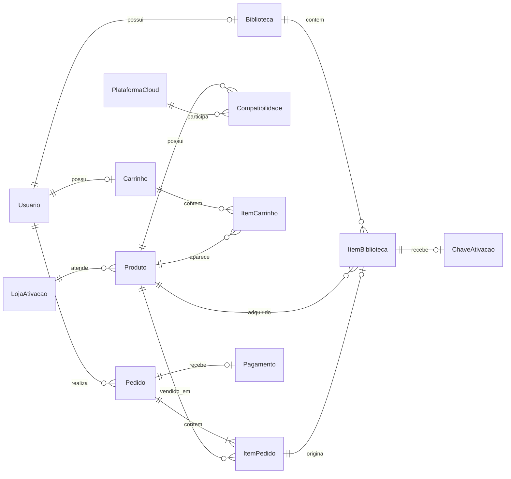

# PixelVault - Modelo de Dados e DER

**Projeto Integrador IV - Desenvolvimento para Dispositivos Móveis**  
**Item atendido:** 1.5 - Modelagem, Estrutura do Banco de Dados e Node  
**Responsável:** Integrante 1  
**Prompt:** 13 - Modelo de dados e DER  
**Versão:** 1.0  
**Data:** 14/09/2026  
**Status:** modelo lógico concluído; entrada aprovada para o Prompt 14

## 1. Objetivo e recorte

Este artefato transforma o escopo aprovado e os dados usados pelo protótipo em um modelo relacional mínimo para usuários, catálogo, compatibilidade cloud, carrinho, pedidos, pagamentos, biblioteca e chaves de ativação.

O modelo atende `HT-02` e preserva a decisão `UX-10`: **produto**, **loja de ativação**, **plataforma cloud** e **compatibilidade** são conceitos distintos. Jogos e DLCs são tipos de `Produto`, não tabelas independentes.

Não fazem parte do modelo: `Servico`, `Agendamento`, assinatura ou execução de cloud gaming, marketplace, estoque físico, dados de cartão, relação entre DLC e jogo-base, avaliações, desejos, cupons, endereços, relatórios gerenciais ou imagens persistidas. A capa atual é produzida pela interface e não existe na estrutura de dados do protótipo.

## 2. Premissas de modelagem

1. O modelo possui somente as 13 entidades necessárias aos fluxos aprovados.
2. Identificadores são textuais para manter compatibilidade com os IDs atuais (`orbit-raiders`, `local-1` e identificadores fictícios de pedido).
3. Valores monetários são armazenados em centavos inteiros; rótulos em reais são formatados pela aplicação.
4. Cada produto possui exatamente uma loja de ativação, pois o formulário e os dados atuais usam um valor singular.
5. Produto e plataforma cloud possuem relação N:N materializada por `CompatibilidadeProduto`.
6. Existe no máximo um carrinho atual por usuário. Produto digital não se repete no mesmo carrinho e, por isso, `ItemCarrinho` não possui quantidade.
7. Quantidade e total do carrinho são derivados dos itens; não são persistidos.
8. O pedido guarda o total e cada `ItemPedido` guarda o preço unitário como snapshot da compra.
9. Existe no máximo um registro de pagamento por pedido neste recorte. Uma nova tentativa atualiza esse registro; histórico de tentativas fica fora do escopo.
10. Número do cartão, nome impresso, CVV, validade e outros dados financeiros nunca são persistidos.
11. A biblioteca é única por usuário e não duplica o mesmo produto. Um item pode receber no máximo uma chave fictícia.
12. Produto referenciado por pedido ou biblioteca não pode ser removido fisicamente. Soft delete e arquivamento só serão adicionados se o grupo aprovar esse comportamento em uma história futura.

## 3. Entidades essenciais

| Entidade | Finalidade | Identificador |
|---|---|---|
| `Usuario` | Representar jogador ou administrador/curador. | `id` |
| `LojaAtivacao` | Identificar onde a chave do produto é ativada. | `id` |
| `PlataformaCloud` | Representar serviços como GeForce NOW e Boosteroid. | `id` |
| `Produto` | Representar jogo ou DLC ofertado no catálogo. | `id` |
| `CompatibilidadeProduto` | Associar produtos às plataformas cloud compatíveis. | `(produto_id, plataforma_cloud_id)` |
| `Carrinho` | Manter o carrinho atual de um usuário. | `id` |
| `ItemCarrinho` | Associar um produto ao carrinho sem duplicidade. | `(carrinho_id, produto_id)` |
| `Pedido` | Registrar a compra preparada pelo checkout. | `id` |
| `ItemPedido` | Preservar produtos e preços confirmados no pedido. | `(pedido_id, produto_id)` |
| `Pagamento` | Registrar o estado e a referência do pagamento simulado/teste. | `id` |
| `Biblioteca` | Agrupar aquisições persistentes de um usuário. | `id` |
| `ItemBiblioteca` | Vincular produto adquirido ao item de pedido de origem. | `(biblioteca_id, produto_id)` |
| `ChaveAtivacao` | Armazenar a chave fictícia opcional da aquisição. | `id` |

## 4. Relacionamentos e cardinalidades

| Origem | Cardinalidade | Destino | Regra |
|---|---|---|---|
| `Usuario` | 1 : 0..1 | `Carrinho` | Um usuário pode ainda não possuir carrinho; não possui dois carrinhos atuais. |
| `Carrinho` | 1 : 0..N | `ItemCarrinho` | Carrinho vazio é um estado válido. |
| `Produto` | 1 : 0..N | `ItemCarrinho` | Um produto pode aparecer em carrinhos diferentes. |
| `LojaAtivacao` | 1 : 0..N | `Produto` | Todo produto referencia exatamente uma loja. |
| `Produto` | 1 : 1..N | `CompatibilidadeProduto` | Produto válido exige ao menos uma compatibilidade. |
| `PlataformaCloud` | 1 : 0..N | `CompatibilidadeProduto` | Plataforma pode existir antes de possuir produtos. |
| `Usuario` | 1 : 0..N | `Pedido` | Um usuário pode realizar vários pedidos. |
| `Pedido` | 1 : 1..N | `ItemPedido` | Pedido não pode ser confirmado vazio. |
| `Produto` | 1 : 0..N | `ItemPedido` | Produto pode participar de vários pedidos. |
| `Pedido` | 1 : 0..1 | `Pagamento` | Pedido pode aguardar pagamento e recebe no máximo um registro neste modelo mínimo. |
| `Usuario` | 1 : 0..1 | `Biblioteca` | Biblioteca é criada quando necessária e é única por usuário. |
| `Biblioteca` | 1 : 0..N | `ItemBiblioteca` | Biblioteca começa vazia. |
| `Produto` | 1 : 0..N | `ItemBiblioteca` | O mesmo produto pode pertencer a usuários diferentes. |
| `ItemPedido` | 1 : 0..1 | `ItemBiblioteca` | Um item aprovado origina no máximo uma aquisição. |
| `ItemBiblioteca` | 1 : 0..1 | `ChaveAtivacao` | Chave existe somente quando aplicável. |

## 5. DER

DER editável no FigJam: [PixelVault - Modelo de Dados MVP](https://www.figma.com/board/iJgztm2hNjFrSheByuIeNF?utm_source=chatgpt&utm_content=edit_in_figjam&oai_id=v1%2FBor5ez7iIiNzJsUMLYaUietTdRdCdYr7Nf1fi7ZaniEivzKm9w8e2s&request_id=157249d8-cbfa-4a71-b22f-09b99f06e129)

## 6. Dicionário de dados resumido

### 6.1 Acesso e catálogo

| Tabela | Campo | Tipo lógico | Restrições e uso |
|---|---|---|---|
| `usuario` | `id` | texto | PK; identificador estável. |
| `usuario` | `nome` | texto | NOT NULL; nome exibido no perfil. |
| `usuario` | `email` | texto | NOT NULL, UNIQUE; normalizado em minúsculas. |
| `usuario` | `senha_hash` | texto | NOT NULL; nunca armazenar senha em texto puro no banco persistente. |
| `usuario` | `papel` | texto | NOT NULL; CHECK em `JOGADOR` ou `ADMIN`. |
| `loja_ativacao` | `id` | texto | PK. |
| `loja_ativacao` | `nome` | texto | NOT NULL, UNIQUE. |
| `plataforma_cloud` | `id` | texto | PK. |
| `plataforma_cloud` | `nome` | texto | NOT NULL, UNIQUE. |
| `produto` | `id` | texto | PK; identidade usada em catálogo, carrinho, pedido e biblioteca. |
| `produto` | `loja_ativacao_id` | texto | FK NOT NULL para `loja_ativacao.id`. |
| `produto` | `nome` | texto | NOT NULL. |
| `produto` | `tipo` | texto | NOT NULL; CHECK em `JOGO` ou `DLC`. |
| `produto` | `preco_centavos` | inteiro | NOT NULL; CHECK maior que zero. |
| `produto` | `descricao` | texto | NOT NULL. |
| `compatibilidade_produto` | `produto_id` | texto | PK composta e FK para `produto.id`. |
| `compatibilidade_produto` | `plataforma_cloud_id` | texto | PK composta e FK para `plataforma_cloud.id`. |

### 6.2 Compra e pós-compra

| Tabela | Campo | Tipo lógico | Restrições e uso |
|---|---|---|---|
| `carrinho` | `id` | texto | PK. |
| `carrinho` | `usuario_id` | texto | FK NOT NULL e UNIQUE para `usuario.id`. |
| `item_carrinho` | `carrinho_id` | texto | PK composta e FK para `carrinho.id`. |
| `item_carrinho` | `produto_id` | texto | PK composta e FK para `produto.id`; impede duplicidade. |
| `pedido` | `id` | texto | PK; identificador exibido no resultado. |
| `pedido` | `usuario_id` | texto | FK NOT NULL para `usuario.id`. |
| `pedido` | `total_centavos` | inteiro | NOT NULL; CHECK maior que zero; deve igualar a soma dos itens. |
| `item_pedido` | `pedido_id` | texto | PK composta e FK para `pedido.id`. |
| `item_pedido` | `produto_id` | texto | PK composta e FK para `produto.id`. |
| `item_pedido` | `preco_unitario_centavos` | inteiro | NOT NULL; CHECK maior que zero; snapshot do preço. |
| `pagamento` | `id` | texto | PK. |
| `pagamento` | `pedido_id` | texto | FK NOT NULL e UNIQUE para `pedido.id`. |
| `pagamento` | `status` | texto | CHECK em `PENDENTE`, `APROVADO`, `RECUSADO` ou `ERRO`. |
| `pagamento` | `valor_centavos` | inteiro | NOT NULL; deve igualar `pedido.total_centavos`. |
| `pagamento` | `referencia_externa` | texto | NULL ou UNIQUE; referência do ambiente de teste. |
| `biblioteca` | `id` | texto | PK. |
| `biblioteca` | `usuario_id` | texto | FK NOT NULL e UNIQUE para `usuario.id`. |
| `item_biblioteca` | `biblioteca_id` | texto | PK composta e FK para `biblioteca.id`. |
| `item_biblioteca` | `produto_id` | texto | PK composta e FK para `produto.id`; garante uma aquisição por produto/usuário. |
| `item_biblioteca` | `item_pedido_id` | texto | FK NOT NULL e UNIQUE para o item de pedido de origem. |
| `chave_ativacao` | `id` | texto | PK. |
| `chave_ativacao` | `item_biblioteca_id` | texto | FK NOT NULL e UNIQUE para `item_biblioteca`. |
| `chave_ativacao` | `codigo` | texto | NOT NULL e UNIQUE; somente valor fictício neste recorte. |

> No script físico, `item_pedido_id` pode ser implementado como identificador técnico do item ou como FK composta `(pedido_id, produto_id)`. O Prompt 14 deve escolher uma única representação e mantê-la coerente no SQL.

## 7. Regras de integridade

1. Habilitar `PRAGMA foreign_keys = ON` no SQLite e indexar as FKs usadas em consulta.
2. E-mail, nome de loja, nome de plataforma, referência externa e código de chave respeitam as unicidades indicadas.
3. Produto exige nome, descrição, preço positivo, tipo válido, loja existente e ao menos uma compatibilidade. A última regra deve ser validada na mesma transação pela API/serviço, pois um `CHECK` isolado não consulta outra tabela.
4. A PK de `item_carrinho` impede a mesma ocorrência de produto. Quantidade e total são sempre calculados.
5. A criação do pedido é transacional, exige carrinho não vazio, copia os preços para `item_pedido` e valida `pedido.total_centavos` contra a soma dos snapshots.
6. Pagamento deve referenciar o pedido e ter o mesmo valor. Dados digitados no formulário financeiro não entram no banco.
7. Somente pagamento `APROVADO` pode inserir itens na biblioteca. A operação deve ser idempotente por `(biblioteca_id, produto_id)` e pelo item de pedido de origem.
8. Chave de ativação é única, opcional por aquisição e explicitamente fictícia na massa acadêmica.
9. Exclusões de pais com histórico (`produto`, `pedido`, `usuario`) usam `RESTRICT`. Dependentes transitórios, como itens ao remover um carrinho, podem usar `CASCADE`.
10. O SQL do Prompt 14 deve inserir pedido, itens, pagamento aprovado, biblioteca e chaves em transação única ou em transações com estados consistentes.

## 8. Rastreabilidade

| Funcionalidade ou requisito | Entidades relacionadas | Evidência funcional |
|---|---|---|
| `HU-01`, `HU-02`, `HU-12` - cadastro, login e acesso futuro | `Usuario` | `WF-01`, `WF-02`, `ST-01`; Story 1.3 AC 3. |
| `HU-03`, `HU-05`, `HU-06`, `HU-07`, `HU-13` - catálogo e CRUD | `Produto`, `LojaAtivacao` | `WF-03`, `WF-04`, `WF-09` a `WF-11`; Story 1.3 AC 4, 9 e 10. |
| `HU-04`, `HU-13`, `UX-10` - filtro e persistência de compatibilidade | `PlataformaCloud`, `CompatibilidadeProduto` | Filtro por `compatibleWith`; Story 1.3 AC 4 e 9. |
| `HU-08`, `HU-09`, `COR-04` - adicionar, impedir duplicidade, remover e totalizar | `Carrinho`, `ItemCarrinho` | `WF-04`, `WF-05`, `ST-03`; Story 1.3 AC 5 e 6. |
| `HU-10` - checkout e pedido demonstrativo | `Pedido`, `ItemPedido`, `Pagamento` | `WF-06`, `WF-07`, `ST-05`; Story 1.3 AC 7. |
| `HU-11`, `HU-15`, `COR-01` - aquisição, biblioteca e chave | `Biblioteca`, `ItemBiblioteca`, `ChaveAtivacao` | `WF-08`, `ST-04`; Story 1.3 AC 8. |
| `HU-14` - pagamento futuro em ambiente de teste | `Pagamento` | Estado e referência externa, sem persistir cartão. |
| `HT-02` - base de dados e API | Todas as 13 entidades | DER, dicionário e regras deste artefato. |

## 9. Decisões adiadas

- Múltiplas lojas/edições do mesmo produto exigiriam uma associação produto-loja; o requisito atual sustenta somente uma loja por produto.
- A relação de uma DLC com um jogo-base não aparece nos requisitos nem nos dados atuais.
- Recompra do mesmo produto, múltiplos carrinhos e histórico de tentativas de pagamento não possuem comportamento aprovado.
- Vocabulário final de status e formato da referência do Mercado Pago devem ser confirmados no Prompt 15.
- Imagem de produto só deve entrar no banco quando existir origem, uso e regra aprovados para esse dado.

## 10. Fontes internas

- `documentos/PixelVault_Artefatos_Consolidados_Prompts_1_a_9.md`: A03, A04, A06 e A09, incluindo `HT-02`, `UX-10`, `COR-01` e `COR-04`.
- `documentos/PixelVault_Artefatos_Consolidados_Prompts_10_a_12.md`: A12, estado real, checkout, pedido, biblioteca e CRUD.
- `docs/stories/1.3.interacoes-academicas-prototipo.md`: critérios de aceitação 2 a 10 e 14.
- `src/data/pixelVaultData.js`: forma atual de usuários, produtos, compatibilidades, loja e chave.
- `src/domain/prototypeLogic.mjs`: não duplicidade, total derivado, validações, CRUD e biblioteca idempotente.
- `src/screens/PixelVaultApp.js`: estado compartilhado e snapshot do pedido.

## 11. Checklist do Prompt 13

- [x] Entidades essenciais listadas.
- [x] Atributos mínimos e identificadores definidos.
- [x] Relacionamentos e cardinalidades documentados.
- [x] Regras simples de integridade registradas.
- [x] DER legível e editável criado no FigJam.
- [x] Dicionário de dados resumido concluído.
- [x] Rastreabilidade com histórias e funcionalidades registrada.
- [x] Tabelas e campos sem uso removidos ou explicitamente adiados.
- [x] Entrada para o Prompt 14 definida sem antecipar o script SQL.
